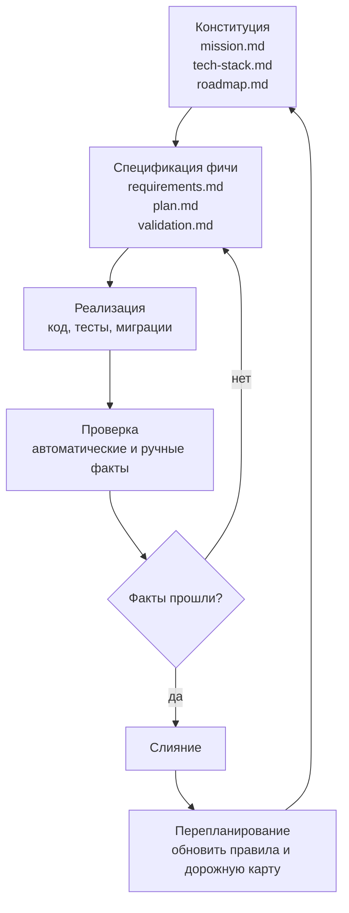

# Часть 3. Обзор процесса

Процесс SDD можно представить как несколько слоёв памяти. Верхний слой — конституция проекта. Средний — спецификации фич. Нижний — реализация и проверки. Между фичами есть перепланирование: вы обновляете верхние слои, если новая работа показала, что старые решения неточны.

Базовый цикл:



## Роль конституции

Конституция отвечает на вопросы, которые не должны заново решаться в каждой фиче:

- зачем существует проект;
- для кого он создаётся;
- какой стек используется;
- какие архитектурные ограничения уже приняты;
- какие фазы запланированы, активны или завершены.

В Qwen Code этот слой дополняется файлом `QWEN.md`. Разница такая: `QWEN.md` говорит агенту, как вести себя в репозитории, а `specs/*.md` говорят, что строит продукт.

Пример структуры:

```text
agentclinic/
  QWEN.md
  specs/
    mission.md
    tech-stack.md
    roadmap.md
```

## Роль спецификации фичи

Для каждой фазы дорожной карты создаётся отдельная папка:

```text
specs/
  2026-05-10-feedback-form/
    requirements.md
    plan.md
    validation.md
```

`requirements.md` фиксирует границы, то, что в них не входит, решения и контекст.

`plan.md` разбивает работу на группы задач.

`validation.md` описывает, как понять, что ветку можно сливать.

Эти файлы важнее, чем история чата. Новая сессия Qwen Code продолжает работу, прочитав только репозиторий.

## Роль веток

Каждая фаза фичи должна жить в отдельной Git-ветке:

```bash
git checkout -b phase-1-hello-hono
```

Это снижает когнитивную нагрузку при работе с агентом. Если агент изменил слишком много, у вас есть чёткая граница: все изменения этой ветки должны соотноситься с конкретной папкой спецификации.

## Роль `/clear`

В Qwen Code свежий контекст помогает проверить, что спецификация достаточна. Если агент может реализовать фичу после `/clear`, значит нужное знание записано в файлах, а не спрятано в памяти чата.

Пример:

```text
/clear
Прочитай @QWEN.md, @specs/mission.md, @specs/tech-stack.md
и @specs/2026-05-10-feedback-form/plan.md.
Реализуй только группу задач 1. Остановись после списка изменённых файлов.
```

Если после очистки агент задаёт разумные уточняющие вопросы, это нормально. Если он начинает угадывать, спецификация недописана.

## Четыре режима работы с агентом

1. Режим интервью. Агент задаёт вопросы и помогает написать спецификацию.
2. Режим реализации. Агент реализует конкретные группы задач.
3. Режим проверки. Агент ищет несоответствия между кодом и спецификацией.
4. Режим перепланирования. Агент обновляет конституцию, дорожную карту, журнал изменений и процесс.

Не смешивайте эти режимы без необходимости. Когда в одной сессии вы сначала обсуждаете продукт, потом просите код, потом проверку, агент начинает тянуть старый контекст туда, где должен работать файл.

## Контур «Планируй — Реализуй — Проверяй»

Внутри одной фичи режимы 2 и 3 удобно представлять как контур «Планируй — Реализуй — Проверяй» (в англоязычных источниках это называют `Plan-Act-Verify`). Контур задаёт три фазы и явные ограничения каждой:

- **Планируй.** Агент перечисляет, что собирается делать, какие файлы тронет, какие проверки запустит. На этом шаге агент не пишет код и не меняет файлы. Если план содержит изменения, которых нет в `requirements.md`, — это сигнал доуточнить спецификацию, а не «давай попробуем».
- **Реализуй.** Агент меняет код в рамках одобренного плана. Расширять план в ходе реализации запрещено: новая идея превращается либо в отдельную группу задач, либо в правку спецификации.
- **Проверяй.** Агент сравнивает результат с `validation.md`, перечисляет, что прошло, что упало и что не проверялось. На этом шаге агент не правит код — он только пишет отчёт.

Полезно держать эти три фазы в голове и при формулировке запросов, и при чтении ответов агента: если ответ смешивает «я планирую» и «я уже сделал», вы потеряли точку контроля. В части 8 эти ограничения превращаются в конкретные запросы для каждой фазы.

## Три режима спецификации

Не каждая работа описывается одинаково. Удобно различать три режима:

- **Сначала требования (Requirements-First).** Дефолтный режим учебника. Используется для фич, где главное — что должно появиться: страница отзывов, форма обратной связи, новый маршрут.
- **Сначала дизайн (Design-First).** Применяется, когда требования понятны давно, а главный риск — как именно реализовать: миграция схемы, изменение публичного API, реорганизация модулей. Здесь сначала пишется `plan.md` или отдельный `design.md`, а уже потом подробные требования.
- **Спецификация bugfix.** Отдельный режим для исправлений: вместо «что должно появиться» — «что воспроизводит баг», «какой ожидался результат», «что не должно измениться при исправлении». Подробнее в части 11.

В учебном проекте AgentClinic вы почти всегда будете работать в режиме «сначала требования». Названия других режимов нужны, чтобы не растягивать первый шаблон туда, где он мешает.

## Пример запроса Qwen Code для обзора проекта

```text
Ты помогаешь мне работать по SDD.
Пока не пиши код.
Прочитай @README.md и посмотри структуру репозитория.
Предложи начальный каталог specs/:
- mission.md
- tech-stack.md
- roadmap.md

Перед записью файлов задай ровно три сгруппированных вопроса:
1. Миссия и аудитория
2. Технический стек и ограничения
3. Дорожная карта и первая фаза
```

## Практика

Создайте в учебном проекте пустую структуру:

```bash
mkdir -p specs
touch specs/mission.md specs/tech-stack.md specs/roadmap.md
```

Пока оставьте файлы пустыми. В следующей части мы настроим Qwen Code так, чтобы он понимал правила проекта, а затем заполним конституцию осознанно.

## Контрольные вопросы

1. Почему спецификацию фичи лучше хранить рядом с кодом, а не в отдельном документе?
2. Когда нужно делать перепланирование?
3. Что показывает успешная реализация после `/clear`?
