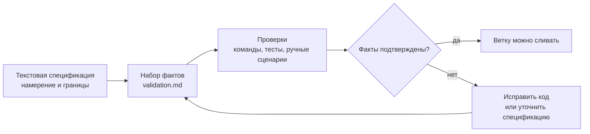

# Часть 9. Проверка фичи: от спецификаций к фактам

Проверка фичи — это не формальность после кода. Это отдельный режим работы, где текстовая спецификация превращается в проверяемые факты. Спецификация объясняет намерение, но сама по себе не доказывает, что оно реализовано. Факт — это утверждение, которое машина или человек может проверить без повторной интерпретации длинной прозы.

Короткая формула:

```text
Спецификации направляют.
Факты допускают к слиянию.
```



Для работы с агентами, которые пишут код, это критично. Модель может по-разному прочитать одну и ту же текстовую спецификацию в разных сессиях или версиях. Тест, код выхода, HTTP-статус, инвариант базы данных или явный контракт меньше зависят от интерпретации. Поэтому `validation.md` должен быть не только контрольным списком, а набором фактов для допуска к слиянию.

## Что такое факт

Факт — это исполняемое или однозначно проверяемое утверждение:

- `npm run typecheck` завершается с кодом 0;
- `GET /` возвращает 200;
- ответ содержит `<h1>AgentClinic</h1>`;
- истёкший JWT возвращает 401;
- вставка отзыва без сообщения не проходит проверку;
- миграцию можно запустить дважды без неожиданного изменения схемы;
- для каждого начального агента страница деталей возвращает связанный список недугов.

Плохой пункт проверки:

```text
Убедись, что страница выглядит хорошо.
```

Лучше:

```text
При ширине 375px заголовок, основное содержимое и подвал не перекрываются.
Главный заголовок остаётся видимым без горизонтальной прокрутки.
```

## Уровни набора фактов

Используйте четыре уровня.

**Примеры** проверяют конкретные пары входа и выхода:

```text
curl -s http://localhost:3000 | rg "<h1>AgentClinic</h1>"
```

**Инварианты** описывают то, что всегда должно быть истинным:

```text
У каждой записи обратной связи есть непустое сообщение.
```

**Свойства** проверяют класс случаев:

```text
Любая оценка вне диапазона 1..5 отклоняется.
```

**Контракты** фиксируют предусловие, действие и постусловие:

```text
Если сессия не аутентифицирована,
при запросе GET /dashboard
ответ перенаправляет на /login.
```

Не каждая фича требует все четыре уровня. Но у каждой фичи должно быть хотя бы несколько машинно проверяемых фактов.

## Какой уровень фактов нужен — по типу риска

Не все фичи одинаковы. Простой UI-баннер и миграция базы данных требуют разной плотности проверок. Минимально достаточный уровень фактов можно выбирать по матрице:

| Тип фичи / риск             | Пример          | Инвариант | Свойство | Контракт | Ручной факт |
|-----------------------------|-----------------|-----------|----------|----------|-------------|
| Визуальное / UI-изменение   | обязательно     |           |          |          | обязательно |
| CRUD-маршрут                | обязательно     |           |          | обязательно |          |
| Валидация форм / ввод       | обязательно     |           | обязательно | обязательно |       |
| Миграция данных             |                 | обязательно | обязательно |       |             |
| Авторизация / доступ        |                 |           | обязательно | обязательно |          |
| Платёж / побочный эффект    | обязательно     |           |          | обязательно |             |
| Интеграция со сторонним API | обязательно     | обязательно |        | обязательно |             |
| Фоновые задачи / шедулер    |                 | обязательно | обязательно |       |             |

Как читать таблицу:

- **Пример** — конкретная пара вход-выход (одна команда, один curl, один утверждённый тест).
- **Инвариант** — то, что всегда истинно после действия. Для миграции это «повторный запуск не меняет схему». Для фоновых задач — «после успешного запуска счётчик не уменьшается».
- **Свойство** — проверяет класс случаев. Для валидации — «любая оценка вне 1..5 отклоняется». Для авторизации — «любой запрос без сессии возвращает 401».
- **Контракт** — формальная связка «при условии X, действие Y приводит к Z».
- **Ручной факт** — то, что человек проверяет глазами или руками. Обязателен для UI, потому что автоматическая проверка визуальной иерархии часто неполноценна.

Цель матрицы — не превратить её в обязательный чек-лист, а помочь увидеть, что вы пропустили. Если фича типа «миграция данных» проходит только с примером, без инварианта — это сигнал переписать `validation.md`.

## Структура `validation.md`

Пример:

```markdown
# Проверка — форма обратной связи

## Набор фактов

### F1 — TypeScript компилируется

- Команда: `npm run typecheck`
- Ожидание: код выхода 0
- Ответственный: автоматическая проверка
- Статус: черновик

### F2 — тесты проходят

- Команда: `npm test`
- Ожидание: код выхода 0
- Ответственный: автоматическая проверка
- Статус: черновик

### F3 — пустое сообщение отклоняется

- Команда: `npm test -- feedback`
- Ожидание: POST /feedback с пустым сообщением возвращает 400
- Ответственный: автоматическая проверка
- Статус: черновик

### F4 — корректная обратная связь сохраняется

- Команда: `npm test -- feedback`
- Ожидание: корректный POST /feedback добавляет одну строку и перенаправляет на /feedback
- Ответственный: автоматическая проверка
- Статус: черновик

### F5 — страница остаётся удобной на мобильном экране

- Проверка: открыть /feedback при ширине 375px
- Ожидание: поля формы и кнопка отправки видны без горизонтальной прокрутки
- Ответственный: ручная проверка
- Статус: черновик

## Критерии готовности

- Все автоматические факты проходят.
- Ручные факты проверены.
- Факты, которые нельзя реализовать, удалены из границ или возвращены в черновик с объяснением.
- Дорожная карта и журнал изменений обновлены до слияния.
```

Жизненный цикл помогает не смешивать намерение и доказательство:

- `черновик`: факт предложен, но ещё не закреплён;
- `обязательный`: факт принят как обязательный для фичи;
- `реализован`: есть тест, команда или ручное подтверждение;
- `отложен`: факт осознанно перенесён в будущую фазу.

## Начните с различий

```bash
git status --short
git diff --stat main...HEAD
```

Попросите Qwen Code проверить не только соответствие спецификации, но и статусы набора фактов:

```text
/clear
Сравни эту ветку с @specs/2026-05-01-hello-hono/validation.md.

Покажи:
1. факты, которые реализованы и проходят;
2. факты, которых не хватает;
3. факты, которые неоднозначны и требуют переписывания;
4. решения в реализации, не описанные в requirements.md;
5. устаревшие утверждения спецификации.

Пока не изменяй файлы.
```

Если Qwen Code не может определить прошёл/не прошёл для пункта проверки, это не факт, а пожелание в прозе. Перепишите его.

## Проверка с участием человека

Агент может найти механические несоответствия, но человек должен оценить продуктовые и архитектурные:

- соответствует ли страница миссии;
- не слишком ли разрослись границы задачи;
- нет ли неоговоренной зависимости;
- понятно ли новому разработчику, почему файлы организованы так;
- есть ли факт для каждого рискованного поведения;
- не остались ли важные решения только в чате.

Типичный пример: после первой реализации часто становится понятно, что структура страницы нужна не как один монолитный компонент, а как набор `Header`, `Main`, `Footer`. Это не просто «поправить код»: нужно обновить `plan.md` и факты в `validation.md`, чтобы будущая сессия не вернулась к старой интерпретации.

## Запрос для исправления кода, спецификации и фактов вместе

```text
Реализации нужна более ясная структура страницы.

Обнови @specs/2026-05-01-hello-hono/plan.md и потребуй:
- компонент Layout;
- компонент Header;
- компонент Main;
- компонент Footer;
- подключение static/style.css из Layout.

Обнови @specs/2026-05-01-hello-hono/validation.md фактами, которые проверяют:
- ответ содержит ориентиры header/main/footer;
- /static/style.css отдаётся сервером;
- npm run typecheck завершается с кодом 0.

Затем обнови реализацию, чтобы она соответствовала новому плану и фактам.
Держи изменения в границах этой фичи.
```

Так вы одновременно предотвращаете отклонение спецификации и отклонение фактов.

## Автоматические проверки

Минимум:

```bash
npm run typecheck
```

Если тесты уже есть:

```bash
npm test
```

Если есть сервер разработки:

```bash
npm run dev
curl -s http://localhost:3000
curl -s http://localhost:3000/static/style.css
```

В `validation.md` записывайте точные команды и ожидаемые результаты. Не пишите «проверить, что работает», если можно написать команду и ожидаемый код выхода.

## Ручные факты

Ручные факты не слабее автоматических, если они конкретны. Слабая ручная проверка:

```text
Проверь интерфейс.
```

Нормальный ручной факт:

```text
При ширине 375px страница /feedback показывает поле имени, поле сообщения,
кнопку отправки и три последние записи без горизонтальной прокрутки и наложений.
```

Ручные факты полезны для тона, визуальной иерархии, базовой проверки доступности и отсутствия расползания границ. Но если ручной факт повторяется в каждой фиче, подумайте, как автоматизировать его через Playwright или модульные и интеграционные тесты.

## Проверка в CI

Факты должны доходить до допуска к слиянию. Для маленького проекта достаточно локальных команд. Для команды лучше добавить CI:

```text
Запрос на слияние нельзя принимать, пока:
- npm run typecheck не проходит;
- npm test не проходит;
- обязательные тесты маршрутов не проходят;
- набор фактов в validation.md не обновлён.
```

Это и есть практический ответ на критику «спецификации интерпретируются». Текстовая спецификация направляет агента, но слияние решают факты.

## Пакет доказательств для слияния

Когда фича подходит к слиянию, у ревьюера должен быть один компактный артефакт, по которому он понимает: что именно реализовано, какие факты прошли, какие отложены. Этот артефакт удобно называть «пакет доказательств» (в англоязычных источниках — `evidence bundle`).

Это не отдельный новый файл — это формат описания запроса на слияние. Хороший пакет доказательств состоит из:

- ссылки на папку спецификации (`specs/YYYY-MM-DD-feature/`);
- списка фактов из `validation.md` со статусами: `подтверждён`, `провален`, `отложен`;
- следов запуска команд: имена команд, коды выхода, последняя строка вывода или короткая выдержка;
- результатов ручных проверок: что именно проверял человек, на каком экране, что увидел;
- списка решений, принятых по ходу реализации, которых не было в исходной спецификации;
- ссылок на коммиты, в которых эти решения отражены.

Шаблон такого описания запроса на слияние есть в Приложении C. Главная идея: ревьюер не должен заново запускать всё, чтобы убедиться в готовности. Он должен суметь по пакету доказательств понять, что именно автор делал и проверял, и при сомнениях точечно перезапустить нужные команды.

Если в пакете доказательств появляется пункт «факт изменён после провала», это не повод его прятать. Наоборот: явно объяснённое изменение факта — нормальная часть SDD, скрытое изменение — антипаттерн (см. часть 20).

## Обновление дорожной карты

После прохождения набора фактов:

```markdown
## Фаза 1: Hello Hono (завершена)

- [x] Установить Hono и tsx.
- [x] Создать маршрут GET /.
- [x] Вернуть минимальный HTML с серверным рендерингом.
- [x] Добавить скрипт проверки типов.
```

Коммит:

```bash
git add specs/roadmap.md specs/2026-05-01-hello-hono
git commit -m "Validate Hello Hono feature"
```

Слияние:

```bash
git checkout main
git merge phase-1-hello-hono
git branch -d phase-1-hello-hono
```

## Практика

1. Запустите все автоматические факты.
2. Попросите Qwen Code сравнить код с `validation.md`.
3. Перепишите неоднозначные пункты проверки как факты.
4. Исправьте код или спецификацию, если они расходятся.
5. Отметьте статусы фактов.
6. Отметьте фазу в дорожной карте.
7. Сделайте слияние.

## Контрольные вопросы

1. Почему текстовая спецификация не должна быть единственным допуском к слиянию?
2. Чем факт отличается от пожелания в проверке?
3. Когда ручную проверку можно считать фактом?
4. Что делать, если тесты проходят, но реализация не соответствует `requirements.md`?
5. Почему «спецификации направляют, факты допускают к слиянию» лучше, чем просто «пишите спецификации лучше»?
