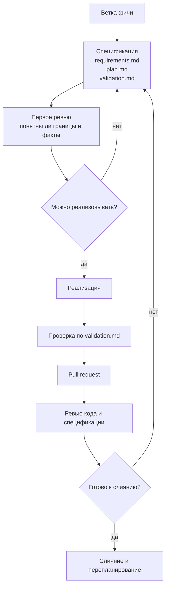

# Часть 16. Командная работа и ревью кода

До этого учебник вёл одного разработчика через полный цикл SDD. В команде появляется второй слой сложности: спецификация становится не только подсказкой для агента, но и договором между людьми. Если этот договор не ревьюить, агент может реализовать аккуратный код по слабому или неполному описанию.

Главное правило командного SDD:

```text
В запросе на слияние ревьюят не только код.
Ревьюят связку: требования -> план -> факты проверки -> изменения.
```

## Как выглядит поток работы



В маленькой команде первое ревью можно делать устно. В большой команде лучше оставить короткий комментарий в запросе на слияние: «границы понятны, факты проверки достаточны, реализацию можно начинать». Это экономит время на финальном ревью.

## Что проверяет автор до открытия запроса на слияние

Перед запросом на слияние автор должен ответить на четыре вопроса.

1. Есть ли у фичи отдельная папка в `specs/`?
2. Не изменял ли агент файлы вне границ фичи?
3. Все обязательные факты из `validation.md` проверены?
4. Если факты изменились по ходу работы, видно ли, почему они изменились?

Последний вопрос особенно важен. Плохой признак: агент меняет `validation.md` после провала тестов так, чтобы проверка стала проще. Хороший признак: автор явно пишет в PR, что один факт оказался неверным, объясняет причину и добавляет новый факт.

## Что проверяет ревьюер

Ревьюер в SDD-проекте смотрит на четыре слоя.

**Требования.** Понятно ли, для кого делается фича, что входит в границы, что не входит, какие решения уже приняты?

**План.** Соответствуют ли группы задач требованиям? Нет ли скрытого большого рефакторинга, который не связан с фичей?

**Факты.** Проверяют ли факты реальное поведение, а не намерение? Есть ли хотя бы часть машинно проверяемых фактов?

**Код.** Соответствует ли реализация плану и фактам? Нет ли изменений, которые агент сделал «заодно»?

Если ревьюер смотрит только код, SDD деградирует до обычного ревью с большим количеством Markdown-файлов.

## Шаблон запроса на слияние

Минимальный шаблон вынесен в приложение: [appendix-c-checklists.md](appendix-c-checklists.md). Его можно скопировать в `.github/pull_request_template.md`.

Смысл шаблона не в бюрократии. Он заставляет автора показать связь между спецификацией и изменениями:

- какая папка спецификации относится к ветке;
- какие факты проверки прошли;
- какие факты отложены и почему;
- какие файлы изменены вне ожидаемой области;
- что ревьюер должен проверить особенно внимательно.

Если шаблон становится длиннее самого запроса на слияние, сократите его. Для большинства фич достаточно 6–8 пунктов.

## Когда править спецификацию в той же ветке

Спецификацию можно править в той же ветке, если уточнение связано с текущей фичей и не меняет стратегию проекта.

Примеры нормальных правок:

- уточнить ожидаемый HTTP-статус;
- добавить ручной факт проверки интерфейса;
- исправить неверное название маршрута;
- отметить факт как отложенный с причиной;
- добавить решение, принятое во время реализации.

Плохая правка: переписать границы фичи так, чтобы они совпали с уже случайно написанным кодом. Это не уточнение, а скрытая смена задачи.

## Когда нужна отдельная ветка перепланирования

Отдельная ветка перепланирования нужна, если изменение затрагивает конституцию проекта:

- меняется стек;
- меняется порядок фаз;
- появляется новая архитектурная граница;
- меняется определение MVP;
- несколько будущих фич должны учитывать новое правило;
- нужно переписать `QWEN.md` или командный навык.

Такой подход уменьшает конфликты и делает историю понятной: ветка фичи реализует фичу, ветка перепланирования меняет процесс или дорожную карту.

## Конфликты в `roadmap.md`

`roadmap.md` часто становится узким местом. Два человека могут одновременно начать разные фазы и оба поменять статус дорожной карты.

Практичное правило:

```text
В ветке фичи можно читать roadmap.md и ссылаться на фазу.
Менять статусы roadmap.md лучше перед слиянием или в короткой ветке перепланирования.
```

Если команда большая, заведите правило владельца дорожной карты. Это не менеджер процесса, а человек, который следит, чтобы статусы фаз не расходились с реальностью.

## Как использовать Qwen Code в ревью

Qwen Code полезен как второй читатель, но не как замена ревьюеру.

Хороший запрос:

```text
/clear
Прочитай @QWEN.md, спецификацию этой ветки и git diff.
Сравни реализацию с requirements.md, plan.md и validation.md.
Составь список расхождений.
Файлы не изменяй.
```

Плохой запрос:

```text
Проверь запрос на слияние и исправь всё, что найдёшь.
```

Во втором случае агент смешивает ревью, исправление и принятие решений. В командной работе это опасно: ревью должно сначала создать ясный список расхождений, а уже потом автор решает, что править.

## Автоматическое ревью в CI (GitHub Actions)

Интерактивное ревью в чате удобно, но требует, чтобы кто-то его запустил. В дополнение к нему стоит настроить автоматическое ревью в CI: при открытии или обновлении запроса на слияние агент сверяет diff со спецификацией ветки (`requirements.md`, `plan.md`, `validation.md`) и оставляет комментарии или общий вердикт прямо в PR.

Минимальный каркас — workflow в `.github/workflows/`, который срабатывает на событие `pull_request`. Описывать его лучше по шагам, а не привязывать к конкретному готовому экшену, которого может не существовать:

```text
1. checkout кода и спецификации ветки
2. запуск агента с задачей: сравнить git diff против requirements.md, plan.md, validation.md
3. публикация списка расхождений как комментариев к PR
```

Иллюстративный скелет (агент здесь — любой CLI-агент, не обязательно Qwen Code; команды запуска зависят от выбранного инструмента):

```yaml
name: spec-review
on:
  pull_request:
    types: [opened, synchronize]

jobs:
  review:
    runs-on: ubuntu-latest
    steps:
      - uses: actions/checkout@v4
        with:
          fetch-depth: 0
      - name: Подготовить diff
        run: git diff origin/${{ github.base_ref }}...HEAD > /tmp/pr.diff
      - name: Ревью diff против спецификации
        # запуск агента в неинтерактивном режиме:
        # вход  — /tmp/pr.diff и specs/<feature>/{requirements,plan,validation}.md
        # выход — список расхождений
        run: ./scripts/spec-review.sh
      - name: Опубликовать комментарии
        run: gh pr comment "$PR_NUMBER" --body-file /tmp/review.md
        env:
          GH_TOKEN: ${{ secrets.GITHUB_TOKEN }}
          PR_NUMBER: ${{ github.event.pull_request.number }}
```

Авто-ревью хорошо ложится на уже описанные в этой части идеи. Оно работает с тем же пакетом доказательств: diff, спецификация и факты проверки — те же артефакты, по которым ревьюер-человек смотрит связку «требования -> план -> факты -> изменения». Комментарии бота делают часть этой сверки фактической и воспроизводимой ещё до того, как до PR дойдёт человек.

Где авто-ревью НЕ заменяет человека:

- архитектурные решения и выбор границ фичи;
- вопросы безопасности и работа с секретами;
- решение, что именно из найденных расхождений править, а что вынести в отдельную ветку.

Бот в CI ловит механические расхождения и экономит время на финальном ревью. Но вердикт «готово к слиянию» по-прежнему остаётся за человеком — это согласуется с правилом части о том, что агент предлагает изменения, а решение принимает человек.

## Что нельзя отдавать агенту на автопилоте

Не отдавайте агенту без человеческого решения:

- расширение границ фичи;
- изменение технического стека;
- удаление фактов из `validation.md`;
- изменение политики безопасности;
- обновление дорожной карты нескольких фаз;
- слияние запроса на слияние;
- правку истории Git;
- удаление данных или миграции, которые нельзя повторить.

Агент может предложить изменения. Человек отвечает за решение.

## Практическое упражнение

Возьмите любую уже реализованную фичу AgentClinic и откройте её как мысленный запрос на слияние.

1. Найдите папку спецификации.
2. Выпишите три главных факта из `validation.md`.
3. Сравните их с изменёнными файлами.
4. Найдите хотя бы один вопрос, который задал бы ревьюер.
5. Сформулируйте короткое описание запроса на слияние по шаблону из приложения C.

Если описание запроса на слияние невозможно написать без догадок, значит спецификация недостаточно переносима.

## Связанные части

- Часть 18 разбирает риски безопасности при ревью: что искать в diff на предмет утечки секретов, новых MCP-серверов, изменений хуков.
- Часть 20 (антипаттерны) перечисляет ситуации, которые ревьюер должен сразу отклонять: спецификация без фактов, факты, ослабленные по ходу работы, реализация будущей фазы.
- Часть 17 описывает, какие хуки помогают сделать часть проверок ревью автоматическими.
