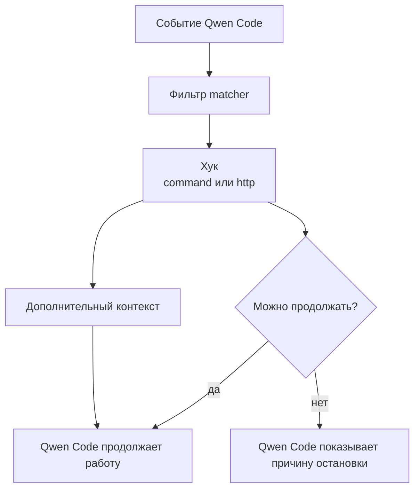

# Часть 17. Хуки Qwen Code: автоматизация рабочего процесса

Хуки Qwen Code — это сценарии, которые запускаются в заранее определённые моменты сессии: при старте, после пользовательского запроса, перед использованием инструмента, после использования инструмента, при ошибке инструмента или перед завершением ответа.

В SDD хуки нужны не для того, чтобы заменить спецификации. Они нужны, чтобы сделать процесс менее зависимым от памяти человека: напомнить агенту о правилах, записать важное событие, остановить опасную команду, добавить короткий контекст или собрать следы для последующей проверки.

Базовая схема:



## Когда хуки уместны

Хук уместен, если действие должно происходить регулярно и одинаково:

- записать факт использования инструмента;
- добавить короткую SDD-памятку после `/clear`;
- проверить потенциально опасную команду перед запуском;
- сохранить ошибку инструмента для ретроспективы;
- отправить событие во внутренний журнал;
- добавить в контекст ссылку на актуальную спецификацию;
- запустить лёгкую фоновую проверку после изменения файла.

Хук не нужен, если правило достаточно записать в `QWEN.md`. Например, «сначала читай спецификации» лучше оставить как правило поведения. А вот «каждый запуск `Bash` с опасной командой должен быть остановлен» уже подходит для хука.

## События, которые чаще всего нужны

Для учебного процесса достаточно понимать несколько событий.

| Событие | Когда срабатывает | Типичный смысл в SDD |
| --- | --- | --- |
| `SessionStart` | при старте или возобновлении сессии | добавить короткое напоминание о проекте |
| `UserPromptSubmit` | после пользовательского запроса | проверить запрос и добавить релевантный контекст |
| `PreToolUse` | перед использованием инструмента | остановить опасное действие |
| `PostToolUse` | после успешного использования инструмента | записать факт, запустить лёгкую фоновую проверку |
| `PostToolUseFailure` | после ошибки инструмента | сохранить ошибку для анализа |
| `Stop` | перед завершением ответа агента | записать итог сессии или напомнить о проверке |
| `PreCompact` | перед сжатием контекста | сохранить важные выводы перед потерей деталей |

Не нужно подключать всё сразу. Начните с одного или двух событий, иначе процесс станет непрозрачным.

## Типы хуков

Qwen Code поддерживает несколько типов исполнителей.

`command` запускает локальную команду. Это основной вариант для проектных хуков: Python-скрипт, скрипт оболочки или маленькая утилита.

`http` отправляет событие на HTTP-адрес. Это удобно для централизованного журнала или внутренней системы аудита, но требует аккуратной настройки секретов и разрешённых адресов.

`function` предназначен для внутренних JavaScript-функций на уровне сессии.

`prompt` отдаёт решение модели: LLM оценивает ввод хука и возвращает структурированный вердикт (разрешить, заблокировать, добавить контекст). Для обычного проекта почти всегда достаточно `command` или `http`.

## Что получает хук

Командный хук получает JSON через стандартный ввод. В нём есть общие поля: идентификатор сессии, текущая директория, имя события, время события. Для событий инструментов добавляются имя инструмента, входные данные инструмента, результат или ошибка.

Хук может вернуть JSON через стандартный вывод. Чаще всего он делает одно из трёх:

- ничего не меняет и просто завершает работу;
- добавляет `additionalContext`, чтобы Qwen Code увидел короткое сообщение в следующем шаге;
- запрещает действие перед использованием инструмента и объясняет причину.

Код завершения тоже важен. `0` означает успешную работу хука. `2` используется для блокирующей ошибки. Другие коды считаются неблокирующей ошибкой: основной ход Qwen Code продолжается, а детали видны в отладке.

## Минимальный комплект файлов

Примеры вынесены из урока в отдельные файлы:

- [examples/hooks/settings-workflow.example.json](examples/hooks/settings-workflow.example.json) — пример подключения хуков;
- [examples/hooks/pre_tool_guard.py](examples/hooks/pre_tool_guard.py) — защитный хук перед опасными командами;
- [examples/hooks/log_tool_result.py](examples/hooks/log_tool_result.py) — журналирование успешных и неуспешных вызовов инструментов;
- [examples/hooks/inject_sdd_context.py](examples/hooks/inject_sdd_context.py) — добавление короткого SDD-контекста;
- [examples/hooks/README.md](examples/hooks/README.md) — краткое описание примеров.

Подключение в учебном проекте:

```bash
mkdir -p .qwen/hooks
cp sdd-qwen-code-ru/examples/hooks/pre_tool_guard.py .qwen/hooks/pre_tool_guard.py
cp sdd-qwen-code-ru/examples/hooks/log_tool_result.py .qwen/hooks/log_tool_result.py
cp sdd-qwen-code-ru/examples/hooks/inject_sdd_context.py .qwen/hooks/inject_sdd_context.py
chmod +x .qwen/hooks/*.py
```

Пример настроек скопируйте отдельно и объедините с уже существующим `.qwen/settings.json` вручную:

```bash
cp sdd-qwen-code-ru/examples/hooks/settings-workflow.example.json .qwen/settings-hooks.example.json
```

Не перезаписывайте рабочие настройки модели, авторизации и MCP-серверов.

## Защитный хук перед инструментом

`PreToolUse` подходит для действий, которые должны быть проверены до выполнения. Самый понятный пример — команды оболочки.

Файл [examples/hooks/pre_tool_guard.py](examples/hooks/pre_tool_guard.py) проверяет вход `Bash` на несколько опасных шаблонов: удаление корня или домашней директории, `git reset --hard`, `git clean -fd`, запуск скачанного скрипта через командную оболочку. Это не полноценная песочница. Это последняя проверка перед очевидно рискованным действием.

Важно: защитный хук должен объяснять причину остановки. Если агент видит только «команда запрещена», он начнёт угадывать обходной путь. Если он видит конкретную причину, он может предложить безопасный вариант.

## Журналирование инструментов

`PostToolUse` и `PostToolUseFailure` подходят для журнала событий. В SDD такой журнал полезен не сам по себе, а как источник ретроспективы:

- какие команды часто падали;
- какие файлы агент менял перед ошибкой;
- какие проверки запускались вручную;
- какие действия стоит перенести в `validation.md`;
- какие правила стоит записать в `QWEN.md`.

Файл [examples/hooks/log_tool_result.py](examples/hooks/log_tool_result.py) пишет компактные записи в `.qwen/hooks/logs/tool-events.jsonl`. Это локальный технический журнал. Не храните там секреты, большие ответы модели и полные дампы окружения.

Для журналирования обычно включают асинхронный режим, чтобы основной ход работы не ждал запись в журнал.

## Добавление SDD-контекста

`SessionStart` и `UserPromptSubmit` подходят для короткого добавления контекста. Это особенно полезно после `/clear`: история чата очищена, но проектный процесс должен остаться видимым.

Файл [examples/hooks/inject_sdd_context.py](examples/hooks/inject_sdd_context.py) не читает весь проект. Он проверяет наличие `QWEN.md`, `specs/mission.md`, `specs/tech-stack.md` и `specs/roadmap.md`, затем добавляет короткую памятку. Такой хук не должен превращаться в скрытую спецификацию. Он только направляет агента к файлам, где живёт источник истины.

## Хуки и проверки

Есть соблазн запускать `npm test` после каждого изменения файла. Обычно это плохая идея: агент станет медленным, а ошибки будут приходить в неподходящий момент. Лучше разделить проверки:

- лёгкие проверки можно запускать автоматически и асинхронно;
- тяжёлые проверки запускаются по явному шагу из `validation.md`;
- блокирующие хуки используют только для опасных действий;
- результаты автоматических проверок должны попадать в отчёт или журнал, а не теряться в шуме.

Если хук запускает проверку, он должен отвечать на один вопрос. Например: «после изменения TypeScript-файла упала ли быстрая проверка типов?» Не надо превращать один хук в полный процесс слияния ветки.

## Правила безопасности

Хуки выполняются в вашей среде и с вашими правами. Поэтому относитесь к ним как к обычному коду автоматизации.

Минимальные правила:

- храните проектные хуки в репозитории и ревьюйте их как код;
- задавайте `timeout`, чтобы зависший хук не блокировал сессию;
- используйте асинхронный режим для журналов и фоновых проверок;
- не передавайте секреты в командную строку;
- для HTTP-хуков задавайте список разрешённых переменных окружения;
- не отправляйте исходники и промпты во внешние сервисы без явного решения команды;
- не пишите хуки, которые молча меняют файлы проекта;
- добавляйте понятное сообщение при блокировке действия.

Проектные хуки стоит включать только в доверенной директории. Если вы открыли чужой репозиторий, сначала прочитайте `.qwen/settings.json` и `.qwen/hooks/`, а уже потом разрешайте автоматический запуск.

## Что не стоит автоматизировать

Плохие идеи:

- автоматически исправлять код после каждой ошибки инструмента;
- блокировать любые команды, которые не входят в заранее составленный список;
- добавлять в контекст большие фрагменты спецификаций на каждый запрос;
- записывать полные ответы модели в постоянный журнал;
- смешивать память, проверку, форматирование и безопасность в одном скрипте;
- использовать хуки как скрытую замену `requirements.md`, `plan.md` и `validation.md`.

Хук должен быть маленьким и понятным. Если вы не можете объяснить его назначение одной фразой, скорее всего, он делает слишком много.

## Практическое упражнение

1. Скопируйте примеры хуков в учебный проект.
2. Подключите `pre_tool_guard.py` только к `PreToolUse` для `Bash`.
3. Подключите `log_tool_result.py` к `PostToolUse` и `PostToolUseFailure`.
4. Подключите `inject_sdd_context.py` к `SessionStart` и `UserPromptSubmit`.
5. Запустите Qwen Code в проекте и выполните `/clear`.
6. Попросите агента прочитать дорожную карту и предложить следующую фичу без изменения файлов.
7. Проверьте, что журнал появился в `.qwen/hooks/logs/tool-events.jsonl`.
8. Попробуйте опасную команду в безопасном тестовом виде и убедитесь, что защитный хук объясняет блокировку.

После упражнения ответьте письменно:

- какой хук реально помог процессу;
- какой хук оказался шумным;
- что лучше перенести в `QWEN.md`;
- что лучше оставить ручным шагом в `validation.md`.

## Сохранение состояния перед компакцией

`PreCompact` срабатывает перед сжатием контекста. Это последний момент, когда детали сессии ещё доступны целиком. Полезно зафиксировать короткое состояние во внешний файл, чтобы после компакции агент мог восстановить рабочий контекст без угадывания.

Хук не должен пытаться сохранить всю историю. Он записывает короткую сводку: над какой задачей идёт работа, что уже сделано, что осталось.

```python
#!/usr/bin/env python3
"""PreCompact: сохранить короткое состояние перед сжатием контекста."""
import json
import sys
from datetime import datetime
from pathlib import Path

payload = json.load(sys.stdin)
session_id = payload.get("session_id", "unknown")

state_dir = Path(".qwen/hooks/state")
state_dir.mkdir(parents=True, exist_ok=True)
state_file = state_dir / "pre-compact.md"

note = (
    f"# Состояние перед компакцией\n\n"
    f"- сессия: {session_id}\n"
    f"- время: {datetime.now().isoformat(timespec='seconds')}\n"
    f"- активная задача: <заполнить из контекста>\n"
    f"- что сделано: <...>\n"
    f"- что осталось: <...>\n"
)
state_file.write_text(note, encoding="utf-8")

sys.exit(0)
```

Сводку можно подмешать обратно через `SessionStart` или `UserPromptSubmit`, добавив `additionalContext` со ссылкой на файл состояния. Так компакция перестаёт быть точкой потери контекста.

## Непрерывное обучение через хук Stop

Если одну и ту же задачу приходится объяснять агенту несколько раз, а он раз за разом наступает на те же грабли, это потерянные токены, потерянный контекст и потерянное время. Решение — превращать находки в навыки.

Идея простая: когда агент находит нетривиальное — приём отладки, обходной путь, проектный паттерн, — он сохраняет находку как новый навык. При похожей задаче навык подгружается автоматически, и объяснять заново не приходится.

Ключевое инженерное решение — делать это на хуке `Stop`, а не на `UserPromptSubmit`. `UserPromptSubmit` срабатывает на каждое сообщение и добавляет задержку каждому запросу. `Stop` срабатывает один раз в конце ответа: это легковесно и не замедляет работу внутри сессии.

Концептуальный скелет: `Stop`-хук читает журнал сессии (тот самый `tool-events.jsonl` из раздела про журналирование), выделяет повторяющиеся находки и дописывает их в файл навыка.

```python
#!/usr/bin/env python3
"""Stop: выделить повторяющиеся находки и дописать их как навык."""
import json
import sys
from collections import Counter
from pathlib import Path

log_file = Path(".qwen/hooks/logs/tool-events.jsonl")
if not log_file.exists():
    sys.exit(0)

# Грубая эвристика: какие команды повторялись в сессии.
commands = Counter()
for line in log_file.read_text(encoding="utf-8").splitlines():
    try:
        record = json.loads(line)
    except json.JSONDecodeError:
        continue
    cmd = (record.get("tool_input") or {}).get("command")
    if cmd:
        commands[cmd.strip()] += 1

recurring = [cmd for cmd, n in commands.items() if n >= 3]
if not recurring:
    sys.exit(0)

skill = Path(".qwen/skills/learned-from-sessions.md")
skill.parent.mkdir(parents=True, exist_ok=True)
with skill.open("a", encoding="utf-8") as fh:
    for cmd in recurring:
        fh.write(f"- повторяющаяся команда: `{cmd}`\n")

sys.exit(0)
```

Это намеренно грубый каркас: настоящая консолидация находок — отдельная задача обобщения (см. часть про SQLite-память). Здесь важен принцип — наблюдение копится в журнале, а превращение в навык происходит один раз в конце сессии, а не на каждом запросе.

## Создание хуков в диалоге

Хуки можно описывать не только вручную в JSON. Часто проще описать задачу агенту словами — «останавливай `Bash`, если команда удаляет каталоги вне проекта», — и попросить сгенерировать конфигурацию хука. Агент составит `matcher`, тип исполнителя и скелет скрипта, а вы проверите результат как обычный код.

В экосистеме Claude Code для этого есть отдельный плагин (`hookify`): команда `/hookify` создаёт хук из словесного описания. Это переносимая практика, а не функция Qwen Code: даже без специального плагина диалоговое описание хука с последующим ревью сгенерированной конфигурации экономит время и снижает число ошибок в `matcher`.

## Связь со следующими частями

В следующей части хуки рассматриваются с точки зрения безопасности: они могут защищать процесс, но сами требуют ревью. После этого в части про SQLite-память тот же механизм используется для сбора событий, фонового обобщения и добавления короткой памяти в новые сессии.
