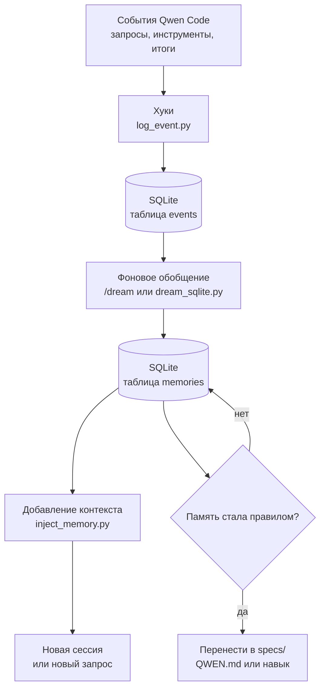

# Часть 19. Память агента на SQLite

SDD хранит намерение проекта в репозитории: `QWEN.md`, `AGENTS.md`, `specs/`, `CHANGELOG.md`. Но у агентной разработки есть ещё один слой памяти: что происходило в сессиях, какие ошибки повторялись, какие предпочтения подтвердил пользователь, какие команды сработали, какие решения агенту пришлось выводить из контекста.

Qwen Code уже имеет встроенную память: `QWEN.md`, автоматическую память, `/remember`, `/forget`, `/dream`. Для большинства проектов этого достаточно. Но если вы хотите сами владеть памятью, видеть журнал аудита, переносить её между средами запуска и использовать свои правила очистки, можно построить локальный слой памяти на SQLite.

Идея современных подходов к памяти агента простая:



Важное ограничение: эта память не заменяет спецификации. Она дополняет их. Решения, от которых зависит продукт, должны попадать в `specs/` или `QWEN.md`, а не жить только в базе.

## Что именно помнить

Не нужно сохранять всё подряд в контексте запроса. Хранить можно много, но добавлять в контекст нужно мало.

Полезные категории:

- устойчивые предпочтения пользователя;
- подтверждённые проектные команды;
- повторяющиеся ошибки агента;
- выводы после проверки;
- ссылки на внешние документы;
- заметки по активным веткам и процессам;
- решения, которые нужно перенести в спецификации.

Плохие категории:

- секреты;
- полные большие расшифровки сессий без необходимости;
- случайные промежуточные мысли;
- устаревшие обходные решения без срока действия;
- то, что агент может легко прочитать из кода.

## SQLite-схема

Создайте директорию:

```bash
mkdir -p .qwen/hooks .qwen/memory
```

Схема вынесена в отдельный файл: [examples/sqlite-memory/schema.sql](examples/sqlite-memory/schema.sql).

**Где брать файлы примеров.** Дальше предполагается, что репозиторий учебника `sdd-qwen-code-ru/` лежит рядом с вашим проектом, и переменная `TUTORIAL_DIR` указывает на него. Если учебник — отдельный клон, выставите `export TUTORIAL_DIR=/path/to/sdd-qwen-code-ru` перед командами ниже. Если файлы примеров вы загрузили иначе (скачали zip, скопировали вручную), просто замените префикс пути.

Инициализация:

```bash
cp "$TUTORIAL_DIR/examples/sqlite-memory/schema.sql" .qwen/memory/schema.sql
sqlite3 .qwen/memory/agent-memory.db < .qwen/memory/schema.sql
```

## Хук 1: логирование событий

Скрипт вынесен в отдельный файл: [examples/sqlite-memory/hooks/log_event.py](examples/sqlite-memory/hooks/log_event.py).

Скопируйте его в проект и сделайте исполняемым:

```bash
cp "$TUTORIAL_DIR/examples/sqlite-memory/hooks/log_event.py" .qwen/hooks/log_event.py
chmod +x .qwen/hooks/log_event.py
```

## Хук 2: добавление релевантной памяти

Скрипт вынесен в отдельный файл: [examples/sqlite-memory/hooks/inject_memory.py](examples/sqlite-memory/hooks/inject_memory.py).

```bash
cp "$TUTORIAL_DIR/examples/sqlite-memory/hooks/inject_memory.py" .qwen/hooks/inject_memory.py
chmod +x .qwen/hooks/inject_memory.py
```

## Подключение хуков в Qwen Code

Пример конфигурации вынесен в [examples/sqlite-memory/settings-hooks.example.json](examples/sqlite-memory/settings-hooks.example.json).

Если в проекте уже есть настройки, объедините JSON вручную. Не перезаписывайте настройки модели и авторизации.

## Фоновое обобщение памяти

Фоновое обобщение не должно работать на каждом хуке. Оно читает накопленные события и создаёт компактные записи памяти. Запускать его можно вручную, через cron или после завершения крупной фазы.

Простейший вариант без API: попросить Qwen Code сделать консолидацию и записать результат через SQL.

```text
/clear
Прочитай последние строки из .qwen/memory/agent-memory.db через sqlite3.
Сожми устойчивые выводы в эти пути памяти:
- profile/preferences.md
- project/agentclinic.md
- workflow/sdd-validation.md
- tools/qwen-code.md

Не включай секреты и сырые расшифровки.
Перед записью покажи предлагаемые памятки.
```

Можно автоматизировать сильнее: `dream_sqlite.py` берёт последние события, вызывает модель через ваш API-клиент и обновляет или вставляет записи в `memories`.

Два готовых файла:

- [examples/sqlite-memory/dream_sqlite_skeleton.py](examples/sqlite-memory/dream_sqlite_skeleton.py) — каркас с пустым адаптером `summarize_with_llm`. Подходит как референс при подключении любого провайдера.
- [examples/sqlite-memory/dream_sqlite_qwen_example.py](examples/sqlite-memory/dream_sqlite_qwen_example.py) — рабочий пример, который зовёт ту же OpenAI-совместимую конечную точку DashScope, что и Qwen Code в части 4 (переменная `BAILIAN_API_KEY`, модель `qwen3-coder-plus`). Этого достаточно, чтобы запустить обобщение без отдельной интеграции.

Установка:

```bash
cp "$TUTORIAL_DIR/examples/sqlite-memory/dream_sqlite_qwen_example.py" .qwen/memory/dream_sqlite.py
```

Запуск:

```bash
python .qwen/memory/dream_sqlite.py --since 24h --dry-run
python .qwen/memory/dream_sqlite.py --since 24h
```

## Как это связано с фоновым обобщением у Anthropic

В статье VentureBeat описан принцип: агент не меняет веса модели, а периодически просматривает прошлые сессии, выделяет повторяющиеся шаблоны, ошибки и удачные рабочие приёмы, затем делает эти заметки доступными будущим сессиям. Для SDD это особенно полезно после проверки:

- агент дважды забыл обновить `roadmap.md`;
- пользователь каждый раз требует сначала показывать различия;
- тестовая команда в проекте отличается от стандартной;
- определённый тип миграций часто ломается;
- удачный контрольный список проверки стоит превратить в навык.

В SQLite-версии это становится полностью локальным и проверяемым процессом: сырые события остаются в `events`, сжатые заметки — в `memories`, а человек может открыть обе таблицы.

## Где память должна уступать спецификациям

Если фоновое обобщение нашло новое устойчивое правило:

```markdown
workflow/sdd-validation.md

Всегда обновлять CHANGELOG.md перед слиянием веток фич.
```

его нужно перенести в `QWEN.md` или навык для журнала изменений.

Если фоновое обобщение нашло продуктовую договорённость:

```markdown
project/agentclinic.md

Записи обратной связи в AgentClinic должны быть публичными и сатирическими,
а не приватными обращениями в поддержку.
```

её нужно перенести в спецификацию фичи или `mission.md`.

Память помогает обнаруживать правила. Спецификации делают правила обязательными.

## Почему меньше контекста часто работает лучше

Память агента легко превратить в хранилище «всё, что когда-либо обсуждалось». Это плохая идея. Исследования и практика последних лет фиксируют явление, которое называют «деградацией контекста» (`context rot`): на больших входах модель хуже выбирает релевантные куски. Короткий, точный контекст из 300 токенов часто даёт результат лучше, чем большой нерелевантный из десятков тысяч.

Из этого следует простое правило для подключения памяти:

- в `QWEN.md` подмешивайте не «всё, что вспомнилось», а только релевантные текущей задаче записи (например, по тегу/категории);
- ограничивайте длину инъекции — несколько коротких пунктов лучше длинного списка;
- если запись потеряла актуальность, удаляйте её, а не «уточняйте»;
- если та же запись нужна каждый раз — это уже не «память», а правило, и место ему в `QWEN.md` или в конституции.

Этот же принцип объясняет, почему `/clear` между ролями работает: вы сознательно сужаете контекст до того, что важно для следующей роли, а не накапливаете всё в одной сессии. О гигиене контекста в навыках и сессиях см. [часть 14](part-14-build-your-own-workflow.md).

## Проверка и просмотр

Список событий:

```bash
sqlite3 .qwen/memory/agent-memory.db \
  "select event_name, tool_name, substr(prompt,1,80), timestamp from events order by id desc limit 20;"
```

Список записей памяти:

```bash
sqlite3 .qwen/memory/agent-memory.db \
  "select path, updated_at from memories order by path;"
```

Поиск:

```bash
sqlite3 .qwen/memory/agent-memory.db \
  "select path, snippet(memory_fts, 1, '[', ']', '...', 12) from memory_fts where memory_fts match 'validation OR changelog';"
```

Ручная запись:

```bash
sqlite3 .qwen/memory/agent-memory.db < "$TUTORIAL_DIR/examples/sqlite-memory/manual-memory-example.sql"
```

## Приватность и безопасность

Память агента легко превращается в склад лишнего. Введите правила:

- не логировать переменные окружения;
- обрезать ответы инструментов;
- не сохранять секреты и персональные данные;
- не добавлять в контекст больше 3–5 блоков памяти;
- регулярно удалять устаревшие записи;
- коммитить только схему и скрипты, но не `.qwen/memory/agent-memory.db`.

Пример правил для `.gitignore` вынесен в [examples/sqlite-memory/gitignore.example](examples/sqlite-memory/gitignore.example).

## Практика

1. Создайте схему SQLite.
2. Подключите `log_event.py` к `UserPromptSubmit`, `PostToolUse` и `Stop`.
3. Подключите `inject_memory.py` к `SessionStart` и `UserPromptSubmit`.
4. Проведите одну SDD-фичу.
5. Посмотрите `events`.
6. Создайте 2–3 ручные памятки.
7. Запустите новую сессию Qwen Code и проверьте, что релевантная память добавляется в контекст.
8. После проверки вручную или скриптом сделайте краткое обобщение памяти.
9. Перенесите обязательные правила из памяти в `QWEN.md`, спецификации или навык.

## Контрольные вопросы

1. Почему сырые события и устойчивые памятки должны быть разными таблицами?
2. Какие сведения нельзя сохранять в памяти агента?
3. Почему фоновое обобщение памяти лучше запускать офлайн, а не в каждом хуке?
4. Когда память нужно переносить в `specs/`?
5. Как ограничить добавляемый контекст, чтобы память не загрязняла запрос?
