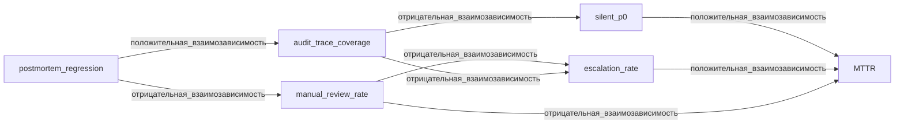

# Приложение D. Калибровка порогов

Это справочное приложение. На первом проходе оно не нужно: учебный минимум каждой главы рассчитан на пороги по умолчанию для AgentClinic-production. Этот файл собирает все таблицы «Низкий / По умолчанию / Высокий», упражнения по сдвигу порогов и сигналы, по которым порог нужно пересматривать. Используйте его при переносе процесса в свой проект, когда стандартные значения перестали подходить.

Принцип, общий для всех таблиц: пороги имеют смысл только в паре. Сдвиг одного значения без пересчёта связанного — это не калибровка, а демонтаж контура. У каждого раздела явно перечислены риски такого сдвига.

## D.1 Мутационное тестирование (глава 5)

Числа главы 5 — значение по умолчанию для AgentClinic-production со средним потоком инцидентов и зрелым SDD-процессом. В вашем проекте пороги зависят от цены пропуска P0, сложности графа маршрутов, SLA-окна CI и стабильности входящего потока. Сдвиг любой строки должен сопровождаться записью в `validation.md` с обоснованием.

| Параметр проекта | Низкий | По умолчанию (AgentClinic) | Высокий |
|---|---|---|---|
| Цена пропуска P0 | `strict_reject_rate ≥ 0.92` | **`≥ 0.98`** | `≥ 0.995` (платежи, здравоохранение) |
| Сложность графа маршрутов | `depth_of_diagnostics ≥ 2` (≤10 рёбер) | **`≥ 3`** (10–50 рёбер) | `≥ 5` (>100 рёбер, multi-tenant) |
| SLA-окно CI | `recovery_time_p95_ms ≤ 800` | **`≤ 1200`** | `≤ 1500` (>500 PR/день) |
| Стабильность потока инцидентов | 1 мутант на класс | **2 мутанта на класс** | 5+ мутантов на класс + ротация зерна |

### Упражнение

```bash
cd book2/examples/stress-mutator

mkdir -p out
cp expected/expected_failures.json out/expected_failures_depth5.json
sed -i 's/"depth_of_diagnostics_min": 3/"depth_of_diagnostics_min": 5/' out/expected_failures_depth5.json

python3 scripts/immunity_score.py \
  --validator-results out/validator_results.json \
  --expected expected/expected_failures.json \
  --out out/immunity_default.json

python3 scripts/immunity_score.py \
  --validator-results out/validator_results.json \
  --expected out/expected_failures_depth5.json \
  --out out/immunity_depth5.json
```

Первый запуск должен пройти: средняя глубина диагностики равна 4 и превышает порог 3. Второй запуск должен завершиться кодом 1: тот же валидатор уже не проходит искусственно ужесточённый порог `depth_of_diagnostics_min = 5`. Дельта показывает не новый дефект в мутантах, а цену ужесточения порога.

### Когда пересмотреть порог

- За квартал ни одно слияние не заблокировано порогом — он избыточно низкий.
- Больше 10 регрессий с одним и тем же `mutation_id` за неделю — `depth_of_diagnostics` недостаточен, увеличить.
- `recovery_time_p95` падает к нулю при росте `strict_reject_rate` — признак Гудхарта.
- Появился новый класс инцидентов — пересчитать все три порога заново.
- Одно зерно (`seed`) повторяет тот же набор `mutation_id` пять спринтов подряд — нужна ротация зерна.

Риск: если `strict_reject_rate` растёт, а `depth_of_diagnostics` одновременно падает, это симптом Гудхарта. Оба параметра двигают только парой.

## D.2 Отбор теневых спецификаций (глава 6)

Веса `0.5*mttr_gain + 0.3*early_signal + 0.2*coverage - 0.4*false_escalation` и пороги `keep/reject` — значения по умолчанию для AgentClinic-production. В вашем проекте они зависят от цены ложной эскалации, важности раннего сигнала, размера исторической базы и доступного бюджета на образцы-подсказки.

| Параметр | Низкий | По умолчанию (AgentClinic) | Высокий |
|---|---|---|---|
| Цена ложной эскалации | штраф `false_escalation: 0.2–0.3` | **`0.4`** | `0.6–0.8` (здравоохранение, платежи) |
| Важность раннего сигнала | вес `early_signal: 0.2` | **`0.3`** | `0.4–0.5` (радиус последствий >5 сервисов) |
| Размер исторической базы | 20–50 кейсов (дымовая проверка) | **50+ кейсов** | 200+ кейсов с ротацией окон |
| Бюджет образцов-подсказок | `keep-threshold 0.80`, 4 слота | **`0.70`, 8 слотов / 2000 токенов** | `0.60`, 12 слотов / 4000 токенов |

### Упражнение

Прогоните аукцион с консервативным профилем риска (выше штраф за ложную эскалацию):

```bash
cd book2/examples/shadow-auction
python3 scripts/score.py --candidates candidates/candidates.yaml --incidents data/incidents.jsonl --weights "0.3,0.4,0.2,0.8" --out out/scorebook.json
python3 scripts/decide.py --scorebook out/scorebook.json --budget-tokens 2000 --keep-threshold 0.70 --reject-threshold 0.40 --out-auction out/auction.json --out-quarantine out/quarantine.json
```

При таком профиле `shadow.p0.voice_handoff` переезжает из `winner` в `disputed`, а `shadow.alert.red_color_urgency` остаётся в `rejected`. Это проявление нового профиля: команда меньше награждает сокращение MTTR и сильнее штрафует ложную эскалацию.

### Когда пересмотреть порог

- За месяц ни один `winner` не показал положительного эффекта в пост-мортемах — `keep-threshold` слишком низкий.
- Доля `disputed` устойчиво выше 40% — формула не различает кейсы.
- В одной фазе выбирается больше 8 победителей — `budget-tokens` подобран без учёта размера `QWEN.md`.
- Появился новый класс инцидентов вне исторических данных.
- `mttr_gain` и `false_escalation` растут вместе — симптом Гудхарта.

Риск: штраф `false_escalation` и вес `mttr_gain` двигают только парой. Сдвиг одного без пересмотра другого ломает связь «полезный сигнал ↔ ложный шум».

## D.3 Ярусные бюджеты (глава 9)

Бюджет 10M токенов с разбиением 9M/1M (local/frontier) — значение по умолчанию для AgentClinic-production со средним потоком инцидентов. В вашем проекте размер бюджета и пропорции зависят от потока инцидентов, средней стоимости фазы, доли спорных ревью и чувствительности к падению `local-coder`.

| Параметр проекта | Низкий | По умолчанию (AgentClinic) | Высокий |
|---|---|---|---|
| Поток инцидентов в сутки | ≤50/день → 2–3M токенов, 90/10 | **200/день → 10M, 9M/1M (90/10)** | ≥500/день → 25–40M, 80/20 |
| Стоимость фазы (токенов) | ~20K | **~50K** | 100K+ (многошаговый реплей) |
| Доля спорных ревью | ≤5% → frontier 5–7% | **~10% → 1M (10%)** | 15–25% → 15–20% frontier |
| Чувствительность к падению `local-coder` | ≤1 раз/месяц → резерв 5% | **2–4 раза/месяц → 7%** | еженедельно → 15% + дублированный провайдер |

### Упражнение

```bash
cd book2/examples/budget-keeper

python3 scripts/compile.py --budget-spec specs/budget_network_5m.yaml --out out/budget_plan_5m.json
python3 scripts/simulate.py --plan out/budget_plan_5m.json --scenario scenarios/fail_local_45m.json --out out/fail_result_5m.json
python3 scripts/inspect.py --result out/fail_result_5m.json --query "failover_to_frontier==2 && degraded_queue==18 && token_health_min>=0.5"
```

Проверьте, удержался ли `token_health_min` выше 0.5 при половинном бюджете. В готовом 5M-варианте пропорции сохранены: local-ярус получает 4.5M, frontier — 0.5M. Если изменить только `daily_budget_tokens`, но не фазовые квоты, `compile.py` обязан упасть с ошибкой суммы.

### Когда пересмотреть порог

- За месяц ни одного срабатывания `degraded_mode` — бюджет избыточен либо реальный поток ниже ожидаемого.
- `token_health_min` уходит ниже 0.5 чаще раза в неделю — локального яруса недостаточно.
- `failover_to_frontier` устойчиво равно 0 при отказах локального яруса — шлюз слишком жёсткий, frontier не работает как страховка.
- Доля `manual_queue` после ручного тайм-аута растёт два месяца подряд — `manual_timeout_sec` слишком короткий.
- В сутки тратится менее 60% `daily_budget_tokens` — пора сжимать бюджет.

Риск: разделение 9M/1M связано с SLA по фазам. Сдвигать его без обновления `budget_plan_phases` в спецификации нельзя — frontier перестанет вмещать «спорные» кейсы.

## D.4 Защита метрик от Гудхарта (глава 10)

Пороги `silent_p0 ≤ 5%`, `manual_review_rate ≥ 15%`, `edge_drift ≤ 0.12`, `audit_trace_coverage = 1.0` — значения по умолчанию для AgentClinic-production. В вашем проекте они зависят от цены пропущенного P0, доступности ручных рецензентов, динамики входящего потока и регуляторных требований к аудиту.

| Параметр проекта | Низкий | По умолчанию (AgentClinic) | Высокий |
|---|---|---|---|
| Цена пропущенного P0 | `silent_p0 ≤ 8%` | **`≤ 5%`** | `≤ 1–2%` (платежи) |
| Доступность ручных рецензентов | `manual_review_rate ≥ 8%` | **`≥ 15%`** | `≥ 25%` (регуляторно) |
| Динамика входа | `edge_drift ≤ 0.20` | **`≤ 0.12`** | `≤ 0.05` (сезонные пики) |
| Регуляторика аудита | `audit_trace_coverage ≥ 0.95` | **`= 1.00`** | `= 1.00` + подписанная трассировка |

### Упражнение

```bash
cd book2/examples/goodhart-validator

mkdir -p out

# Скопировать spec в локальный out/ и ослабить silent_p0_cap до 0.08
cp specs/validation.yaml out/validation_loose.yaml
sed -i 's/threshold: 0.05/threshold: 0.08/' out/validation_loose.yaml

python3 scripts/run_validation.py \
  --validation out/validation_loose.yaml \
  --metrics fixtures/new_metrics_bad.json

# Опасный вариант: ослабить сразу две независимые защиты
cp specs/validation.yaml out/validation_unsafe.yaml
sed -i 's/threshold: 0.15/threshold: 0.10/' out/validation_unsafe.yaml
sed -i 's/threshold: 0.05/threshold: 0.20/' out/validation_unsafe.yaml

python3 scripts/run_validation.py \
  --validation out/validation_unsafe.yaml \
  --metrics fixtures/new_metrics_bad.json
```

Первый прогон должен остаться красным: плохой релиз с `silent_p0=0.18` всё ещё нарушает `silent_p0_cap`. Второй, опасный, вариант проходит только потому, что одновременно ослаблены две независимые защиты. Это показывает, почему guard-метрики нельзя калибровать по одной строке YAML.

### Когда пересмотреть порог

- За квартал ни один релиз не заблокирован `silent_p0_cap` — либо команда не делает рискованных изменений, либо порог избыточно мягкий.
- `manual_review_rate` падает три спринта подряд при росте `mttr_gain` — симптом Гудхарта, ручные рецензенты перестали быть страховкой.
- `edge_drift` стабильно колеблется около 0.10–0.11 — реальная динамика входа близка к порогу.
- `audit_trace_coverage` опустился ниже 1.0 хоть в одном прогоне — нарушение регуляторного инварианта, hot-fix, не калибровка.
- Появился новый класс инцидентов, который не попадает в `silent_p0`, — нужны новые инварианты, не пересмотр старых.

Риски: `silent_p0` и `manual_review_rate` двигают только парой. `edge_drift` имеет смысл только при `audit_trace_coverage=1.0`, иначе дрейф вычисляется по частичной выборке. Все четыре порога образуют единый контракт риска: ослабить один в отрыве от остальных — значит сломать его, а не настроить.

### Полная сеть метрик

В тексте главы используется упрощённая mermaid-схема с тремя метриками и одним сторожем. Полная сеть зависимостей выглядит так:



Логика та же, что в упрощённой версии: красная зона — `MTTR` и `silent_p0`; путь к её ослаблению идёт через сокращение ручной проверки и потерю аудит-следа.

## D.5 Production-готовность (глава 11)

Порог 23/25 — значение по умолчанию для AgentClinic-production со средней зрелостью SDD-процесса и смешанным типом действий. В вашем проекте порог зависит от цены ошибки переключения (cutover), зрелости процесса, нагрузки на ручное ревью и характера действий (stateless / stateful).

| Параметр проекта | Низкий | По умолчанию (AgentClinic) | Высокий |
|---|---|---|---|
| Цена ошибки переключения | внутренний инструмент: 21–22/25 только полуручно | **смешанный production: auto ≥23/25** | платежи/здравоохранение: auto ≥24/25 |
| Зрелость SDD-процесса | 3 месяца → только полуручной 20–22 | **6+ месяцев → полуручной 20–22, auto 23+** | 12+ месяцев + 50+ реплеев → auto 23+, меньше ручных остановок |
| Нагрузка ручного ревью | каждый пулл-реквест (~5/неделю) → можно держать 21–22 полуручно | **20–30% пулл-реквестов → auto 23+** | редко → auto 24/25 |
| Тип действия | stateless → 22/25 только canary/полуручно, auto 23+ | **смешанный → auto 23+** | stateful → auto 24+ и `backup_verified` |

### Упражнение

Скрипт `check_readiness.py` хардкодит `THRESHOLD = 23`. Прогоните с другим значением через копию:

```bash
cd book2/examples/real-api && mkdir -p out
cp scripts/check_readiness.py out/check_readiness_t22.py
sed -i 's/THRESHOLD = 23/THRESHOLD = 22/' out/check_readiness_t22.py
python3 out/check_readiness_t22.py --readiness fixtures/readiness_block_audit.json
```

При `THRESHOLD = 22` `readiness_block_audit.json` всё равно блокируется из-за `audit_trace_coverage=0.7 < 1.0`, хотя сумма 22/25 проходит. Это показывает, что `audit_trace_coverage` — независимый блокирующий инвариант, а не часть суммы. Упражнение про чувствительность порога, а не рекомендация снижать auto-допуск.

### Когда пересмотреть порог

- За квартал ни одна готовность не заблокирована порогом — он слишком низкий для текущей зрелости команды.
- Доля полуручных инцидентов растёт три спринта подряд — порог 23/25 не достигается из-за системного пробела в Verification или Process.
- Появился класс действий с `stateful=true` — требуйте `backup_verified` и поднимите порог по этому классу до 24/25.
- Все провалы готовности в течение месяца идут по одной оси — это пробел в шаблонах SDD; исправлять шаблоны, а не двигать порог.
- Время сборки артефактов готовности превышает SLA на переключение — пересмотрите, какие баллы можно автоматизировать, а не снижайте порог.

Риск: порог 23/25 несовместим с нулевым баллом по Security при любой сумме — такой провал блокирует слияние независимо от итога. Снижение ниже 23/25 меняет режим эксплуатации: это уже не auto-допуск, а полуручной или canary-режим. Даже «low» (21/25) — это остановка после каждого implement-шага и явное подтверждение оператора, а не право агента выполнить ремедиацию самостоятельно.
