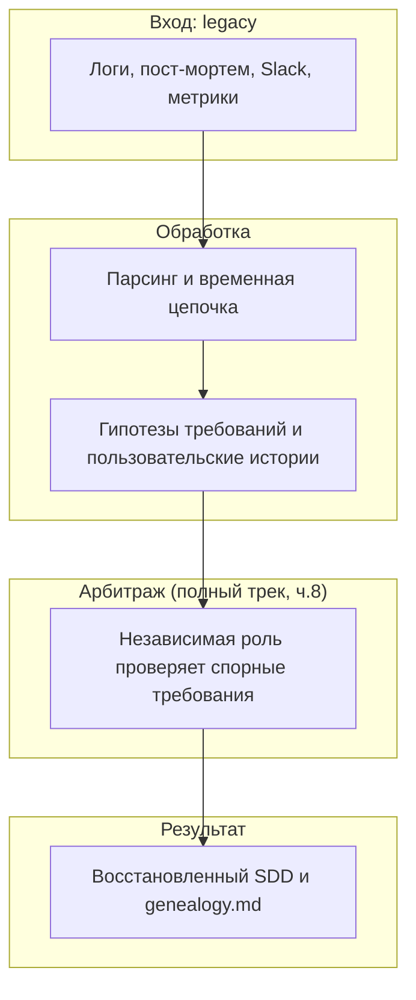

# Прикладная часть 1. Восстановление спецификаций из legacy

**Статус: Рекомендация.** Сбор доказательств, нормализация временной шкалы и разделение требований и `memory bank` — устоявшиеся инженерные приёмы. Трёхсторонний файловый арбитраж в конце главы — фронтир.

Для учебного прохождения достаточно собрать один `genealogy.md` и отделить утверждённое требование от гипотезы. Файловый арбитраж, нормализаторы и replay исторических данных нужны только полному production-треку.

Эта глава продолжает [часть 13 первого тома](../book/part-13-legacy-support.md): там мы восстанавливали конституцию существующего проекта, здесь восстанавливаем одно production-требование из следов инцидента. Держите фокус узким: один claim, два источника, один открытый вопрос. Всё, что требует нормализаторов, исторического replay или файлового арбитража, относится к полному треку.

## Перед чтением

- Опора из первого тома: часть 13 учит восстанавливать конституцию существующего проекта; здесь вы восстанавливаете одно production-требование.
- Локальный учебный кейс: `node_not_ready`, потому что по нему легко показать провенанс и неопределённость.
- След для `capstone/`: одна запись `genealogy.md` для основного `high_memory_usage` с двумя `evidence_ref` и одним открытым вопросом.
- Главные термины первого прохода: `evidence_ref` и `memory bank` (граница между требованием и фоновым контекстом). Остальные термины главы — `Verifier/Implementor/Safety`, Координатор-протоколист, нормализатор, файловый арбитраж — справочные, разбираются подробно в части 8.
- Что отложить: нормализаторы логов, исторический replay и файловый арбитраж.

В первом томе AgentClinic был учебным проектом на TypeScript, Hono, серверном JSX, SQLite и Vitest. Во втором томе мы используем учебную модель AgentClinic-production. Тот же проект мысленно развёрнут в Kubernetes. Grafana и PagerDuty шлют вебхуки (`webhook`) в его триаж-контур, а долго работающие реплики накопили операционную историю. Python во втором томе используется только для маленьких runnable-скриптов в `examples/`, а не как стек основного приложения.

Реальный кластер поднимать не нужно. Legacy-следы, с которыми работают главы 1–11, — это учебные пост-мортемы, дашборды и логи production-сценария. Конкретные инциденты дальше (`node_not_ready`, `appointment_latency` / `appointment_latency_spike`, `autoscale_200pct`, `cdn_error_budget_burn`, `high_memory_usage`) — события из этой модели, а не абстрактные сценарии.

Инженерное название этого приёма — восстановление спецификаций из наблюдаемых артефактов: логов, метрик, чатов, пост-мортемов и проверяемых следов решений. Если встречаете образную формулировку «Spec-некромантия», считайте её только коротким ярлыком для этой реконструкции, а не отдельной техникой.

## Цель

После оттока команды SRE в проекте автоматического управления инцидентами остались фрагменты: 47 страниц неструктурированных логов, несколько Slack-тредов, скриншоты дашбордов и пост-мортемы без формального SDD. Цель главы — показать, как по таким следам восстановить инженерно пригодную спецификацию для триаж-пайплайна на основе Qwen Code. Альтернатива — набор правдоподобных догадок — нам не подходит.

После раздела вы сможете:

- отделять требования от фоновой модели `memory bank` (полное определение — в «Ключевых идеях» ниже);
- собирать доказательства в единую цепочку событий;
- извлекать неявные правила и превращать их в проверяемые пользовательские истории;
- закреплять происхождение каждого пункта так, чтобы спорные решения можно было аудировать и переобосновывать позже (рамка SDD «спецификация как исполняемый артефакт» из [GitHub Spec Kit](https://github.com/github/spec-kit)).

## Минимальный учебный сценарий

### Учебный кейс

Production-инцидент `node_not_ready`: по логу метрик, эскалации в PagerDuty и одному пост-мортему нужно восстановить одно требование — когда событие `NodeNotReady` становится P1 и когда его нельзя закрывать автоматически.

### Подготовка

- `book2/examples/templates/genealogy.md` — шаблон провенанса.
- Учебная выписка ниже — минимальный заменитель логов, пост-мортема и Slack-треда.
- Один спорный факт: окно планового деплоя, canary namespace или ручная отмена эскалации.

Логичный вопрос: чем `genealogy.md` отличается от `git log` или `git blame`. Коротко: тем, что в git нет полей, которые здесь несущие. `git log` показывает, какой файл изменился и кто это сделал. `genealogy.md` показывает, откуда взялось само требование, насколько мы в нём уверены (`uncertainty`), какие источники его подтверждают (`evidence_ref`) и какие открытые вопросы остались без ответа. Коммит «added requirement» в git-истории не отличает «мы это твёрдо знаем из двух пост-мортемов» от «мы это предположили в чате». В `genealogy.md` эта разница обязательна.

Минимальная учебная выписка:

```text
grafana:NR-2026-05-17-01  cluster=prod-k8s node=worker-07 event=NodeNotReady count=3 window=10m
pagerduty:NR-2026-05-17-01 escalation=created owner=platform_oncall severity=P1
postmortem:node-not-ready-2026-05  note="auto-resolve was rejected until two stable OK windows"
open_questions:
  - "canary namespace исключает P1 или только снижает уверенность?"
```

Если у вас нет своих логов, используйте эту выписку. Если есть реальные материалы, замените строки на свои, но сохраните тот же минимум: два источника, один claim, один открытый вопрос.

### Шаги

1. Скопируйте шаблон `genealogy.md` в рабочий каталог. *Ожидание: появился файл с разделами для источника, статуса, уверенности и открытых вопросов.*
2. Запишите одно утверждение-кандидат: например, `>=3 NodeNotReady за 10 минут создают P1`.
3. Добавьте минимум две пометки-доказательства (`evidence_ref`) и один недостающий контекст. *Ожидание: утверждение нельзя прочитать как «просто мнение автора».*
4. Отделите требование от `memory bank`: топология кластера и имена дежурных не должны становиться контрактом.
5. Перепишите утверждение в Given/When/Then и рядом укажите, какое поле будущей JSON Schema проверит порог, severity и условие закрытия.
6. Поставьте статус `approved`, `needs_clarity` или `rejected`. *Ожидание: спорный факт не маскируется под утверждённое требование.*

### Контрольный факт

В `genealogy.md` есть одна запись, где одновременно видны утверждение, источники, уровень уверенности, недостающий контекст и связь с проверяемым поведением. Если порог или SLA нельзя защитить ссылкой на источник, требование остаётся гипотезой.

### Как это попадает в `capstone/`

Перенесите в `capstone/genealogy.md` только одну защищённую запись: утверждение, два `evidence_ref`, уровень уверенности и открытый вопрос. Не переносите всю временную шкалу, выписки логов и Slack-цитаты, если они не стали доказательством конкретного требования.

Минимальный фрагмент для `high_memory_usage`:

```yaml
- claim: "При memory_percent >= 90% за 10m для appointments-api создаётся P1."
  status: needs_clarity
  evidence_ref: ["grafana:HM-2026-05-17-01", "postmortem:api-memory-2026-05"]
  uncertainty: medium
  open_questions:
    - "Подтверждён ли запрет auto-resolve без двух стабильных окон?"
```

### Ревьюируемый след

В учебном пакете сохраняйте только заполненный `genealogy.md` или его фрагмент. Черновые выписки логов и временные таблицы не нужны в репозитории, если они не стали проверяемым доказательством.

## Ключевые идеи

Первая дисциплина восстановления спецификаций — жёстко разделяйте фактические требования и фоновую модель `memory bank`. Под `memory bank` мы понимаем отдельный слой инфраструктурного контекста: всё, что помогает интерпретировать факты, но само контрактом не является.

Если этот термин кажется новым, посмотрите на него через первый том. То, что там жило в `tech-stack.md` (на чём пишем) и в `QWEN.md` (постоянный контекст агента), во втором томе называется одним общим словом `memory bank`. Это тот же фоновый слой, только теперь он явно отделён от требований, потому что в production-сценариях разница «контракт vs контекст» становится критичной.

Требование, в отличие от `memory bank`, описывает поведение фичи. Что считается триггером. Когда создаётся инцидент. Какой SLA применяется. Кто получает эскалацию. При каких условиях событие закрывается.

`memory bank` хранит другое: топологию кластера, список команд, исторические договорённости, ограничения API, привычные каналы связи и операционную лексику. Почему это важно разделять. Если смешать уровни, в SDD легко появится ложное правило вроде «canary всегда неэскалируемый». На самом деле это может быть только контекст тестового namespace, а не универсальное поведение продукта.

Вводите разделение уже на этапе инвентаризации артефактов. В SDD относите утверждения, которые можно проверить наблюдаемым сценарием: `>=3 NodeNotReady за 10 минут создают P1`, `NOC получает уведомление через 15 минут`, `закрытие требует 2 последовательных OK`.

В `memory bank` отправляйте всё, что помогает интерпретировать факты, но контрактом не является:

- кто дежурил в ночь инцидента;
- почему в Slack использовали старое имя сервиса;
- какие команды имеют доступ к Grafana.

Такой фильтр снижает риск, что Qwen Code примет инфраструктурный фон за бизнес-правило и начнёт проектировать поведение на основании случайной детали.

Вторая идея — собрать и нормализовать доказательства в единую временную цепочку событий. Источники у каждого свой профиль:

- логи дают наблюдаемые состояния и порядок наступления событий;
- Slack показывает намерения операторов и ручные обходы;
- пост-мортем фиксирует причины и последствия;
- метрики позволяют оценить масштаб деградации.

Перед анализом приведите источники к общему времени (UTC). Уберите дубли, выделите коды событий и свяжите записи единым идентификатором инцидента, кластера, узла (node) или развёртывания (deployment). Без этого восстановление SDD превращается в спор о воспоминаниях, а не в реконструкцию поведения системы.

Нормализованная цепочка строится как последовательность `ts → source → event_code → actor → affected_scope → evidence_ref`, где последнее поле — это пометка-доказательство (`evidence_ref`), ссылка на конкретное место в исходном артефакте. В кейсе `node_not_ready` каркас может показать, что три события `NodeNotReady` за 10 минут почти всегда предшествовали созданию P1. Затем через 15 минут шла эскалация в NOC. Закрытие происходило только после пары устойчивых `OK`.

Отдельно фиксируйте исключения: окно планового деплоя, canary namespace, временная потеря метрик или ручная отмена эскалации. Не удаляйте такие исключения как шум — именно они часто указывают на скрытые условия будущей спецификации.

> **[conceptual interface]** — эти команды показывают ожидаемый интерфейс локальных нормализаторов. Готовых `timeline_builder.py` и `evidence_matrix.py` в репозитории учебника нет; реализуйте их в своём проекте, если перейдёте от учебного минимума к полному треку.

```bash
rg -n "NotReady|NodeNotReady|ALERT|deploy" evidence/raw/* > evidence/index.txt
python3 tools/timeline_builder.py --input evidence/raw --out evidence/timeline.ndjson
python3 tools/evidence_matrix.py \
  --timeline evidence/timeline.ndjson \
  --slack evidence/slack_export.json \
  --metrics evidence/metrics.csv \
  --out evidence/matrix.csv
```

```text
Контроль: каждая строка в evidence/timeline.ndjson содержит ts, source, event_code, cluster, namespace, actor и evidence_ref; пустые поля блокируют переход к выводу требований.
```

Дальше схема показывает, как из legacy получают восстановленный SDD. На правой стороне появляется блок «Арбитраж» с тремя ролями и координатором: это полный трек, который подробно разбирается в [части 8](part-08-multiagent-tribunal.md). На первом проходе считайте блок «Арбитраж» одним шагом «спорные требования проверяет независимая роль» — детальный состав ролей здесь читать не нужно.



Третья идея — извлекать неявные требования через Qwen Code, но оценивать каждое утверждение по источнику и контексту. Qwen Code здесь работает не как автор бизнес-логики, а как посредник для извлечения. Ему передают факты, ограничения среды и строгий формат ответа, где запрещены утверждения без ссылки на доказательство.

Хороший запрос просит не «придумать SDD», а сделать другое:

- найти повторяющиеся правила в цепочке событий;
- указать подтверждающие источники;
- назвать контрпримеры;
- присвоить уровень уверенности.

Так модель усиливает анализ, но не получает права превращать догадки в требования. Ожидайте от Qwen Code список утверждений-кандидатов (`claims`), а не финальную спецификацию.

**Плохо:**

> `REQ-NR-01: при частых NodeNotReady на node создаётся P1.`

Проблема: нет ни порога, ни окна, ни пометки-доказательства. Правило невозможно ни проверить, ни оспорить.

**Хорошо:**

> `REQ-NR-01: при >=3 NodeNotReady за 10 минут на одном node и коррелированном росте 5xx создаётся P1. evidence: logs/node-2026-05-12.parquet#row_4123, slack/thread_11#msg_7, grafana/node_5xx#segment_11:00. confidence: medium. missing_context: planned deploy window.`

Что это даёт на практике. Такая запись полезнее гладкого текста пользовательской истории: она сразу показывает, где требование устойчиво, а где требует проверки у владельца сервиса. Если правило подтверждено только одним пост-мортемом и не совпадает с метриками, оно остаётся гипотезой, даже если звучит убедительно.

> **[project script]** — `qwen -p` сам по себе runnable, но входной `@evidence/matrix.csv` нужно сначала собрать в вашем проекте. Формат итогового JSON стабилизируйте отдельным парсером-нормализатором.

```bash
qwen -p "Прочитай @evidence/matrix.csv. Найди повторяющиеся правила
инцидента node_not_ready. Верни claims с evidence, counterexample,
missing_context и confidence. Не утверждай факты без evidence." \
  --approval-mode plan \
  --output-format json \
  > sdd/drafts/nr-claims.qwen.json

qwen -p "Прочитай @sdd/drafts/nr-claims.qwen.json и проведи cross-examine:
для каждого claim проверь source, counterexample и missing_context.
Пометь claim как approved, needs_clarity или rejected." \
  --approval-mode plan \
  --output-format json \
  > sdd/drafts/nr-claims-cross.qwen.json
```

```text
Контроль: Qwen здесь работает в безголовом Plan Mode. Итоговый JSON Qwen Code —
отчёт с сообщениями сессии; если проекту нужен строгий claims.json,
добавьте отдельный парсер-нормализатор и проверяйте его тестами.
```

Четвёртая идея — кодировать требования одновременно в Given/When/Then и машинно-читаемый контракт, например JSON Schema. Given/When/Then удерживает требование на языке поведения: исходное состояние, событие, ожидаемый результат.

JSON Schema фиксирует обязательные поля, допустимые значения, числовые границы и структуру данных. Контракт можно валидировать в CI или локальном валидаторном пайплайне. Двойная запись устраняет разрыв между «понятно человеку» и «проверяемо машиной».

Для `node_not_ready` поведенческая история выглядит так:

- **Given** кластер `prod-k8s` находится в активной смене и за 10 минут фиксируется `>=3 NodeNotReady` для одного узла;
- **When** событие коррелировано с развёртыванием или ростом 5xx в связанных метриках;
- **Then** создаётся инцидент `severity=P1`, первичная реакция ожидается за 8 минут, автоэскалация в `NOC` происходит через 15 минут, а закрытие разрешено только после 2 последовательных `OK` в течение 10 минут.

Оформите исключение для canary namespace как отдельное условие, а не как примечание в конце. Иначе валидатор не сможет отличить стандартный путь от ослабленного порога. Такой формат переводит разговор о «быстрой реакции» в конкретные числа, события и статусы.

Минимальная JSON Schema того же контракта (полная форма с `triggers` и регулярным выражением для `auto_resolve_window` — в полном треке):

```json
{
  "$id": "urn:spec:node-not-ready:v1",
  "type": "object",
  "required": ["rule_id", "severity", "sla_minutes", "conditions"],
  "properties": {
    "rule_id":      {"type": "string"},
    "severity":     {"type": "string", "enum": ["P0", "P1", "P2", "P3"]},
    "sla_minutes":  {"type": "integer", "minimum": 1, "maximum": 120},
    "conditions": {
      "type": "object",
      "required": ["event_code", "count", "window_minutes", "namespace_rule"],
      "properties": {
        "count":          {"type": "integer", "minimum": 3},
        "window_minutes": {"type": "integer", "minimum": 1},
        "namespace_rule": {"type": "string", "enum": ["standard", "canary"]}
      }
    }
  }
}
```

Пятая идея относится только к полному треку: спорные восстановленные требования можно отдавать в файловый арбитраж. Голосуют три роли — Верификатор, Имплементор, Safety; Координатор ведёт журнал, не голосуя. Верификатор проверяет непротиворечивость чисел и статусов, Имплементор — реализуемость в текущем триаж-пайплайне, Safety — границы безопасного действия и право veto при `critical_risk`. Подробно роли, вердикты и прецеденты разбираются в [части 8](part-08-multiagent-tribunal.md); запускаемый учебный аналог — [`examples/tribunal/`](examples/tribunal/). Для учебного минимума этот шаг не нужен: достаточно `genealogy.md` с источниками, уровнем уверенности и открытым вопросом.

Шестая идея — вести `genealogy.md`, отдельный реестр происхождения каждого требования. Зачем он нужен. Восстановленный SDD быстро теряет ценность, если через месяц невозможно объяснить:

- почему выбран порог 3 события за 10 минут;
- кто подтвердил SLA 8 минут;
- почему canary получил отдельный режим.

`genealogy.md` связывает утверждение с логами, Slack, метриками, пост-мортемом, решением файлового арбитража и текущим уровнем неопределённости. Так спецификация становится цепочкой доказательств, а не текстовым снимком коллективной памяти.

```markdown
- req_id: NR-01
  statement: "При >=3 NodeNotReady за 10m для одного node и росте 5xx создаётся P1."
  source:
    - logs: evidence/normalized_node_logs.parquet#row_4123
    - slack: export/slack_thread_11.json#msg_7
    - metrics: grafana/node_5xx_timeseries.csv#segment_2026-05-12T11:00
  status: approved
  adjudicated_by: [Verifier, Implementor, Safety]
  uncertainty: low
  open_questions: []
```

Если пункт остаётся спорным, не маскируйте его под утверждённый контракт. Поставьте `uncertainty: medium` или `uncertainty: high`, укажите причину сомнения и добавьте план проверки:

- запросите владельца сервиса;
- прогоните replay по историческим данным;
- сравните с соседним кластером;
- соберите недостающую метрику.

Такой реестр провенанса особенно важен для будущей Конституции проекта. В неё должны переходить только правила с понятным происхождением, областью действия и механизмом пересмотра.

## Примеры и применение

Учебная выписка из 4 строк в «Минимальном учебном сценарии» — это уже отфильтрованный итог нормализации. В исходном наборе встречается:

- 9 часов наблюдений;
- 11 релевантных Slack-сообщений;
- 47 страниц неочищенных логов;
- 1 248 событий `NodeNotReady`;
- 63 алерта;
- 8 ранее закрытых инцидентов.

После нормализации видно, что резкий рост `NodeNotReady` совпал с развёртыванием, часть событий ушла в canary-сегмент с другой логикой автоэскалации, и появляются две ветки поведения: стандартный P1 и canary-путь с ослабленными порогами.

> **[conceptual interface]** — псевдокод нормализатора. Runnable-примеры второго тома остаются на Python stdlib и лежат в `book2/examples/`.

```text
read evidence/normalized_node_logs
sort events by ts
filter event_code == "NodeNotReady"
group by cluster,node in 10m windows
mark windows where count >= 3
link marked windows to alerts and Slack messages in [-15m,+5m]
```

Окно `[-15m,+5m]` нужно потому, что оператор мог обсудить проблему до формальной записи инцидента или уже после автоматического алерта. Если событие относится к canary namespace без деградации SLO — ставьте отдельную метку, а не удаляйте как шум. Если окно планового деплоя объясняет часть `NodeNotReady`, прямо укажите в требовании, блокирует ли это создание P1 или только снижает уверенность.

Восстановленный SDD становится рабочим артефактом только после реплея: прогоните исторические инциденты через новый JSON-контракт и проверьте, совпадают ли созданные severity, SLA и эскалации с подтверждёнными исходами. Несовпадения не всегда означают ошибку контракта — иногда они показывают, что старая практика была противоречивой или зависела от конкретного дежурного. Что менять в этом случае — спецификацию, `memory bank` или статус гипотезы в `genealogy.md` — решает файловый арбитраж из [части 8](part-08-multiagent-tribunal.md).

## Итог

Восстановление спецификаций из legacy восстанавливает SDD не из интуиции, а из проверяемой цепочки доказательств. Маршрут такой:

- legacy-артефакты нормализуются во временную шкалу;
- Qwen Code извлекает кандидатов-утверждений с уровнем уверенности;
- требования отделяются от `memory bank`;
- затем кодируются в Given/When/Then и JSON Schema;
- для полного трека проходят файловый арбитраж Координатор/Имплементор/Верификатор;
- получают провенанс в `genealogy.md`.

Такой процесс превращает хаос логов, чатов и пост-мортемов в контракт. Контракт можно валидировать, оспаривать, переигрывать на исторических данных и переносить в более строгую систему правил. В следующей главе мы намеренно отравим спецификации противоречиями и изучим, где Qwen Code начинает застревать.

## Артефакты и критерии готовности

| Артефакт | Готов, когда |
|---|---|
| `genealogy.md` с одним требованием или гипотезой | требование отделено от `memory bank`, спорные факты помечены как гипотезы |
| Минимум два `evidence_ref` и один недостающий контекст | утверждение нельзя прочитать как «мнение автора», порог/SLA защищается ссылкой на источник либо явно помечен как пока неутверждаемый |
| Given/When/Then-формулировка | проверяемые поля связаны с тем, что покрывает JSON Schema |

Полный трек добавляет `evidence/timeline.ndjson`, `evidence/matrix.csv` со ссылками на логи, Slack, метрики и пост-мортемы, `sdd/drafts/nr-claims.qwen.json` с утверждениями-кандидатами, `contracts/node_not_ready.schema.json` и запись файлового арбитража для требований, которые нельзя утвердить вручную. Считайте полный трек готовым, если Given/When/Then и JSON Schema описывают один и тот же контракт, нормализатор даёт воспроизводимую временную цепочку, а валидатор или файловый арбитраж выносит проверяемый `verdict`.

## Практика

1. Скопируйте [`examples/templates/genealogy.md`](examples/templates/genealogy.md) в `capstone/genealogy.md` и заполните одну запись по основному кейсу `high_memory_usage`: утверждение, минимум два `evidence_ref`, уровень уверенности и один открытый вопрос. Учебную выписку из «Минимального учебного сценария» можно использовать как заменитель реальных логов.
2. Перепишите своё утверждение в Given/When/Then и рядом укажите, какие три поля JSON Schema проверяют порог, severity и условие закрытия. Поле, которое нельзя защитить ссылкой на источник, оставьте как `uncertainty: medium`, а не как утверждённый контракт.
3. Откройте [`appendix-a-bridges-to-book.md`](appendix-a-bridges-to-book.md) и отметьте, какая глава первого тома была опорой для вашего `genealogy.md`. Если опоры нет — это сигнал, что требование пока не привязано к учебной модели.

## Контрольные вопросы

1. Почему доказательство важнее уверенной формулировки требования?
2. Чем `memory bank` отличается от SDD-контракта и почему опасно их смешивать?
3. Когда гипотезу нельзя переводить в approved-требование?
4. Вы восстановили правило по двум пост-мортемам, но владелец сервиса уволился полгода назад. Что вы сделаете с этим правилом до того, как добавите его в `requirements.md`?
