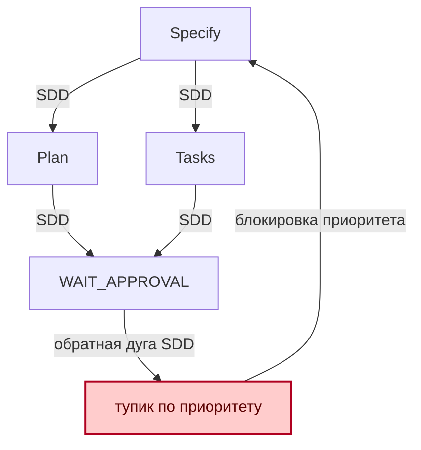

# Прикладная часть 2. Диагностика дефектов спецификации

**Статус: Рекомендация.** Инъекция одного контролируемого дефекта в спецификацию — учебная техника, близкая к мутационному тестированию (mutation testing). Конкретные классы дефектов (`cycle`, `priority_conflict`, `hidden_out_of_scope`) применяются в проектах, но не унифицированы. Метрики застревания (`ask_storm`, `stage_regress`) — фронтир.

Инженерное название приёма — контролируемо дефектная спецификация: вы намеренно вносите один дефект, чтобы проверить диагностику. В тексте иногда используется короткий ярлык «ядовитая спецификация», но он не должен скрывать главное правило: одна мутация, один симптом, один критерий восстановления.

Эта глава продолжает две базовые идеи первого тома: отрицательные требования из [части 7](../book/part-07-feature-specification.md) и антипаттерны из [части 20](../book/part-20-sdd-antipatterns.md). Разница в том, что теперь дефект вносится намеренно и заранее ограничивается. Не пытайтесь здесь проверять весь триаж-процесс: учебный минимум — poisoned/fixed-пара и одна строка восстановления в `validation.md`.

## Перед чтением

- Опора из первого тома: часть 7 даёт отрицательные требования, часть 20 — антипаттерны SDD.
- Локальный учебный кейс: `appointment_latency`, потому что конфликт приоритетов виден без внешней инфраструктуры.
- След для `capstone/`: poisoned/fixed-пара для `high_memory_usage` и одна строка восстановления в `validation.md`.
- Главный термин первого прохода: контролируемый дефект.
- Что отложить: метрики `ask_storm`, `stage_regress`, полный обратный прогон и автоматический поиск циклов.

Граница с соседними техниками простая. Эта глава — один вручную внесённый дефект и один симптом застревания. Глава 4 — один минимальный контрпример к формальному `Then`. Глава 5 — много детерминированных мутантов для проверки валидатора. Глава 8 — официальный протокол спора, доказательств и прецедентов.

Сценарий главы — рост latency маршрута `appointments-api`, страницы агентов на Hono JSX, появившейся ещё в [части 11 первого тома](../book/part-11-second-feature-phase.md). Тот же домен, только в стрессе. Каталог классических ошибок, на которые опираются мутации, — в [части 20. Антипаттерны SDD](../book/part-20-sdd-antipatterns.md).

## Цель

После этой главы вы сможете намеренно сломать спецификацию триажа инцидентов, выявить точку застревания Qwen Code и довести спецификацию до устойчивого, воспроизводимого состояния.

Учебная ценность не в том, чтобы сразу получить безупречный триаж. Цель — научиться управляемо производить сбой, читать его следы и исправлять первопричину в требованиях. Результатом станет рабочая техника:

- один дефект за итерацию;
- измеримая диагностика тупика;
- формальное разрешение противоречий;
- обратный прогон полного SDD-контура `Specify → Plan → Tasks → Implement`.

## Минимальный учебный сценарий

### Учебный кейс

Инцидент `appointment_latency`: спецификация требует одновременно «эскалировать P0 за 30 секунд» и «ждать ручного подтверждения перед любой эскалацией». Нужно зафиксировать один конфликт приоритетов и исправить его правилом-исключением.

### Подготовка

- `book2/examples/templates/validation.md` — форма для записи проверки.
- Два коротких файла или раздела: `poisoned-spec.md` и `fixed-spec.md`.
- Один ожидаемый симптом: `ask_storm`, `stage_regress` или `phase_context_loss`.

Минимальная poisoned/fixed-пара для первого прохода:

```text
poisoned:
REQ-LAT-01: latency_p95 >= 2s и severity=P0 требуют эскалации за 30 секунд. priority=100
REQ-LAT-02: любая эскалация требует предварительного human approval. priority=100

fixed:
REQ-LAT-01: для severity=P0 действует p0_time_critical_override.
REQ-LAT-02: при p0_time_critical_override эскалация разрешена сразу, но human_audit_required=true.
REQ-LAT-03: для P1-P3 предварительное human approval остаётся блокирующим.
```

Эти строки можно положить в учебные `poisoned-spec.md` и `fixed-spec.md` для локального кейса `appointment_latency`. Если итоговый зачёт идёт по `high_memory_usage`, переносите в `capstone/` только класс дефекта и строку восстановления из блока ниже. Меняйте только один дефект за раз: здесь это конфликт приоритетов.

### Шаги

1. В `poisoned-spec.md` запишите два конфликтующих правила с одинаковым `priority`. *Ожидание: дефект виден в данных, а не спрятан в комментарии.*
2. До запуска анализа запишите ожидаемый симптом: например, `priority_conflict=true && escalation_path_resolved=false`.
3. Проведите ручное ревью или Plan Mode-запрос к Qwen Code без изменения файлов. *Ожидание: модель указывает конфликт или теряет ход именно на спорном месте.*
4. В `fixed-spec.md` добавьте `p0_time_critical_override` и перенесите ручную проверку в постфактум-аудит.
5. В `validation.md` зафиксируйте два факта: исходный конфликт найден, исправленный путь сохраняет `human_audit_required=true`.
6. Сверьте результат с runnable-аналогом Spec CI из [`examples/spec-ci/`](examples/spec-ci/README.md), если хотите проверить форму требований и плана автоматически.

### Контрольный факт

Исправление меняет проверяемое правило, а не только объяснение. В `validation.md` есть строка восстановления: `priority_conflict=false && escalation_path_resolved=P0 && audit_required=true`.

### Как это попадает в `capstone/`

Перенесите в `capstone/poisoned-spec.md` ровно один дефект, а в `capstone/fixed-spec.md` — ровно одно исправление. В `capstone/validation.md` добавьте строку восстановления. Не переносите длинную трассу Plan Mode: для зачёта важны класс дефекта, патч и факт, что конфликт больше не воспроизводится.

Минимальный фрагмент (тот же класс `priority_conflict` перенесён с `appointment_latency` на основной зачётный кейс `high_memory_usage`: конфликтуют разрешение на `restart_pod` и требование human approval с одинаковым приоритетом):

```markdown
- defect_class: priority_conflict
- poisoned: memory_percent >= 90 за 10 минут разрешает restart_pod, но любое restart_pod требует предварительного human approval с тем же priority.
- fixed: restart_pod разрешён как pre-approved action только для stateless pod, а первый production-запуск требует human_review_for_first_run=true.
- validation: priority_conflict=false && action=restart_pod && human_review_for_first_run=true
```

### Ревьюируемый след

В учебном пакете сохраняйте пару `poisoned-spec.md` / `fixed-spec.md` и запись в `validation.md`. Выводы `out/*` не нужны, если они получены только локальным проектным скриптом.

## Ключевые идеи

В каждую итерацию внедряйте ровно один тип дефекта. Под «дефектом» здесь имеется в виду одна из трёх контролируемых мутаций спецификации:

- цикл — циклическая зависимость между состояниями (например, `WAIT_APPROVAL → VALIDATE_ESCALATION → WAIT_APPROVAL`);
- конфликт приоритетов — два правила с одинаковым приоритетом, ведущих к взаимоисключающим действиям (скажем, «эскалировать P0 за 30 секунд» и «ждать ручного подтверждения»);
- скрытый выход за границы (hidden out-of-scope) — действие, которое требование вынуждает выполнить, хотя оно запрещено в `constraints` (например, Jira-тикет в приёмочном тесте при запрете Jira в ограничениях).

Если одновременно добавить рекурсивную зависимость, спорное правило эскалации и запрещённую интеграцию, трасса Qwen Code покажет общий хаос. Понять, какой элемент сломал поведение, будет невозможно.

Удерживайте мутацию в минимальном радиусе: один изменённый фрагмент спецификации, один ожидаемый симптом и один критерий восстановления.

Локализуйте застревание модели через метрики чата, а не через впечатление от «странного» ответа. Введём три диагностических признака:

- `ask_storm` — повторные уточняющие запросы без появления новых данных;
- `stage_regress` — возврат к одной и той же задаче или стадии;
- `phase_context_loss` — потеря контекста этапа, например смешение `Plan` и `Implement`.

Эти признаки особенно полезны, когда Qwen Code формально продолжает отвечать, но фактически не продвигает решение: снова спрашивает владельца, заново строит тот же план или предлагает инструмент, который не был разрешён в спецификации. Практическая контрольная строка может выглядеть так: `ask_storm >= 4 || stage_regress >= 2 || phase_context_loss=true`. После срабатывания разбирайте сессию как диагностический артефакт, а не как неудачный диалог.

> **Как считать эти метрики на учебном проходе.** Это эвристики, а не CI-метрики: на первом проходе достаточно карандашной отметки в `validation.md`.
>
> - `ask_storm`: каждое новое сообщение агента, которое запрашивает данные, уже названные в предыдущих сообщениях текущей сессии. Считается +1. Сбрасывается, когда вы добавили хотя бы одно новое поле в `requirements.md` или `clarifications.md`.
> - `stage_regress`: возврат текущей фазы SDD (`specify`/`plan`/`tasks`/`implement`) на предыдущую без явной записи причины в `validation.md`. Считается +1 за каждый откат.
> - `phase_context_loss`: верно ровно тогда, когда агент в новой фазе ссылается на правило, отсутствующее в текущем `requirements.md` или `plan.md`.
>
> Для полного трека эти счётчики автоматизируются через парсер транскрипта сессии Qwen Code (`qwen --output-format json` + скрипт-агрегатор). Учебный минимум считает их глазами в момент сессии.

Задавайте дефект явными конфликтующими требованиями с приоритетами, а не комментарием в YAML. Сравните два способа.

**Плохо:**

```yaml
# TODO: P0 должны эскалироваться за 30s, но human approval обязателен —
# непонятно, что побеждает, разберёмся позже.
rules:
  - id: escalate_p0
    when: severity == "P0"
    then: { escalation: critical_phone }
```

Проблема: дефект сидит в комментарии. Линтер и JSON Schema его не проверяют, а Qwen Code может прочитать `# TODO`, но не обязан считать комментарий исполняемым контрактом. Поэтому конфликт останется за пределами формальной проверки.

**Хорошо:**

```yaml
rules:
  - id: escalate_p0
    when: severity == "P0"
    then: { escalation: critical_phone }
    priority: 100
  - id: human_approval_required
    when: severity == "P0"
    then: { require_human_approval: true }
    priority: 100   # намеренный конфликт на одном приоритете
```

Теперь `check_rule_priority.py` (см. ниже как `[project script]`) ловит коллизию по `priority`, а не по человеческой памяти.

Переводите спорные требования в Given/When/Then и JSON Schema. Естественный язык хорошо передаёт намерение, но плохо удерживает границы допустимого поведения. Формулировка «для критичных инцидентов нужна быстрая эскалация» оставляет модели пространство для догадки. Сценарий `Given severity=P0 and owner_unresponsive=true / When escalation_deadline expires / Then use critical_phone and record human_audit_required` задаёт проверяемую ветку.

JSON Schema закрывает вторую половину проблемы. Она не просто описывает желаемый путь, а запрещает недопустимые состояния. Например, отсутствие `auto_escalation_channel` при P0 или использование интеграции из списка `forbidden_integrations`. Такая связка соответствует SDD-подходу: спецификация должна включать критерии успеха, ограничения и проверяемые приёмочные тесты в полном цикле разработки. [GitHub Spec Kit Quickstart](https://github.github.io/spec-kit/quickstart.html) описывает эти фазы как последовательность `Specify → Plan → Tasks → Implement`.

Разрешайте конфликт по формальной стратегии. Стратегия включает три части:

- правило-исключение (override) определяет, какое требование побеждает на краю времени (например, `time_critical_override` выше `manual_gate_for_noncritical`);
- единственный источник правды устраняет расхождение между текстом спецификации, схемой и тестом — если приоритеты объявлены в YAML, ссылайтесь на ту же иерархию из приёмочных тестов и JSON Schema, а не вводите параллельную трактовку;
- проверочный инвариант фиксирует безопасность перехода: до эскалации зафиксируйте `severity`, `deadline` и `owner_state`, после эскалации — `channel`, `audit_record` и `reason_code`. Иначе система может формально «решить» конфликт, но потерять трассируемость.

Рефакторинг закрывайте обратным прогоном полного цикла `Specify → Plan → Tasks → Implement`. Иначе исправление останется локальной догадкой. Что искать в трассе:

- если после патча стабилизировался `Plan`, но `Tasks` создают несовместимые действия — значит дефект переехал из правил в декомпозицию;
- если `Implement` проходит, но приёмочные тесты падают — граница допустимого поведения описана неполно или схема не покрывает операционный эффект.

Считайте надёжным только повторяемый результат: один и тот же журнал инцидента, одна и та же спецификация, два последовательных прогона без новых `ask_storm`, `stage_regress` и приоритетных конфликтов.

## Примеры и применение

Возьмём сценарий, отличный от предыдущих кейсов: резкий рост latency `appointments-api` в production. В ядовитой версии спецификации одновременно заданы два требования: «все `P0` эскалируются за 30 секунд» и «любая эскалация требует ручное подтверждение (human approval)».

Что произойдёт. Если ответственный недоступен, Qwen Code попадает в петлю `ESCALATE_EVENT → CHECK_OWNER → WAIT_APPROVAL → VALIDATE_ESCALATION → ESCALATE_EVENT`. Дедлайн требует действия. Ручной барьер запрещает действие. Правило выхода не определено. Диагностический запуск можно оформить так:

> **[project script]** — команды ниже описывают ожидаемые проверки контура ядовитой спецификации; близкий запускаемый аналог базового шлюза спецификации (Spec CI) см. в [examples/spec-ci/README.md](examples/spec-ci/README.md).

```bash
qwen -p "В режиме планирования проанализируй @specs/appointment-latency-poisoned.yaml.
Найди циклы, конфликты приоритетов и скрытый выход за границы (hidden_out_of_scope). Файлы не меняй." \
  --approval-mode plan \
  --output-format json \
  > out/appointment-latency-plan-review.json

python3 scripts/spec_ci/find_spec_loops.py \
  --spec specs/appointment-latency-poisoned.yaml \
  --out out/appointment-loop.dot
```

Контрольная строка для провала: `cycle_count > 0 && ask_storm >= 4 && escalation_path_resolved=false`.



Начинайте исправление не с удаления ручного подтверждения, а с уточнения его области действия. Для P0 введите правило-исключение, где время реакции важнее предварительного ручного подтверждения. Ручную проверку перенесите в постфактум-аудит.

Для P1–P3 оставьте ручной барьер блокирующим — там нет такого же временного риска. Минимальный патч может выглядеть так:

```yaml
rules:
  - id: p0_time_critical_override
    when: severity == "P0" && owner_unresponsive == true
    then:
      escalation: critical_phone
      human_audit_required: true
    priority: 100

  - id: human_gate_noncritical
    when: severity in ["P1", "P2", "P3"]
    then:
      require_human_approval: true
    priority: 10
```

Затем закрепите спорное место схемой. Это нужно, чтобы модель не вернулась к скрытому согласованию через соседний шаг. В JSON Schema потребуйте канал автоэскалации для P0 при недоступном владельце и одновременно сохраните обязательный аудит-след. Так вы задаёте не только «что делать», но и «что нельзя считать успешным завершением»:

```json
{
  "if": {
    "properties": {
      "severity": { "const": "P0" },
      "owner_unresponsive": { "const": true }
    },
    "required": ["severity", "owner_unresponsive"]
  },
  "then": {
    "required": ["auto_escalation_channel", "human_audit_required", "reason_code"],
    "properties": {
      "auto_escalation_channel": { "const": "critical_phone" },
      "human_audit_required": { "const": true },
      "reason_code": { "const": "time_critical_override" }
    }
  }
}
```

Финальная проверка должна прогнать весь контур, а не только новую схему:

> **[project script]** — `lint_spec.py` и `check_rule_priority.py` нужно реализовать в вашем проекте; запускаемый аналог простых шлюзов схемы и покрытия см. в [examples/spec-ci/README.md](examples/spec-ci/README.md).

```bash
python3 scripts/spec_ci/lint_spec.py \
  --spec specs/appointment-latency-fixed.yaml \
  --atomicity

python3 scripts/spec_ci/check_rule_priority.py \
  --spec specs/appointment-latency-fixed.yaml \
  --expect-json-schema

qwen -p "Прочитай @specs/appointment-latency-fixed.yaml и @validation.md.
Сделай реплей фаз specify/plan/tasks/implement как ревью: что проходит,
что остаётся непроверенным, какие факты требуют скриптов." \
  --approval-mode plan \
  --output-format json \
  > out/appointment-latency-replay-review.json
```

Успешная строка восстановления: `priority_conflict=false && cycle_count==0 && escalation_path_resolved=P0 && audit_required=true`.

## Итог

Ядовитая спецификация полезна только тогда, когда её яд заранее ограничен: один дефект, измеримый симптом, формальный патч и полный обратный прогон.

Циклы, конфликты приоритетов и скрытый выход за границы превращаются из случайных провалов Qwen Code в управляемые лабораторные мутации при двух условиях. Первое — вы читаете трассу через `ask_storm`, `stage_regress`, `phase_context_loss`. Второе — проверяете исправление через Given/When/Then, JSON Schema, правила-исключения и инварианты до/после эскалации.

После такой тренировки спецификация перестаёт быть набором пожеланий и становится устойчивым контрактом. Контракт можно воспроизводимо ломать, чинить и защищать от повторного сбоя. В следующей главе мы оформим эти правила в `constitution.md` как первый проектный референдум.

## Артефакты и критерии готовности

| Артефакт | Готов, когда |
|---|---|
| `poisoned-spec.md` (или `specs/appointment-latency-poisoned.yaml`) | внесён ровно один контролируемый дефект из одного класса: цикл, конфликт приоритетов или скрытый выход за границы |
| Запись ожидаемого симптома | до запуска агента названо одно из `ask_storm` / `stage_regress` / `phase_context_loss` |
| `fixed-spec.md` (или исправленный YAML) | патч меняет проверяемое правило, а не только объяснение в тексте |
| Строка восстановления в `validation.md` | объясняет, какой именно факт перестал воспроизводиться после починки |

Полный трек добавляет `out/appointment-latency-plan-review.json` с диагностикой Qwen Code, JSON Schema-фрагмент, запрещающий возврат к скрытому ручному подтверждению, и `out/appointment-latency-replay-review.json` после обратного прогона. Считайте его готовым, если запускаемый аналог Spec CI локально показывает исправимый провал и прохождение, а реплей `Specify → Plan → Tasks → Implement` не возвращает исходный конфликт.

## Практика

1. Скопируйте одну существующую спецификацию фичи и внесите в неё ровно один дефект: конфликт приоритетов, цикл или скрытый выход за границы. *Ожидание: получились две версии — `poisoned-spec.md` и `fixed-spec.md`, отличающиеся ровно одной мутацией; вы можете назвать класс дефекта одним словом до запуска агента.*
2. Опишите ожидаемый симптом сбоя до запуска агента: что должно зациклиться, что должно стать неоднозначным, какой факт должен провалиться. *Ожидание: симптом записан конкретно (`ask_storm` после третьего уточнения, `stage_regress` с plan → specify, провал `Then` в `validation.md`), а не как «агент не справится».*
3. Исправьте дефект так, чтобы патч менял требование, план и проверку, а не только объяснение в тексте. *Ожидание: diff затрагивает как минимум один из `requirements.md`, `plan.md`, `validation.md`; обратный прогон `Specify → Plan → Tasks → Implement` не возвращает исходный конфликт.*

## Контрольные вопросы

1. Почему в ядовитую спецификацию нельзя вносить несколько дефектов сразу?
2. Чем конфликт приоритетов отличается от скрытого выхода за границы?
3. Что доказывает полный обратный прогон `Specify → Plan → Tasks → Implement`?
4. Вы внесли дефект «цикл эскалации», но Qwen Code выдал «уточнений не требуется» и пошёл реализовывать. Что это говорит о вашей спецификации и какой следующий шаг диагностики?
