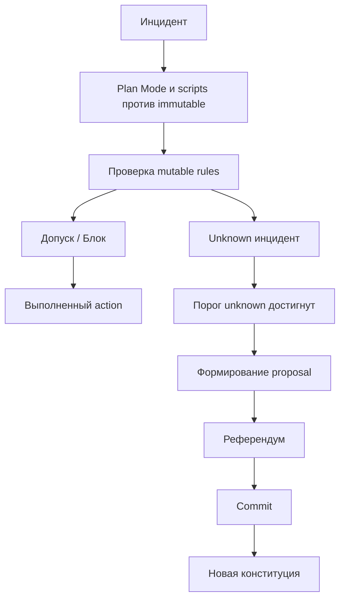

# Прикладная часть 3. Конституция проекта: первый референдум правил

**Статус: Рекомендация.** Разделение `immutable_principles` и `mutable_rules` с явным `ttl`, `max_scope`, `rollback_condition` — устойчивая практика. Автоматический референдум агентов с детерминированным правилом-разрешителем ничьей (tie-breaker) — фронтир: его форма зависит от конкретной команды и моделей.

Для учебного прохождения достаточно вручную заполнить `constitution.md` и проверить, что изменяемые правила имеют `ttl`, `max_scope` и `rollback_condition`. Автоматический референдум и внешний арбитр относятся к полному production-треку.

«Конституция проекта» здесь — это версионированный набор инвариантов, изменяемых правил и процедуры принятия поправок. Набор проверяется до выполнения опасных действий.

## Одно слово — два разных файла

В первом томе конституция проекта распределена по трём файлам: `mission.md` (зачем мы это делаем), `tech-stack.md` (на чём пишем), `roadmap.md` (что и в каком порядке). Этот контракт описывает продукт.

Во втором томе под тем же словом появляется четвёртый файл — `constitution.md`. Он описывает не продукт, а контур безопасной автоматизации: какие действия агента запрещены, какие разрешены с ограничениями, кто и как меняет правила. Это надстройка, а не замена. Файлы первого тома остаются на месте, `constitution.md` добавляется рядом и читается до любого опасного действия.

Если хотите однострочное разделение: `mission/tech-stack/roadmap` отвечают на вопрос «что мы строим», `constitution.md` — на вопрос «что агенту нельзя сделать с этим, даже если очень хочется».

В учебном минимуме достаточно маленького `constitution.md` с двумя неизменяемыми запретами и одним изменяемым правилом. Референдум агентов, внешний арбитр и автоматическая проверка плейбуков нужны только полному треку. Глава опирается на [часть 6 первого тома](../book/part-06-constitution.md) (откуда берутся `mission.md`, `tech-stack.md`, `roadmap.md`) и [часть 18](../book/part-18-sdd-security.md) (откуда берётся представление о безопасности SDD-процесса).

## Перед чтением

- Опора из первого тома: часть 6 вводит `mission.md`, `tech-stack.md`, `roadmap.md`; часть 18 объясняет безопасность SDD.
- Локальный учебный кейс: `node_not_ready`, потому что на нём видно различие между разрешённым мягким действием и запретом опасных операций.
- След для `capstone/`: два `immutable_principles`, одно `mutable_rule` и короткий `governance_protocol` для `high_memory_usage`.
- Главные термины первого прохода: `immutable_principles` и `mutable_rules`. Третий слой — `governance_protocol` — справочный, нужен только когда команда вводит правило голосования.
- Что отложить: референдум агентов, внешний арбитр и автоматическая проверка плейбуков.

Причина отдельного production-слоя простая: сценарии вроде `node_not_ready` или `autoscale_200pct` не оставляют времени на чат. Опасное действие должно или пройти формальный шлюз, или быть заблокированным. Безопасностью этого шлюза мы займёмся в опоре на [часть 18. Безопасность SDD](../book/part-18-sdd-security.md). Связь со взаимодействием с уже работающим кодом — в [части 13. Поддержка существующего проекта](../book/part-13-legacy-support.md).

### Дорожная карта главы

Глава длинная, и читать её линейно не нужно. Карта движения:

1. **Минимальный учебный сценарий.** Заполняете `constitution.md` руками: два immutable-запрета, одно mutable-правило с шестью полями. Это всё, что нужно для зачёта.
2. **Ключевые идеи.** Объясняют, *почему* минимум выглядит так.
3. **Интервью через Qwen Code.** Один способ ускорить заполнение `constitution.md`. На первом проходе можно пропустить — ручное заполнение тоже работает.
4. **Полный трек.** `governance_protocol`, `change_log`, `decision_hash`, референдум. На первом проходе читать необязательно: они становятся нужны, когда у команды появляется автоматический шлюз.

Если читаете впервые, остановитесь после раздела «Ключевые идеи» и идите делать упражнение. К полному треку вернётесь после того, как закроете `capstone/constitution.md` минимальным фрагментом.

## Цель

К концу раздела вы разработаете рабочую `constitution.md` для авто-ремедиации. Инварианты и изменяемые нормы станут понятными, эволюционирующими через референдум агентов и полностью прослеживаемыми в генеалогии правок.

Что это даёт на практике. Агент больше не действует по разрозненным подсказкам. Он сверяет каждое решение с формальным проектным контрактом. Такой контракт помогает ускорять реакцию на повторяющиеся инциденты, но не превращает скорость в право автоматически обходить резервные копии, аудит, лимиты радиуса последствий (blast radius) и условия безопасного отката.

## Минимальный учебный сценарий

### Учебный кейс

Для `node_not_ready` нужно разрешить мягкий перезапуск агента на фазе triage, но запретить опасные действия с production-БД, бэкапами и аудитом. Цель — получить маленький `constitution.md`, который можно проверить глазами до любого production-действия.

### Подготовка

- `book2/examples/templates/proposal.md` — форма поправки.
- Один список опасных действий, которые нельзя выполнять автоматически.
- Один повторяющийся unknown-паттерн, который может стать mutable-правилом.

Для первого прохода можно взять такой стартовый набор:

```yaml
dangerous_actions:
  - delete_namespace
  - restart_database
  - bypass_audit_trace
candidate_mutable_rule:
  incident_type: node_not_ready
  pipeline_phase: triage
  permitted_actions: ["soft_restart_agent"]
  max_scope: "single_node"
  ttl: "30d"
  rollback_condition: "repeat_incidents_same_node>=2 or Safety veto"
```

Если вы адаптируете главу под свой проект, замените имена действий, но не убирайте `max_scope`, `ttl` и `rollback_condition`.

### Шаги

1. Запишите минимум два `immutable_principles` как запреты, а не советы.
2. Добавьте одно `mutable_rule` с `incident_type`, `pipeline_phase`, `permitted_actions`, `max_scope`, `ttl`, `rollback_condition`.
3. Опишите `governance_protocol`: роли, кворум, veto от Safety и правило-разрешитель ничьей.
4. Заполните короткий `proposal.md`: почему правило появилось, кто голосовал, когда оно активируется и как откатывается.
5. Проверьте файл вопросом: «какое действие агент не сможет выполнить, даже если это снизит MTTR?». *Ожидание: ответ находится в `immutable_principles`, а не в чате.*
6. Сравните с runnable-аналогом из [`examples/spec-ci/`](examples/spec-ci/README.md): идея та же — до действия должен быть проверяемый шлюз.

### Контрольный факт

Каждое изменяемое правило имеет `ttl`, `max_scope` и `rollback_condition`. Если хотя бы одно поле отсутствует, правило не допускается в конституцию и остаётся proposal-черновиком.

Проверить файл можно тем же runnable-аналогом, что и в `capstone/`:

```bash
cd book2/examples/constitution
python3 scripts/check.py \
  --constitution specs/constitution.yaml \
  --proposal proposals/valid_proposal.md
```

Получите `verdict: PASS`. Затем повторите с `proposals/missing_evidence.md` и `proposals/conflict_with_immutable.md` — получите `verdict: BLOCK` с причинами. Это и есть учебный шлюз перед опасным действием.

### Перенос на `high_memory_usage`

Локальный кейс главы — `node_not_ready`, но зачётный — `high_memory_usage`. Перенос делается одной строкой принципа, а не копированием правила.

| Что брать из `node_not_ready` | Что записать в `capstone/constitution.md` для `high_memory_usage` |
|---|---|
| immutable «не закрывать инцидент без двух OK подряд» | immutable «не закрывать `high_memory_usage` без подтверждения, что RSS вернулся ниже 80% дважды подряд» |
| mutable `soft_restart_agent` с `ttl: 30d`, `max_scope: single_node` | mutable `restart_pod` с `ttl: 14d`, `max_scope: single_pod`, `rollback_condition: 5xx_increase OR memory_percent>=90% after 2 windows` |
| Safety-veto при расширении радиуса | Safety-veto при попытке расширить `restart_pod` на namespace |

Если эту строку нельзя сформулировать, локальный кейс ещё не дал переносимого принципа — вернитесь к нему до перехода в `capstone/`.

### Как это попадает в `capstone/`

Перенесите в `capstone/constitution.md` два `immutable_principles`, одно `mutable_rule` и короткий `governance_protocol`. Если вы делали `proposal.md`, оставьте в `capstone/README.md` одну строку с причиной появления правила. Не переносите полный референдум агентов, если он не запускался.

Минимальный фрагмент:

```yaml
immutable_principles:
  - "Не выполнять auto-remediation без audit_trace."
  - "Не трогать stateful workload без подтверждённой резервной копии."
mutable_rules:
  - incident_type: high_memory_usage
    pipeline_phase: recovery
    permitted_actions: ["restart_pod"]
    max_scope: "single_pod"
    ttl: "14d"
    rollback_condition: "memory_percent>=90% after 2 windows or 5xx increases"
governance_protocol: "Любое расширение max_scope требует отдельного proposal."
```

### Ревьюируемый след

В учебном пакете сохраняйте `constitution.md` вместе с `proposal.md` или записью `change_log`. Поправка без происхождения не считается частью production SDD.

## Ключевые идеи

Первый слой `constitution.md` — `immutable_principles`. Под `immutable_principles` (неизменяемые принципы) понимаются правила, которые никогда не могут быть отключены автоматически. Сюда входят запреты и обязательства уровня безопасности:

- не перезапускать production-БД без актуального бэкапа;
- не удалять резервные копии для освобождения места;
- не переводить инцидент в `resolved` без подтверждённой стабилизации;
- не выполнять обход (bypass) в пространстве имён, критичном для безопасности.

Формулируйте эти нормы как инварианты, а не как рекомендации. Именно они ограничивают агента в момент давления, когда кратчайший путь к снижению MTTR может создать больший каскад отказов.

Второй слой — `mutable_rules`. Это изменяемые нормы с точным радиусом действия (в отличие от `immutable_principles`, такое правило можно отменить или переписать через формальную процедуру). Для каждого такого правила указывайте минимум шесть полей. Что они значат:

- `incident_type` — класс инцидента, для которого правило применимо;
- `pipeline_phase` — фаза реагирования (`triage`, `recovery` и т. д.);
- `permitted_actions` — список разрешённых действий;
- `max_scope` — лимит радиуса последствий (например, `single_node`);
- `ttl` (срок жизни, time to live) — срок действия правила, после которого его нужно пересмотреть или продлить;
- `rollback_condition` — условие, при котором правило откатывается автоматически.

Без этих полей поправка становится слишком широкой и начинает конкурировать с инвариантами. Сравните два варианта.

**Плохо:**

```yaml
- id: node_not_ready_soft_restart
  incident_type: "NodeNotReady"
  permitted_actions: ["soft_restart_agent"]
```

Проблема: нет `ttl`, нет `max_scope`, нет `rollback_condition`. Правило бессрочно и без границ радиуса. Через полгода его уже никто не пересмотрит.

**Хорошо:**

```yaml
- id: node_not_ready_soft_restart
  incident_type: "NodeNotReady"
  pipeline_phase: "triage"
  permitted_actions: ["soft_restart_agent"]
  max_scope: "single_node"
  ttl: "30d"
  rollback_condition: "repeat_incidents_same_node>=2 or Safety veto"
```

Например, разрешите мягкий перезапуск (soft restart) для `incident:NodeNotReady` на фазе `triage`, но запретите его для `incident:DBWriteLag` на фазе `recovery`. Одинаковое действие в разных контекстах имеет разный риск для данных и доступности.

### Остановка для первого прохода

Если вы здесь впервые, к этому моменту у вас уже есть всё для зачёта по главе: два immutable-запрета, одно mutable-правило с шестью полями, понимание различия между ним и `mission/tech-stack/roadmap` первого тома. Дальше идёт **полный трек** — `governance_protocol`, `change_log`, `decision_hash`, референдум. Эти механизмы становятся нужны, когда у команды появляется автоматический шлюз и три-четыре человека-роли вокруг него. Для зачётного `capstone/constitution.md` они не обязательны.

Если у вас на проекте нет ещё ни одного автоматического действия, идите сразу к разделу «Артефакты и критерии готовности», а полный трек дочитайте после главы 8 (там роли всплывают снова в файловом арбитраже).

### Полный трек: governance_protocol

Делайте триггер эволюции наблюдаемым: три и более повторных непредсказанных инцидента с одним `pattern_id` запускают обязательный референдум по поправке. Такой порог отделяет единичную аномалию от устойчивого пробела в правилах и не позволяет менять конституцию после каждого шумного оповещения.

Зафиксируйте окно агрегации, например 48 часов. В кандидат-поправку (тот самый `proposal.md`, который выносится на референдум) включите:

- входные события;
- текущую классификацию `unknown`;
- предполагаемый риск;
- ожидаемый эффект;
- условие отмены.

Зачем здесь сразу несколько ролей, если в первом томе ревью делал один человек. В [части 16 первого тома](../book/part-16-team-code-review.md) одного ревьюера хватало, потому что предметом ревью был код фичи в учебном AgentClinic. Цена ошибки — переделать фичу. В production-сценарии ревью предметов другое: автоматическое опасное действие на живом сервисе. Цена ошибки — потерянные данные, расширенный радиус последствий, скрытое закрытие P0. Один проверяющий не справляется не потому, что недостаточно умный, а потому, что человеку трудно одновременно держать в голове корректность инварианта, применимость плейбука и риск для production. Поэтому проверка разносится на роли, каждая со своим узким вопросом. В минимальной форме это всё ещё могут быть три модели одного агента, читающие один и тот же файл по очереди — но вопросы у них разные.

Опишите процедуру голосования в `governance_protocol`. В неё входят роли агентов, веса голосов, кворум, время созыва и детерминированное разрешение ничьей. Минимальный состав — три роли:

- `Verifier` (Верификатор) ищет нарушения инвариантов;
- `Implementor` (Имплементор) оценивает применимость в плейбуке;
- `Safety` (Безопасность) проверяет радиус последствий, приватность и условия отката.

Для принятия задайте кворум в два голоса, правило `2 approve + no Safety-veto`, созыв в течение 15 минут после срабатывания триггера и правило-разрешитель ничьей `safety-first`. При таком разрешителе критический риск от `Safety` всегда ведёт к отклонению.

Четвёртая роль, Координатор, в `governance_protocol` не голосует. Она появляется на следующем уровне — в файловом арбитраже (часть 8), где ведёт `judgment.md` и порядок раундов. Здесь, в конституции, Координатор только записывает итог голосования в `change_log`.

Фиксируйте каждое обновление как неизменяемый след, а не как правку без происхождения. В запись включайте:

- `version` и `parent_version` — текущая и предыдущая версии конституции;
- `reason` — причина поправки;
- `votes` — итоги голосования по ролям;
- `decision_hash` — криптографический хеш решения, по которому его можно пересчитать и проверить позже;
- `incident_context` — события, спровоцировавшие триггер;
- `activation_time` — момент, с которого поправка действует;
- ссылку на различие (diff) внутри репозитория.

Такой журнал превращает историю правок в цепочку доказательств. Если позже возникнет вопрос, почему агент получил право выполнить действие, ответ будет находиться не в чате команды, а в воспроизводимой генеалогии решений.

## Примеры и применение

Базовая структура `constitution.md` может выглядеть так:

```yaml
immutable_principles:
  - id: prod_db_no_restart_without_backup
    rule: "Production database restart is forbidden unless a verified backup exists."
    enforcement: "always_on"

  - id: backups_are_protected_assets
    rule: "Backup deletion, overwrite, or quarantine bypass cannot be executed automatically."
    enforcement: "always_on"

mutable_rules:
  - id: node_not_ready_soft_restart_triage
    incident_type: "NodeNotReady"
    pipeline_phase: "triage"
    permitted_actions:
      - "cordon_node"
      - "soft_restart_agent"
    max_scope: "single_node"
    ttl: "30d"
    rollback_condition: "increase in repeat incidents or Safety veto"

governance_protocol:
  roles:
    verifier:
      vote_weight: 1
    implementor:
      vote_weight: 1
    safety:
      vote_weight: 1
      veto: "critical_risk"
  quorum: 2
  pass_rule: "at_least_2_approve_and_no_safety_veto"
  convene_after: "3_unknown_incidents_same_pattern"
  convene_within: "15m"
  tie_breaker: "safety_first_then_latest_matching_precedent"

change_log:
  - version: "1.2.0"
    parent_version: "1.1.0"
    reason: "3 unknown NodeNotReady incidents in 48h"
    votes:
      verifier: "approve"
      implementor: "approve"
      safety: "abstain"
    decision_hash: "sha256:..."
    activation_time: "2026-05-17T12:00:00Z"
```

Подключайте конституцию к шлюзовым проверкам до выполнения плейбука, а не после него. Порядок шагов такой:

1. локальный скрипт проверяет `immutable_principles` и `mutable_rules`;
2. Qwen Code в режиме планирования (Plan Mode) объясняет риск и пробелы;
3. исполнитель получает право на действие.

Команда `/constitution` не является встроенной командой Qwen Code. `/tasks`, в отличие от неё, встроена — но показывает список фоновых задач, а не генерирует список задач разработки, как `/speckit.tasks` в Spec Kit. Если вам нужны обе команды именно в спек-китовском смысле, оформите их как пользовательские команды проекта (project custom commands).

### Интервью через Qwen Code

Прежде чем писать `constitution.md` руками, проведите такое же интервью, как в [части 6 первого тома](../book/part-06-constitution.md). Production-слой добавляет два контура к классической тройке `mission/tech-stack/roadmap`, и в эти контуры нельзя заходить без явных решений человека: какие действия агент имеет право выполнить без подтверждения, кто получает veto, какой максимальный радиус последствий разрешён на фазе `triage`.

Запрос:

```text
/clear
Мы расширяем конституцию AgentClinic-production.
Посмотри @specs/mission.md, @specs/tech-stack.md, @specs/roadmap.md
и @specs/playbooks/node-not-ready.md.

Создай черновик @specs/constitution.md c тремя секциями:
- immutable_principles
- mutable_rules
- governance_protocol

Перед записью на диск задай мне ровно три сгруппированных вопроса:
1. Какие действия агента в production запрещены всегда (бэкапы, аудит, секреты).
2. Какие действия можно делегировать на фазе triage с лимитом радиуса последствий и сроком жизни (ttl).
3. Кто голосует, у кого veto, по какому порогу созывается референдум.

Файлы пока не пиши. После моих ответов покажи план изменений, дождись одобрения.
```

Если Qwen Code сразу начинает писать YAML без вопросов, остановите его:

```text
Остановись. Не записывай файлы до интервью.
Сначала задай три сгруппированных вопроса, как указано в QWEN.md.
```

Хороший ответ человека на интервью содержит решения, а не пожелания:

```text
Неизменяемые принципы:
Никаких авто-перезапусков production-БД без проверенного бэкапа.
Никакого автоматического удаления резервных копий, аудита и секретов — даже под давлением освобождения места.
Инцидент не переходит в resolved без двух последовательных OK.

Изменяемые правила:
На фазе triage для NodeNotReady разрешён soft_restart_agent c max_scope=single_node и ttl=30d.
Откат правила — при двух повторных инцидентах на том же узле или veto от Safety.
Запрещено расширять max_scope без референдума.

Управление:
Голосуют Verifier, Implementor, Safety. Каждый голос равен 1.
Кворум — 2 approve и отсутствие veto от Safety.
Референдум созывается после трёх unknown-инцидентов с одним pattern_id за 48 часов.
Правило-разрешитель ничьей — safety_first.
```

Затем попросите Qwen проверить собственный черновик:

```text
Проверь @specs/constitution.md.
Найди immutable-правила, сформулированные как рекомендации.
Найди mutable-правила без ttl, max_scope или rollback_condition.
Найди governance_protocol без правила-разрешителя ничьей (tie-breaker).
Файлы не изменяй, верни список несоответствий.
```

Типичные ошибки на этом шаге:

- неизменяемое правило написано как «по возможности избегать» — это рекомендация, а не запрет;
- у изменяемого правила нет `rollback_condition`, и при инциденте оно остаётся бессрочным;
- `governance_protocol` не описывает правило-разрешитель ничьей — при равном счёте система зависает;
- `change_log` отсутствует, и первое же изменение конституции теряет провенанс.

Только после прохода по этому списку фиксируйте черновик в своём проекте. В учебном `book2/` этот шаг не требует git-команд: важен читаемый `constitution.md` с происхождением правила.

> **Шлюз конституции: runnable-аналог и проектный интерфейс.** Runnable-проверка лежит в [`examples/constitution/`](examples/constitution/README.md) — она читает YAML конституции и Markdown с YAML-frontmatter (предложение поправки), возвращает `verdict: PASS|BLOCK` и список блокеров. На зачёте достаточно её. В реальном проекте этот шлюз дополняется ещё двумя шагами: запросом к Qwen Code в режиме планирования (Plan Mode) и проверкой `max_scope` плейбука против `max_scope` правила. Все три шага идут одним блоком.

```bash
# [runnable] — проверка предложения против конституции
python3 book2/examples/constitution/scripts/check.py \
  --constitution book2/examples/constitution/specs/constitution.yaml \
  --proposal book2/examples/constitution/proposals/valid_proposal.md

# [project script] — те же проверки на вашей конституции и плейбуке
python3 scripts/constitution/check.py \
  --constitution specs/constitution.yaml \
  --proposal proposals/<your-proposal>.md

# [project script] — Qwen в режиме планирования, отдельный шлюз
qwen -p "Проверь @specs/constitution.yaml и @specs/playbooks/node-not-ready.md.
Режим: только планирование. Скажи, нарушает ли план ремедиации immutable_principles
и какие mutable_rules нужны для допуска." \
  --approval-mode plan \
  --output-format json \
  > out/node-not-ready-constitution-review.json
```



Референдум удобно тренировать на сценарии-реплее. Три одинаковых `unknown`-инцидента создают `proposal.md`, агенты голосуют, а принятая поправка попадает в `change_log` с хешем решения.

Пример: временное правило `hotfix_ticketing_flood` может разрешить упрощённую маршрутизацию тикетов на 12 часов. Условие — наличие точки восстановления (checkpoint) и сохранение неизменяемого запрета на потерю аудита. После принятия проверьте, что поправка не стала бессрочной. Убедитесь, что `ttl`, `rollback_condition`, `decision_hash` и `activation_time` видны в репозитории вместе с записью изменения.

## Итог

`constitution.md` задаёт для авто-ремедиации границу между тем, что агент может адаптировать, и тем, что он не имеет права отключить ради локальной оптимизации.

Роли слоёв в этой границе таковы:

- инварианты защищают резервные копии, аудит, данные и критические зоны;
- изменяемый слой позволяет уточнять плейбуки по повторяющимся инцидентам;
- референдум агентов делает изменение правил проверяемым;
- генеалогия правок сохраняет причину, голоса, хеш решения и момент активации.

Далее эти нормы будут проверяться в LLM-дуэли: Верификатор против Имплементора.

## Артефакты и критерии готовности

| Артефакт | Готов, когда |
|---|---|
| `specs/constitution.md` | неизменяемые правила сформулированы как запреты, а не советы; по файлу видно, какое действие агент не сможет выполнить даже ради улучшения MTTR |
| Одно `mutable_rule` | заполнены `incident_type`, `pipeline_phase`, `permitted_actions`, `max_scope`, `ttl`, `rollback_condition` — все шесть полей |
| `proposal.md` или запись происхождения правила | у поправки есть причина появления, иначе она не часть SDD-пакета |

Полный трек добавляет несколько поправок с разными радиусами последствий, запись `change_log` с `parent_version`, голосами и `decision_hash` и проектный шлюз, который проверяет конституцию до выполнения плейбука. Считайте его готовым, если шлюз действительно блокирует нарушение неизменяемого слоя до выполнения, у референдума есть кворум, veto от Safety и детерминированное правило-разрешитель ничьей, а принятая поправка прослеживается от контекста инцидента до различия (diff).

## Практика

1. Откройте `book2/examples/templates/proposal.md` и заполните его для одного опасного домена (деплой, миграции, инциденты, секреты): минимум два `immutable_principles` (как запреты) и одно `mutable_rule` с `incident_type`, `pipeline_phase`, `permitted_actions`, `max_scope`, `ttl`, `rollback_condition`. *Ожидание: каждое изменяемое правило содержит все шесть полей; контрольный факт из учебного сценария выполняется.*
2. Запишите `governance_protocol`: роли, кворум, veto от Safety и правило-разрешитель ничьей; задайте вопрос «какое действие агент не сможет выполнить, даже если это снизит MTTR?». *Ожидание: ответ находится в `immutable_principles`, а не в чате.*
3. Перенесите в `capstone/constitution.md` два `immutable_principles`, одно `mutable_rule` и короткий `governance_protocol` (формат — фрагмент в учебном сценарии главы); если запускали `proposal.md`, добавьте в `capstone/README.md` одну строку с причиной появления правила. *Ожидание: поправка без происхождения не попадает в SDD-пакет.*

## Контрольные вопросы

1. Какие правила проекта должны быть неизменяемыми, а какие — нет?
2. Почему изменяемому правилу нужен `ttl` и что произойдёт без него через год?
3. Что должно происходить при veto от Safety и почему его нельзя обойти двумя `approve`?
4. После трёх одинаковых `NodeNotReady` за 48 часов сработал триггер референдума, но в этот момент идёт активный инцидент. Что вы сделаете с поправкой — примете, отложите или откатите триггер?
