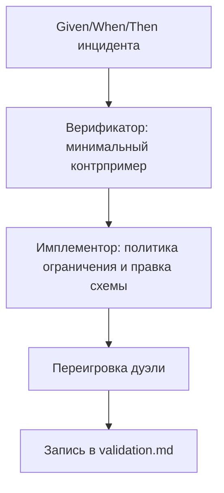

# Прикладная часть 4. LLM-дуэль: Верификатор против Имплементора в формальных утверждениях

**Статус: Фронтир.** Для учебного прохождения достаточно офлайн-прогона из `examples/tribunal/`: он показывает, как один контрпример превращается в проверяемый вердикт. Реальные LLM-роли, ротация моделей и внешний Координатор нужны только полному production-треку.

Чтобы не пересказывать главу до того, как мы её начали, оттолкнёмся от одного сценария. В кластере AgentClinic-production загружен сервис `appointments-api`. Загрузка CPU 98%, реплик 12, квота позволяет добавить ещё 3, лимит реплик — 15. Прилетает вебхук: «увеличьте количество реплик на 200%». Формально просьба корректна — все поля заполнены, диапазоны валидны. А выполнить её нельзя: квоты не хватит, лимит не позволит. Дальше всю главу будет крутиться вокруг этого `autoscale_200pct` — того же AgentClinic, который в [части 12 первого тома](../book/part-12-mvp.md) мы доводили до MVP, только теперь под нагрузкой.

Возможны два сценария реакции. Первый: правило поведения настроено только на «формальную корректность входа», и автоскейлер уходит в ошибку посередине действия. Второй: в правиле есть отдельная проверка эксплуатационных границ — квоты, лимита, радиуса последствий, — и автоскейлер либо безопасно ограничивает свой шаг, либо отказывается с диагностикой. Этой главе важно научить второму: довести правило до состояния, в котором его не сломает простой нарушающий вход.

Технику, которую мы для этого применим, не стоит путать с одноимённым термином из ML (adversarial validation там обозначает обнаружение сдвига между train и test выборкой бинарным классификатором) — она ближе к двум другим прецедентам: циклу CEGAR (Counterexample-Guided Abstraction Refinement — «абстракция → контрпример → уточнение», Clarke, Grumberg, Jha, Lu, Veith, CAV 2000) и схеме «AI Safety via Debate» (Irving, Christiano, Amodei, 2018), где два агента спорят перед арбитром. Здесь одна модель ищет минимальный нарушающий пример, вторая чинит правило и реализацию до устойчивого PASS. В тексте короче — **LLM-дуэль**: Верификатор (Verifier) и Имплементор (Implementor) спорят по файлам, пока минимальный **контрпример** — конкретный вход, который проходит схему, но ломает заявленное правило, — не становится частью спецификации. В Qwen Code это не встроенная команда; качество результата зависит от выбора моделей, длины контекста, дисциплины протокола и состава ролей.

С другими техниками главу путать не стоит. Ядовитая спецификация из главы 2 проверяет, умеете ли вы создать и исправить один дефект требований. Мутанты из главы 5 проверяют, ловит ли валидатор целый класс дефектов. Дуэль проверяет третье: способен ли Верификатор построить минимальный контрпример к уже сформулированному правилу, а Имплементор — закрыть именно этот провал. В главе 8 тот же спор оформится в процедуру файлового арбитража с Координатором, `judgment.md` и `precedents.md`; здесь нам нужен только один раунд по одному правилу.

Глава опирается на две идеи первого тома: «спецификация направляет, факты допускают к слиянию» из [части 9](../book/part-09-feature-validation.md) и независимое ревью пакета фактов человеком из [части 16](../book/part-16-team-code-review.md). Разница в одном: контрпример строит не ревьюер-человек, а вторая модель, и делает это до слияния, а не после.

## Перед чтением

- Опора из первого тома: часть 9 даёт проверяемые факты, часть 16 — независимое ревью.
- Локальный учебный кейс: `autoscale_200pct`, потому что квота и лимит реплик дают компактный контрпример.
- След для `capstone/`: один `next_guard` для `high_memory_usage`, например запрет обходить stateful-блокер даже при хорошем readiness-score.
- Главный термин первого прохода: контрпример. Роли (Верификатор/Имплементор/Safety) подробно разбираются в части 8; здесь достаточно пары Верификатор–Имплементор.
- Что отложить: ротацию моделей, ярусы (tier) и внешний Координатор.

## Цель

Вы сможете внедрить LLM-дуэль Верификатор↔Имплементор в проект автоматического управления инцидентами. Цель — довести формальную Given/When/Then-спецификацию до состояния, устойчивого к контрпримерным атакам.

Практический результат — не абстрактная проверка текста, а рабочий протокол. Он состоит из четырёх шагов:

- инцидентный сценарий связывается с JSON Schema;
- спорные условия проверяются минимальными контрпримерами;
- эксплуатационные лимиты становятся частью спецификации;
- каждый провал фиксируется как воспроизводимое улучшение в `validation.md`.

## Минимальный учебный сценарий

### Учебный кейс

`autoscale_200pct`: вебхук просит увеличить количество реплик на 200%, но `remaining_quota=3`, а `max_replicas=15`. Нужно доказать, что действие либо ограничивается безопасным `allowed_delta`, либо блокируется с диагностикой.

### Подготовка

- `book2/examples/tribunal/specs/autoscale_spec.yaml`.
- `book2/examples/tribunal/cases/autoscale_counter_200pct.json`.
- Скрипт `book2/examples/tribunal/scripts/run_duel.py`.

### Шаги

1. `cd book2/examples/tribunal`. *Ожидание: вы в каталоге runnable-примера.*
2. `python3 scripts/run_duel.py --spec specs/autoscale_spec.yaml --cases cases/ --out out/duel.json`. *Ожидание: создан `out/duel.json` с вердиктами по контрпримерам.*
3. Найдите в `out/duel.json` случай `autoscale_counter_200pct`. *Ожидание: видно, какой Then проверялся и почему контрпример допустим по входной схеме.*
4. Перепишите вывод в `validation.md`: `duel_id`, `assertion_id`, `counterexample`, `verdict`, `next_guard`.
5. Не переходите к файловому арбитражу целиком. В этом минимуме важно только доказать, что один контрпример превращается в новое проверяемое правило.

### Контрольный факт

Контрпример содержит только поля, необходимые для нарушения: текущие реплики, квоту, лимит и процент масштабирования. Если для объяснения нужны лишние поля, контрпример ещё не минимален.

### Как это попадает в `capstone/`

Перенесите в `capstone/validation.md` один `duel_id`, один `assertion_id`, минимальный `counterexample` и `next_guard`. Runnable-пример использует `autoscale_200pct`, а основной зачётный кейс — `high_memory_usage`. Перенос делается не копированием контрпримера, а формулировкой принципа.

| Что брать из `autoscale_200pct` | Что записать в `capstone/validation.md` для `high_memory_usage` |
|---|---|
| Минимальный контрпример: только поля, без которых нарушение исчезает | Минимальный контрпример к одному правилу `restart_pod`: `readiness=24/25`, `stateful=true`, `backup_verified=false` |
| `next_guard: duplicate_webhook_must_not_double_scale` | `next_guard: stateful + backup=false блокирует dry-run даже при readiness >= 23/25` |
| Эксплуатационная граница: `quota`, `blast-radius` | Эксплуатационная граница: `restart_pod` не расширяется до namespace |

Минимальный фрагмент:

```yaml
duel_id: duel-high-memory-001
assertion_id: HM-READINESS-01
counterexample: "readiness=24/25, stateful=true, backup_verified=false"
verdict: PASS
next_guard: "Given stateful=true и backup_verified=false When readiness >= 23/25 Then dry-run заблокирован с диагностикой STATEFUL_BACKUP_REQUIRED"
```

### Ревьюируемый след

`out/duel.json` — локальный результат. В учебном пакете сохраняйте не его, а запись в `validation.md` или короткий прецедент с указанием, какой guard появился после дуэли.

## Ключевые идеи

Оформляйте инцидентный сценарий в строгом Given/When/Then. Минимальный пример достаточно держать в трёх строках:

- **Given:** `current_replicas=12`, `remaining_quota=3`, `max_replicas=15`.
- **When:** вебхук просит `scale_up_percent=200`.
- **Then:** либо масштабирование укладывается в лимит, либо действие отказано с диагностикой и без изменения состояния.

Каждое поле Given и Then позже связывается с типом и ограничением JSON Schema; сама схема разбирается ниже фрагментами. Полный список полей, которые в реальном правиле уйдут в Given (кластер, пространство имён, дедупликационное окно, источник вебхука, доверенный контекст мониторинга), и в Then (диагностический код, отсутствие повторного действия в окне дедупликации, сохранение аудит-следа) дописывайте по мере роста сценария — не как заранее заполненный шаблон, а как реакцию на найденные контрпримеры.

Такой формат согласуется с практикой «сначала спецификация» (specification-first) в SDD ([GitHub Spec Kit](https://github.com/github/spec-kit)) и с пользовательскими историями с критериями вида Given/When/Then ([Wikipedia: Given-When-Then](https://en.wikipedia.org/wiki/Given-When-Then)).

Задавайте правила дуэли до запуска. Иначе спор между агентами быстро превратится в переговоры о смысле требований. Введём роли. **Верификатор** — роль, которая ищет минимальный контрпример к утверждению Then. **Имплементор** — роль, которая чинит код и правило после провала. Верификатор побеждает, если строит валидный минимальный контрпример: он удовлетворяет входной схеме, но нарушает утверждение Then. Имплементор побеждает только при двух условиях: обновлены код и правило; повторный прогон дуэли больше не находит тот же класс провала и не ломает существующие инварианты.

Минимальность контрпримера — отдельное требование. Контрпример должен содержать ровно те поля и значения, без которых нарушение исчезает. Не произвольный набор шумовых условий, а узкий выжимающий пример.

**Плохо:**

> контрпример со множеством шумовых полей: `cluster_id`, `namespace`, `labels`, `annotations`, `node_pool`, `region`, `current_replicas`, `remaining_quota`, `scale_up_percent`, `last_deploy_at`, `owner_team`.

Проблема: при правке непонятно, какое поле действительно ломает Then. Регрессия не воспроизводится в чистом виде.

**Хорошо:**

> минимальный контрпример только с критичными полями: `current_replicas=12`, `remaining_quota=3`, `scale_up_percent=200`.

Например, для autoscale достаточно `current_replicas=12`, `remaining_quota=3`, `pod_cpu=1`, `scale_up_percent=200`. Для воспроизводимости Верификатор публикует `counterexample.json` с полями `given_snapshot`, `when_payload`, `assertion_id`, `minimality_trace`. Имплементор отвечает четырьмя артефактами: `repair.patch`, `schema_delta`, `rationale` и списком `affected_assertions`.

Фиксируйте эксплуатационные границы как часть спецификации, а не как устные договорённости команды. Перечислим их:

- квоту (`quota`),
- ограничение частоты (`rate-limit`),
- радиус последствий (`blast-radius`),
- дедупликация,
- окно повторных действий,
- максимальный размер изменения.

Почему это важно. Если схема проверяет только типы, то `scale_up_percent` может быть целым числом и одновременно приводить к недопустимому расходу ресурса.

Поэтому добавляйте в Then условия вида:

- `target_replicas <= max_replicas`,
- `executed_delta <= remaining_quota / pod_cpu`,
- `actions_per_window <= max_actions_per_window`,
- `affected_services <= blast_radius_limit`.

Это переводит проверку из чисто логической плоскости в эксплуатационную. Система не просто «правильно рассуждает». Она доказывает, что действие не выйдет за пределы безопасного радиуса.

Каждый спорный запуск сохраняйте в `validation.md` как цепочку доказательств, а не как свободный комментарий в тикете. Включайте в запись:

- `duel_id`,
- `assertion_id`,
- проваливающийся случай,
- версию спецификации до правки,
- изменение JSON Schema,
- изменение кода,
- новый вердикт,
- ссылку на проход теста дуэли.

Отдельное поле `next_guard` задаёт новое правило, которое обязано проверяться в будущих запусках. Например, «повторный вебхук в течение 2 секунд не увеличивает `executed_delta`». Такой журнал превращает единичный инцидент в каталог прецедентов. Если похожая ошибка возникнет снова, CI сможет воспроизвести старый провальный случай и заблокировать регрессию до слияния.

Встраивайте дуэль в учебный конвейер инцидентного проекта так, чтобы каждый новый инцидент автоматически ужесточал спецификацию. Нормализованный вебхук от PagerDuty или Grafana проходит четыре шага:

1. проверку схемы (schema lint),
2. валидацию Given/When/Then,
3. дуэль Верификатор↔Имплементор,
4. реплей истории из `validation.md` после фикса.

Что происходит, если Верификатор нашёл новый контрпример. Конвейер не должен ограничиваться красным статусом. Он должен требовать `schema_delta`, обновления правила и повторного зелёного прохода. В результате проект обучается не на декларациях, а на проверяемых следах: новые инциденты расширяют матрицу верификации, усиливают блокировку в CI и уменьшают пространство неявных трактовок.

## Примеры и применение



Сценарий тот же `autoscale_200pct`, который мы запустили в «Минимальном учебном сценарии». Здесь мы смотрим на него с другого ракурса: как Имплементор закрывает провал через JSON Schema, а не только через правило. Запрошенное увеличение требует 12 дополнительных реплик, квота позволяет добавить только 3, а `target_replicas=24` нарушает `max_replicas=15`. Имплементор отвечает формулой `allowed_delta = min(requested_delta, floor(remaining_quota / pod_cpu), max_replicas - current_replicas)` и политикой `hard_block | soft_clamp`. Но формула без схемы — это всё ещё устная договорённость.

JSON Schema закрепляет правило. Чтобы не путать сразу в десяти полях, посмотрим её тремя короткими блоками: что идентифицирует источник, что описывает текущее состояние и что задаёт политику ответа.

Сначала идентификация источника. Без неё две одинаковые просьбы из разных систем мониторинга нельзя различить:

```json
{
  "cluster_id": {"type": "string", "minLength": 1},
  "source_service": {"type": "string", "enum": ["pagerduty", "grafana"]},
  "scale_up_percent": {"type": "integer", "minimum": 1, "maximum": 1000}
}
```

Дальше — состояние кластера на момент запроса. Это поля, которыми Верификатор оперирует, когда строит контрпример:

```json
{
  "current_replicas": {"type": "integer", "minimum": 0},
  "pod_cpu": {"type": "number", "exclusiveMinimum": 0},
  "remaining_quota": {"type": "integer", "minimum": 0},
  "max_replicas": {"type": "integer", "minimum": 1}
}
```

Наконец, политика ответа. Это поля, которые Имплементор вынужден добавить после первого же контрпримера, потому что без них правило умеет только ломаться:

```json
{
  "max_actions_per_window": {"type": "integer", "minimum": 1},
  "clamp_policy": {"type": "string", "enum": ["hard_block", "soft_clamp"]}
}
```

В собранном виде это один объект с `required: [cluster_id, source_service, scale_up_percent, current_replicas, pod_cpu, remaining_quota, max_replicas, max_actions_per_window, clamp_policy]`. Главное в нём — не количество полей, а то, что политика ответа описана наравне с состоянием.

После правки Верификатор обязан переиграть не только исходный `autoscale_200pct`, но и соседние случаи:

- отсутствующий `cluster_id`,
- нулевую квоту,
- повторный вебхук внутри дедупликационного окна,
- `remaining_quota=1` при `current_replicas=max_replicas`,
- конфликт `soft_clamp` с `blast_radius_limit`.

Это защищает от узкой латки, которая закрывает один пример и оставляет рядом эквивалентный провал.

В CI такой прогон представляется как последовательность команд. Первая проверка валидирует схему. Вторая запускает дуэль. Третья требует записи в журнал:

> **[project script]** — `lint_spec.py` и `lint_validation.py` здесь проектные шлюзы; запускаемый аналог дуэли см. в [examples/tribunal/README.md](examples/tribunal/README.md).

```bash
python3 scripts/spec_ci/lint_spec.py spec/incident-autoscale.md

python3 scripts/tribunal/run_duel.py \
  --scenario autoscale \
  --case autoscale_counter_200pct.json \
  --max-rounds 8 \
  --out .artifacts/duels/autoscale.json

python3 scripts/spec_ci/lint_validation.py \
  validation.md \
  --require next_guard
```

Фрагмент `validation.md` должен быть достаточно конкретным, чтобы другой агент или инженер мог повторить спор без устных пояснений.

Например, запись `du-2026-001` хранит:

- проваливающийся случай `autoscale_counter_200pct`,
- старое правило `target_replicas = current_replicas + requested_delta`,
- новое правило с `allowed_delta`,
- выбранную стратегию `soft_clamp`,
- вердикт `PASS` после реплея,
- `next_guard: duplicate_webhook_must_not_double_scale`.

Что делать, если Верификатор и Имплементор не сходятся после заданного числа раундов. Здесь подключается ещё одна роль — **Координатор** (Coordinator), арбитр, который ведёт протокол дуэли и фиксирует исход. Координатор проставляет `DEFERRED` и переводит случай в ручную проверку (manual-review). Делает это только с явным описанием спорного инварианта. Так предотвращается бесконечная диагностика циклов и в истории остаётся точка, к которой можно вернуться после уточнения политики.

## Итог

LLM-дуэль Верификатор↔Имплементор делает живую спецификацию управляемым механизмом проверки инцидентных решений. Соберём роли по шагам:

- Given/When/Then задаёт поведенческий контракт;
- JSON Schema ограничивает допустимое пространство входов;
- Верификатор ищет минимальный контрпример;
- Имплементор исправляет правило и реализацию;
- `validation.md` сохраняет провал как регрессионный актив.

Главная ценность подхода проявляется в эксплуатационных границах. Квота, ограничение частоты и радиус последствий становятся частью проверяемого утверждения. Поэтому автоматическая ремедиация не подменяет безопасность формально правильным, но опасным действием. Следующая глава переведёт дуэль в генератор стресс-спецификаций.

## Артефакты и критерии готовности

Учебный минимум — три артефакта и три условия, по которым их можно считать готовыми.

| Артефакт | Готов, когда |
|---|---|
| Given/When/Then-сценарий | покрывает одно спорное требование, проверяемые поля связаны с JSON Schema |
| `counterexample.json` или запись в `validation.md` | вход валиден по схеме и нарушает только проверяемый Then; контрпример минимален или явно помечен как не минимальный |
| `next_guard` | новое правило сформулировано в Given/When/Then-форме и будет проверяться после починки |

Полный трек добавляет `repair.patch` / `schema_delta` от Имплементора, запись `validation.md` с `duel_id` и ссылкой на повторный прогон, матрицу соседних контрпримеров и локальный smoke-pass запускаемого аналога дуэли из `examples/tribunal/`. Считайте полный трек готовым, если Имплементор меняет правило и контракт (а не только объяснение) и повторная дуэль не находит тот же класс провала.

## Практика

1. `cd book2/examples/tribunal && python3 scripts/run_duel.py --spec specs/autoscale_spec.yaml --cases cases --out out/duel.json` — *ожидание: stderr показывает `PASS autoscale_counter_200pct` и `PASS duplicate_webhook_within_dedup_window`; в `out/duel.json` у `autoscale_counter_200pct` поле `verdict: "PASS"`, `actual.diagnostic_code: "QUOTA_EXCEEDED_AFTER_CLAMP"`, `actual.allowed_delta: 3`.*
2. Откройте `judgment.example.md` и сверьте, что для `autoscale_counter_200pct.json` поле `counterexample_id` равно имени файла без `.json`, а `assertion_id` равен `allowed_delta_within_quota`. *Ожидание: идентификаторы согласованы — `counterexample_id` совпадает с именем файла, `assertion_id` ссылается на нарушенный Then.*
3. Перенесите в `capstone/validation.md` одну строку: «контрпример `<counterexample_id>` нарушает Then `<assertion_id>`; добавлен `next_guard: <…>`». *Ожидание: имя контрпримера совпадает с `counterexample_id` из `out/duel.json`, формулировка `next_guard` написана в Given/When/Then-форме.*

## Контрольные вопросы

1. Зачем контрпример обязан быть минимальным?
2. Почему свободное объяснение не заменяет доказательство?
3. Что Имплементор обязан изменить после провала дуэли — кроме кода?
4. Верификатор нашёл контрпример, но Имплементор чинит только код без правки JSON Schema. Через неделю похожий контрпример проходит. Где ошибка в процедуре дуэли?
