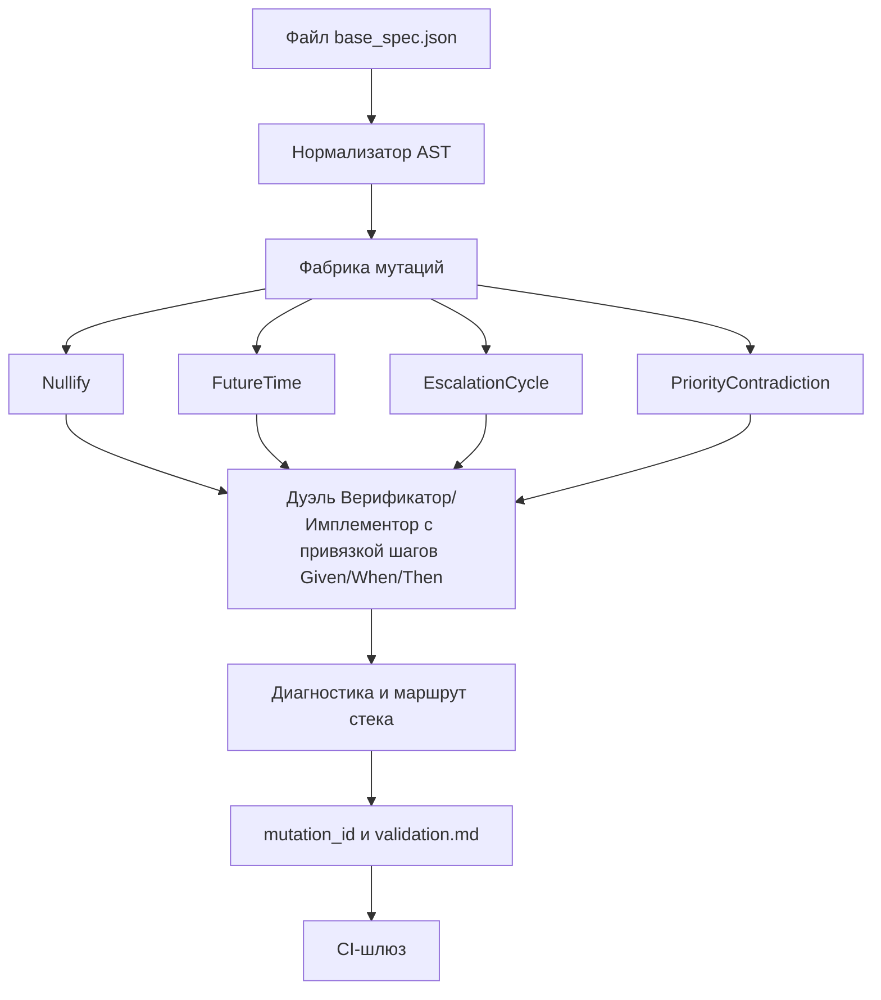

# Прикладная часть 5. Мутационное тестирование спецификаций

**Статус: Фронтир.** Мутационное тестирование (mutation testing) для спецификаций и вектор метрики иммунитета (immunity score) — практика, которая ещё не стандартизована. Идея «один мутант — один ожидаемый отказ» относится к рекомендации. Сами наборы операторов и пороги нужно настраивать под проект.

Для учебного прохождения достаточно запустить `examples/stress-mutator/` и увидеть, что один мутант даёт один ожидаемый отказ. Подбор операторов, порогов и CI-шлюза — полный production-трек.

Введём базовые понятия. **Мутационное тестирование** — техника, при которой эталонный артефакт контролируемо «портится», а тест-контур обязан этот дефект поймать. **Метрика иммунитета** — векторная метрика устойчивости валидатора, состоящая из трёх компонент:

- `strict_reject_rate` — доля кейсов, отклонённых строго на ожидаемом шаге;
- `depth_of_diagnostics` — полезная глубина диагностики до отказа;
- `recovery_time` — время до возвращения стабильного вердикта.

Образное название «вакцинация валидаторов» означает обычное мутационное тестирование спецификаций. Валидатор получает контролируемо испорченные входы и обязан отклонить их на ожидаемом шаге.

Граница с соседними механизмами такая. В главе 2 вы создаёте один ручной дефект, чтобы научиться читать симптом. В этой главе вы создаёте серию машинных мутантов, чтобы измерить устойчивость валидатора. В главе 4 Верификатор ищет минимальный контрпример к правилу, а не перебирает каталог операторов мутации. В главе 8 результат таких проверок может стать доказательством для вердикта, но сам файловый арбитраж не заменяет генератор мутантов.

Глава опирается на дисциплину фактов из [части 9 первого тома](../book/part-09-feature-validation.md). Без неё мутации не имеют смысла. Мутант проверяет именно факт отказа на ожидаемом шаге Given/When/Then. Простейший пример этой дисциплины уже встречался в учебном AgentClinic: пустой текст отзыва из [части 12](../book/part-12-mvp.md) обязан быть отклонённым. Здесь та же логика обобщается до набора операторов мутации, привязанных к каталогу классических ошибок из [части 20. Антипаттерны SDD](../book/part-20-sdd-antipatterns.md).

## Перед чтением

- Опора из первого тома: часть 9 вводит факты проверки, часть 20 — классы ошибок процесса.
- Локальный учебный кейс: `appointment_latency_spike` (минимальный incident-payload, на нём построен `base/base_spec.json` в runnable-примере).
- След для `capstone/`: seed, список операторов, три метрики иммунитета и вердикт как строка в `validation.md` для `high_memory_usage`.
- Главные термины первого прохода: мутационное тестирование (вход в главу) и метрика иммунитета (выход — три компоненты вектора). Остальные — операторы мутации, фабрика мутаций, «вакцинация валидаторов» — справочные, открываются только при настройке CI-шлюза.
- Что отложить: подбор операторов, калибровку порогов и CI-шлюз мутаций.

## Цель

После этой главы читатель соберёт генератор вырожденных спецификаций для проекта автоуправления инцидентами и настроит валидаторный контур, который делает три вещи: отбрасывает абсурдные кейсы с точной диагностикой, сохраняет цепочку доказательств в SDD, вычисляет метрику иммунитета перед merge. Валидатор перестаёт быть сторожем синтаксиса и становится инструментом анатомической диагностики: показывает факт отказа, поле, шаг `Given/When/Then`, правило JSON Schema, маршрут падения и регрессионный риск. Это согласуется с подходом «сначала спецификация» (spec-first) — контракт предшествует планированию и реализации кода ([GitHub Spec Kit](https://github.com/github/spec-kit)).

## Минимальный учебный сценарий

### Учебный кейс

Production-инцидент `appointment_latency_spike` (производная от учебной фичи `/agents` из [book/part-11-second-feature-phase.md](../book/part-11-second-feature-phase.md)): SLA 10 минут, эскалация от `appointments_oncall` к `sre_lead`. Мутация `Nullify` обнуляет `severity`. Ожидание — валидатор останавливается перед `When:evaluate_sla_window` с кодом `EMPTY_REQUIRED_FIELD`, до расчёта SLA и до выбора владельца.

### Подготовка

- `book2/examples/stress-mutator/base/base_spec.json` — корректный исходник.
- `book2/examples/stress-mutator/expected/expected_failures.json` — ожидаемые `(diagnostic_code, halt_before)` под ключом `by_operator` и пороги иммунитета в `thresholds`.
- `book2/examples/stress-mutator/scripts/mutate_specs.py`, `fake_validator.py`, `immunity_score.py`.
- `book2/examples/stress-mutator/manifest.example.json` — эталон детерминизма.

### Шаги

1. `cd book2/examples/stress-mutator`. *Ожидание: вы в каталоге примера, дополнительных зависимостей нет.*
2. `python3 scripts/mutate_specs.py --base base/base_spec.json --seed 20260517 --operators Nullify,FutureTime,EscalationCycle,PriorityContradiction --out out/mutations`. *Ожидание: создан `out/mutations/manifest.json` и по JSON-файлу на каждого мутанта.*
3. Контроль детерминизма — повторить шаг 2. *Ожидание: список `mutation_id` и порядок совпали с предыдущим запуском.*

   **Плохо:** один прогон без повторного запуска — невозможно отличить детерминированный генератор от случайного шума.
   **Хорошо:** два запуска подряд, одинаковый порядок `mutation_id`, регрессионная база воспроизводима.

4. Сравнить `out/mutations/manifest.json` с `manifest.example.json` через `diff`. *Ожидание: 0 строк различий.*
5. `python3 scripts/fake_validator.py --mutations out/mutations --out out/validator_results.json`. *Ожидание: для каждого `mutation_id` в результате есть пара `diagnostic_code` + `halt_before`.*
6. `python3 scripts/immunity_score.py --validator-results out/validator_results.json --expected expected/expected_failures.json`. *Ожидание: `strict_reject_rate >= 0.98`, `depth_of_diagnostics >= 3`, `recovery_time_p95_ms <= 1200`.*
7. Для учебного минимума на этом остановитесь: runnable-пример доказал детерминизм мутантов, ожидаемые отказы и расчёт иммунитета.

Если у вас установлен Qwen Code и вы хотите получить дополнительное объяснение, выполните отдельный необязательный шаг:

```bash
qwen -p "Прочитай @out/validator_results.json и @expected/expected_failures.json. Какие мутанты отклонены не на ожидаемом шаге? Файлы не меняй." --approval-mode plan
```

Этот запрос не заменяет runnable-проверку. Его результат можно использовать как комментарий к ревью, но не как единственный факт готовности.

Полный production-трек добавляет отдельный CI-шлюз. В своём проекте это обычно `python3 scripts/ci_gate.py --strict-reject-min 0.98 --diag-depth-min 3 --recover-ms-p95 1200 --fail-on-regression` — три порога, любое нарушение блокирует слияние. Запускаемого аналога именно для stress-mutator в учебнике нет; близкий по идее `examples/goodhart-validator/scripts/ci_gate.py` показан в части 10.

### Контрольный факт

Три метрики из шага 6 одновременно удовлетворяют порогам. `manifest.json` побитово совпадает с `manifest.example.json`. Если выполняли необязательный Qwen-запрос, его вывод не должен противоречить runnable-фактам. Без детерминизма, ожидаемых отказов и зелёной метрики иммунитета учебный конвейер не считается зелёным.

### Как это попадает в `capstone/`

Перенесите в `capstone/validation.md` или короткий `capstone/README.md` только итог smoke-прогона: seed, операторы, три метрики иммунитета и вердикт. Не переносите каталог `out/mutations`: он должен оставаться воспроизводимым локальным следом, а не ревьюируемым артефактом.

Минимальный фрагмент:

```yaml
stress_run:
  seed: 20260517
  operators: [Nullify, FutureTime, EscalationCycle, PriorityContradiction]
  strict_reject_rate: "1.0 >= 0.98"
  depth_of_diagnostics: "4.0 >= 3"
  recovery_time_p95_ms: "850 <= 1200"
  verdict: PASS
```

### Ревьюируемый след

Каталог `out/` — результат локального прогона и игнорируется в `book2/examples/.gitignore`. Не коммитьте его как учебный артефакт и не делайте коммит ради отметки. Для первого прохода достаточно строки в `capstone/validation.md`: seed, операторы, три метрики и verdict.

В своём production-репозитории можно хранить короткий отчёт `outputs/immunity.last-run.json`, если он создаётся CI и участвует в ревью. В учебном маршруте источником истины остаётся воспроизводимая команда и минимальный `capstone`-фрагмент выше.

## Ключевые идеи

Делите вырожденные сценарии инцидентного процесса на четыре класса. **Пустые поля** — это не только `null`: сюда же входят пустые строки, пустые массивы владельцев, отсутствующие `severity`, `service_id` или `runbook_ref` — любая пустота, без которой невозможно выбрать безопасное действие. **Временные аномалии** выглядят формально корректно: ISO-метка есть, но `response_timestamp` оказывается раньше `event_received_at` или позже согласованного `now`. **Обратимые циклы эскалации** и **рекурсивные зависимости** опаснее обычных пропусков — они могут отправить исполнительный контур в бесконечное переопределение владельца, приоритета или следующего действия.

Введём ещё одно понятие. **Фабрика мутаций** — не случайный генератор шума, а детерминированный мутатор поверх корректного `base_spec.json`. Базовая спецификация разбирается в синтаксическое дерево (AST) с явными узлами `Given/When/Then`, матрицей SLA, правилами эскалации и фрагментами JSON Schema. Далее к ней применяются операторы:

- `Nullify` — обнуление поля;
- `FutureTime` — сдвиг временной метки в будущее;
- `EscalationCycle` — добавление обратного ребра в граф эскалации;
- `PriorityContradiction` — введение взаимно противоречивых правил приоритета.

В будущих расширениях добавится `RecursiveDependency` для косвенной рекурсии между вычисляемыми полями.

Принцип «один мутант — один ожидаемый отказ» — главное правило фабрики. Покажем контраст.

**Плохо:**

> один мутант одновременно обнуляет `service_id`, разворачивает граф эскалации и инвертирует приоритеты; `expected_failure` не задан.

Проблема: при провале нельзя локализовать причину. Валидатор может остановиться на любом из трёх дефектов, регрессия привязана к составному артефакту.

**Хорошо:**

> один мутатор `Nullify` обнуляет только `severity`; `expected_failure.code = EMPTY_REQUIRED_FIELD`, `halt_before = When:evaluate_sla_window`.

Каждый запуск получает фиксированное зерно (`seed`). Один и тот же вход создаёт один и тот же список `mutation_id` в стабильном порядке. Это критично для дуэли Верификатора и Имплементора: спорный кейс можно воспроизвести, отдать обеим ролям и проверить, кто именно нарушил контракт.

> **[runnable]** — минимальная реализация этого интерфейса есть в [examples/stress-mutator/README.md](examples/stress-mutator/README.md).

```bash
cd book2/examples/stress-mutator

python3 scripts/mutate_specs.py \
  --base base/base_spec.json \
  --seed 20260517 \
  --operators Nullify,FutureTime,EscalationCycle,PriorityContradiction \
  --out out/mutations

python3 scripts/fake_validator.py \
  --mutations out/mutations \
  --out out/validator_results.json
#### CONTROL: повторный запуск с тем же seed должен выдать тот же список mutation_id и тот же порядок
```

Комбинаторный взрыв появляется уже при глубине 2–3. Задавайте генератору политику отбора, а не полный перебор: минимум один мутант на каждый класс (обязательное поле, временное окно, граф эскалации, рекурсивная зависимость, конфликт приоритетов). Связывайте приоритет операторов с историей инцидентов: если пост-мортемы чаще показывают ошибочные временные окна, давайте `FutureTime` и `NegativeLag` больший вес в очереди. Направленное fuzzing-тестирование проверяет исторически хрупкие места контракта, а не расходует токеновый бюджет на равномерный хаос.



Привязывайте каждый мутант к конкретному шагу `Given/When/Then` и конкретному правилу JSON Schema. Иначе диагностика останется слишком общей для исправления. Связки должны быть явными: мутация `Nullify(service_id)` относится к `Given:incident_received` и правилу `required.service_id`, а мутация `FutureTime(response_timestamp)` — к `When:evaluate_sla_window` и ограничению `format + maximum(now)`.

Если мутант ломает `Then:notify_primary_owner`, отчёт должен показать суть проблемы. Дело не в уведомлении как действии. Дело в невозможности вычислить допустимого владельца после повреждения маршрута. Такая трассировка сокращает ручную отладку: инженер видит точку застревания, а не только итоговое `VALIDATION_FAILED`.

```json
{
  "mutation_id": "m_20260517_0009",
  "operator": "EscalationCycle",
  "target_step": "When:route_escalation",
  "json_schema_rule": "$defs.escalation_graph.no_cycles",
  "failed_step": "Verifier::GraphCheck::Escalation",
  "stack_route": [
    "schema.normalize",
    "step.when.prepare",
    "graph.build",
    "graph.detect_cycle",
    "halt"
  ]
}
```

Диагностика циклов требует отдельного графового прохода. Причина в том, что JSON Schema хорошо проверяет форму данных, но не всегда выражает топологическое поведение маршрута. Для `EscalationCycle` валидатор строит ориентированный граф владельцев или очередей и запускает поиск в глубину (DFS) с состояниями `white/gray/black`. Обнаружение `gray`-узла возвращает минимальный цикл, например `primary_oncall → sre_lead → primary_oncall`.

Для обратимых переходов приоритетов используется похожий контроль. Если `P1` по одному правилу понижается до `P2`, а затем другое правило возвращает `P2` в `P1` без правила-разрешителя ничьей (`tie_breaker`), валидатор обязан остановиться до исполнительной фазы. Диагностический код должен отличать `CYCLE_ESCALATION` от `PRIORITY_REVERSAL`. Первое исправляется графом маршрутов. Второе — политикой разрешения конфликтов.

Проверяйте временные аномалии раньше маршрутизации. Неверное время искажает SLA, severity и выбор канала реакции. Дайте валидатору как минимум три якоря — `event_detected_at`, `event_received_at`, согласованный `now` из контролируемого источника времени — и политику `max_reaction_lag`. Соответственно, отказ получает один из трёх кодов: `INVALID_TIME_ANCHOR` (если `response_timestamp` в будущем — проблема во входной нагрузке), `NEGATIVE_RESPONSE_LAG` (отрицательная задержка реакции — проблема в нормализации времени) или `STALE_INCIDENT_WINDOW` (событие старше допустимого окна — проблема в SLA-правиле). Разные коды важны для SDD-журнала: они показывают, где именно ослаблен контракт.

Рекурсивные зависимости отличаются от циклов тем, что могут не выглядеть как короткая петля в графе. Типичная цепочка: `owner` вычисляется из `priority`, `priority` зависит от `blast_radius`, `blast_radius` запрашивает `owner_group`, а `owner_group` снова требует уже вычисленного `owner`.

Для таких случаев задайте лимит разворачивания, например `max_resolution_depth = 8`. Сохраняйте трассу попыток разрешения зависимостей. Если лимит превышен, валидатор возвращает `RECURSION_LIMIT` вместе с цепочкой полей, а не маскирует проблему под таймаут. Это защищает LLM-исполнителя от бесконечного уточнения условий и делает каскад отказов наблюдаемым.

Теперь о метрике иммунитета (компоненты вектора — в начале главы). Вводите её как вектор, а не как одну итоговую оценку. Если `strict_reject_rate` растёт, но `depth_of_diagnostics` падает до единицы, контур стал строже, но слепее. Если `recovery_time_p95_ms` выходит за лимит, даже корректный валидатор начинает тормозить CI и провоцирует обходные практики.

Стройте блокировку в CI на порогах иммунитета и регрессионном сравнении с предыдущим проходом. Для учебного контура начните со следующих значений:

- `strict_reject_rate >= 0.98`,
- `depth_of_diagnostics >= 3`,
- `recovery_time_p95_ms <= 1200`.

Затем калибруйте значения по фактической нагрузке и числу мутантов.

Слияние блокируется, если новое изменение делает хотя бы одно из трёх:

- пропускает старый `mutation_id`,
- ухудшает диагностическую глубину,
- превышает лимит времени восстановления.

Такой шлюз защищает не только JSON Schema, но и весь валидаторный контур: нормализатор, графовые проверки, правила `Given/When/Then` и формат отчёта.

> **[runnable]** — команда ниже соответствует `book2/examples/stress-mutator`.

```bash
cd book2/examples/stress-mutator

python3 scripts/immunity_score.py \
  --validator-results out/validator_results.json \
  --expected expected/expected_failures.json
```

В своём проекте этот шлюз обычно выглядит как `python3 scripts/ci_gate.py --strict-reject-min 0.98 --diag-depth-min 3 --recover-ms-p95 1200 --fail-on-regression`. Готового скрипта именно для stress-mutator в учебнике нет; идея «один не прошедший порог = блок» сохранена в близком по форме `examples/goodhart-validator/scripts/ci_gate.py` (часть 10).

Фиксируйте результаты прогона в SDD как цепочку доказательств, а не как разовый лог тестов: `mutation_id`, различие (diff) спецификации, исходный и мутированный фрагменты, журнал отклонений, код диагностики, `stack_route`, ссылка на правило JSON Schema и итоговая запись в `validation.md`. Для ревью особенно полезно хранить `expected_failure` и `actual_failure`: если они расходятся, валидатор, возможно, отклоняет кейс случайно или слишком поздно. Такая структура превращает каталог мутаций в каталог прецедентов, где каждое новое правило связано с конкретной слепой зоной и проверяемым основанием.

## Полный трек: калибровка порогов

Таблица «Низкий / По умолчанию / Высокий» для `strict_reject_rate`, `depth_of_diagnostics`, `recovery_time_p95_ms` и количества мутантов на класс, упражнение по сдвигу порога и сигналы для пересмотра вынесены в [Приложение D, раздел D.1](appendix-d-threshold-calibration.md#d1-мутационное-тестирование-глава-5). На первом проходе раздел не нужен.

## Примеры и применение

Пример: корректная спецификация описывает инцидент `appointment_latency_spike`. SLA требует реакции за 10 минут. Маршрут эскалации идёт от `appointments_oncall` к `sre_lead`.

Мутатор создаёт `m_20260517_nullify_855e4297f7`. В нём поле `severity` заменено пустой строкой. Мутант связан с `Given:incident_received` и правилом `severity.minLength`. Ожидаемый отказ — `EMPTY_REQUIRED_FIELD`. Конвейер должен остановиться перед `When:evaluate_sla_window`, до расчёта SLA и до выбора владельца.

Если вместо этого валидатор доходит до `Then:notify_owner`, значит пустое поле `severity` протекло слишком глубоко и может породить ложное уведомление о неклассифицированном инциденте.

```json
{
  "mutation_id": "m_20260517_nullify_855e4297f7",
  "base_case": "appointment_latency_spike",
  "operator": "Nullify",
  "target_step": "Given:incident_received",
  "json_schema_rule": "$.properties.severity.minLength",
  "diff_spec": {
    "before": { "severity": "P1" },
    "after": { "severity": "" }
  },
  "expected_failure": {
    "code": "EMPTY_REQUIRED_FIELD",
    "halt_before": "When:evaluate_sla_window"
  }
}
```

Второй пример проверяет граф эскалации для инцидента `cdn_error_budget_burn`. Владелец `edge_oncall` передаёт P1 на `traffic_sre`. Мутатор добавляет обратное ребро `traffic_sre → edge_oncall`.

Что должен сделать Верификатор. Вернуть `CYCLE_ESCALATION`, показать минимальный цикл и привязать отказ к `When:route_escalation`. Имплементор при этом не должен предлагать обход вроде «выбрать первого владельца из списка». После исправления в JSON Schema или в дополнительном графовом правиле тот же `mutation_id` запускается повторно, чтобы доказать, что патч закрывает именно найденный дефект.

Запись в `validation.md` должна включать различие (diff), вердикт, время восстановления и ссылку на прогон в CI. Иначе решение невозможно будет проверить при следующем изменении маршрутов.

## Итог

Генератор стресс-спецификаций превращает проверку валидатора в управляемый инженерный цикл: он классифицирует вырожденные сценарии, создаёт воспроизводимые мутации, связывает каждую поломку с шагом `Given/When/Then` и правилом JSON Schema, измеряет иммунитет через три компоненты вектора и сохраняет доказательства в SDD через `mutation_id`, различия спецификаций, журнал отклонений и `validation.md`. Такой контур превращает абсурдные кейсы в регрессионный набор против будущих токсичных требований и скрытых каскадов отказа. Следующая глава переходит к аукциону теневых спецификаций.

## Артефакты и критерии готовности

| Артефакт | Готов, когда |
|---|---|
| `base/base_spec.json` | описывает корректный инцидентный сценарий, по которому будут строиться мутации |
| Локальный `out/mutations/` (4 мутанта) | повторный запуск с тем же `seed` выдаёт тот же порядок `mutation_id`; каталог не коммитится |
| `out/validator_results.json` | у каждого мутанта связан шаг Given/When/Then и правило JSON Schema; есть `diagnostic_code`, `halt_before`, глубина (`depth`) |
| Минимальный отчёт иммунитета | заполнены три компоненты вектора — `strict_reject_rate`, `depth_of_diagnostics`, `recovery_time_p95_ms`; запускаемый пример проходит smoke-pass |

Полный трек добавляет `expected/expected_failures.json` как регрессионную базу для CI, короткий ревьюируемый отчёт или запись в `validation.md` и CI-шлюз, который сравнивает новый прогон со старым `mutation_id`. Считайте его готовым, если валидатор останавливает циклы и временные аномалии до фазы исполнения, а CI блокирует регрессию хотя бы по одному старому `mutation_id`.

## Практика

1. `cd book2/examples/stress-mutator && python3 scripts/mutate_specs.py --base base/base_spec.json --seed 20260517 --out out/mutations` — *ожидание: в `out/mutations/` ровно 4 файла с `mutation_id` `m_20260517_nullify_855e4297f7`, `m_20260517_futuretime_…`, `m_20260517_escalationcycle_…`, `m_20260517_prioritycontradiction_…`; `diff out/mutations/manifest.json manifest.example.json` даёт 0 строк различий.*
2. `python3 scripts/fake_validator.py --mutations out/mutations --out out/validator_results.json && python3 scripts/immunity_score.py --validator-results out/validator_results.json --expected expected/expected_failures.json --out out/immunity.json` — *ожидание: `strict_reject_rate >= 0.98`, `depth_of_diagnostics >= 3`, `recovery_time_p95_ms <= 1200`.*
3. Перенесите в `capstone/validation.md` одну строку: «иммунитет (seed=20260517): отвергнуто `<n>/4` мутантов в ожидаемом шаге; провал — `<mutation_id>`, нужен дополнительный guard». *Ожидание: при следующем регрессе сравнение идёт против фиксированного `seed`, а не «всё зелёное».*

## Контрольные вопросы

1. Почему JSON Schema недостаточна для проверки циклов и рекурсивных зависимостей?
2. Что показывает `strict_reject_rate`, а что он скрывает?
3. Когда рост строгости валидатора становится вредным?
4. Валидатор пропустил smoke-прогон с 50 мутантами и показал `strict_reject_rate=0.95`, `depth_of_diagnostics=2.4`, `recovery_time_p95_ms=900`. Все три скаляра внутри пороговых значений по умолчанию. Назовите хотя бы один сценарий, при котором этот прогон следует считать провальным, и какие дополнительные поля manifest.json нужно проверить, чтобы такой провал был виден следующему ревьюеру.
