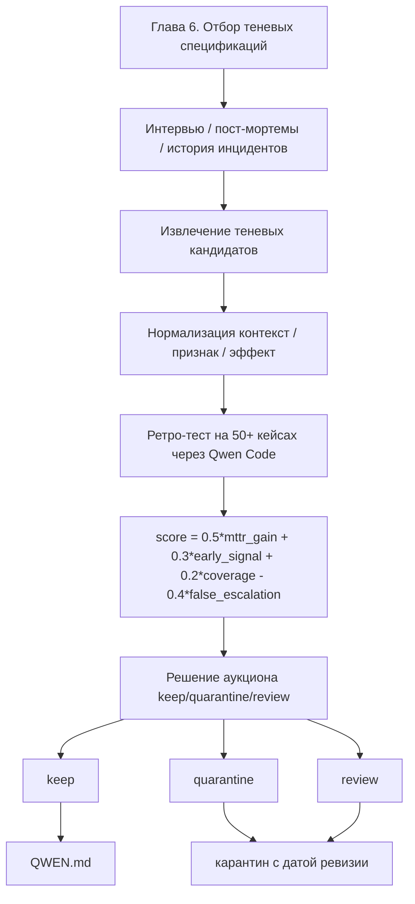

# Прикладная часть 6. Отбор теневых спецификаций

**Статус: Фронтир.** Сам приём — выносить неформальные эвристики в отдельный слой и ограничивать их по бюджету few-shot слотов — применяют. Но формула оценки и пороги принятия требуют калибровки под конкретный проект. Идея «не подменять основную спецификацию» — рекомендация.

Для учебного прохождения достаточно прогнать `examples/shadow-auction/` и увидеть, почему одна эвристика попадает в `QWEN.md`, а другая уходит в карантин. Калибровка весов на 50+ инцидентах относится к полному production-треку.

Введём ключевые понятия. **Теневые спецификации (shadow specs)** — проверяемые эвристики из операционной практики. Они помогают на фазе triage, но не являются обязательными требованиями системы. **Образец-подсказка (few-shot)** — короткий пример в подсказке, который показывает агенту желаемый формат ответа на похожих кейсах. **Журнал оценок (scorebook)** — журнал экономики теневых спецификаций: исходные данные (seed), формула оценки, пороги, бюджет (budget), версии кандидатов и протокол решения.

Когда мы собирали `mission.md` в [части 6 первого тома](../book/part-06-constitution.md), у участников оставались пожелания, не дотянувшие до требования. Вот типичные:

- «отвечать короче ночью»,
- «не пугать пациента словом emergency»,
- «при повторном симптоме сразу запрашивать историю».

Эта глава отвечает на отложенный тогда вопрос — что делать с такими пожеланиями в production. Куда они попадают, как доказывают свою полезность и когда их можно убрать. Образец-подсказка, который в итоге окажется в `QWEN.md`, — это та же память агента, что и в [части 19 первого тома](../book/part-19-agent-memory-sqlite.md), но с явным сроком жизни (`ttl`) и аукционом приёма.

## Перед чтением

- Опора из первого тома: часть 6 показывает, что пожелания не равны требованиям; часть 19 отделяет память от спецификации.
- Локальный учебный кейс: аукцион `shadow.p0.voice_handoff` против шумной эвристики про цвет дашборда.
- След для `capstone/`: короткий блок `Shadow notes` с одним принятым и одним отклонённым кандидатом для `high_memory_usage`.
- Главные термины первого прохода: теневая спецификация и журнал оценок (scorebook). Аукцион, образец-подсказка, карантин — справочные.
- Что отложить: сбор кандидатов из 50+ инцидентов, калибровку весов и автоматическое обновление `QWEN.md`.

## Цель

В этой главе вы превратите неформальные наблюдения из инцидентного управления в проверяемый слой теневых спецификаций с измеримой ценностью. Слово «аукцион» здесь означает ранжированный отбор под ограниченный контекстный бюджет, а не отдельный продукт или обязательный внешний сервис. Какие наблюдения сюда попадают:

- тон общения,
- интуитивные предпосылки,
- сигналы среды,
- «магические» решения опытных инженеров.

Цель не в том, чтобы подменить формальную спецификацию. Цель — отделить полезные эвристики от операционного фольклора. По итогу вы сможете:

- запускать аукцион теневых спецификаций (то есть оценку и отбор эвристик под ограниченный контекстный бюджет);
- присваивать каждому нюансу предсказательную ценность на основе исторических инцидентов;
- оставлять в `QWEN.md` только те образцы-подсказки, которые реально повышают качество Qwen Code.

## Минимальный учебный сценарий

### Учебный кейс

Нужно решить, попадёт ли эвристика `shadow.p0.voice_handoff` в `QWEN.md`, а шумная эвристика про красный цвет дашборда — в карантин. Цель — увидеть, что неформальное наблюдение проходит через оценку и бюджет, а не становится требованием по авторитету.

### Подготовка

- `book2/examples/shadow-auction/candidates/candidates.yaml`.
- `book2/examples/shadow-auction/data/incidents.jsonl`.
- Скрипты `score.py`, `decide.py`, `write_qwen_block.py`.

### Шаги

1. `cd book2/examples/shadow-auction`. *Ожидание: вы в каталоге runnable-примера.*
2. `python3 scripts/score.py --candidates candidates/candidates.yaml --incidents data/incidents.jsonl --weights 0.5,0.3,0.2,0.4 --out out/scorebook.json`. *Ожидание: создан журнал оценок с компонентами скора.*
3. `python3 scripts/decide.py --scorebook out/scorebook.json --budget-tokens 2000 --keep-threshold 0.70 --reject-threshold 0.40 --out-auction out/auction.json --out-quarantine out/quarantine.json`. *Ожидание: часть кандидатов получила статус `winner`, часть ушла в карантин (`quarantine`).*
4. `python3 scripts/write_qwen_block.py --auction out/auction.json --target-anchor "QWEN.md#incident-triage-shadow" --today 2026-05-17 --out out/qwen_block.md`. *Ожидание: блок для `QWEN.md` содержит только победителей и ссылку на источник решения; с учебной датой он совпадает с `outputs/qwen_block.example.md`.*
5. Сравните `out/auction.json` и `out/quarantine.json`: *Ожидание: проигравший кандидат не исчез, а получил причину отклонения.*

### Контрольный факт

Победитель не стал обязательным требованием. Он оформлен как версионированный образец-подсказка с `source_ref`, score и сроком пересмотра. Кандидат ниже порога находится в карантине с причиной.

### Как это попадает в `capstone/`

Перенесите в `capstone/README.md` короткую секцию `Shadow notes`: одного победителя и одного отклонённого кандидата, `id`, score, причина keep/reject и срок пересмотра. Не добавляйте победителя в `requirements.md`: в зачётном пакете он остаётся теневой подсказкой, а не утверждённым требованием.

Минимальный фрагмент:

```yaml
shadow_notes:
  keep:
    id: shadow.p0.voice_handoff.v1
    score: 0.727
    ttl: "14d"
    reason: "early signal for manual handoff"
  reject:
    id: shadow.alert.red_color_urgency
    reason: "false escalation risk"
```

### Ревьюируемый след

`out/` не нужен в учебном пакете. Для зачёта достаточно сохранить короткую выдержку в `QWEN.md` или `capstone/README.md` со ссылкой на критерий аукциона.

## Ключевые идеи

Начинайте нормализацию с перевода наблюдений в формат теневой спецификации: `контекст → признак → наблюдаемый эффект`. Поля такие:

- **Контекст** задаёт границы применимости. Например, «P0-инцидент с риском каскада в appointments-api».
- **Признак** фиксирует наблюдаемую деталь. Например, «дежурный пишет короткими императивными сообщениями и пропускает стандартный шаблон».
- **Эффект** описывает проверяемое последствие. Например, «через 5–10 минут возникает ручной обход (bypass) или срочный откат (rollback)».

Такой формат не делает нюанс полностью формальным контрактом. Но превращает его в слот, который можно сравнить с историей инцидентов. Дополнительные поля `evidence`, `scope`, `risk` и `source_ref` нужны, чтобы Qwen Code не угадывал смысл эвристики по свободному тексту.

В своём проекте сбор кандидатов делает пара скриптов `harvest.py` + `normalize.py`: первый собирает выдержки из интервью, постмортемов и инцидентов в `.specify/memory/shadow-candidates.raw.ndjson`, второй разворачивает их по шаблону `контекст → признак → эффект` в `.specify/memory/shadow-candidates.yaml`. Запускаемого аналога для этой стадии в учебнике нет; она зависит от того, где у вас лежат источники. Запускаемый аналог самой оценки и аукциона — в [examples/shadow-auction/README.md](examples/shadow-auction/README.md).

После нормализации каждый кандидат-слот оценивается на исторических инцидентах по трём группам метрик:

- влияние на MTTR,
- доля ложных эскалаций,
- способность заранее предупреждать о каскаде.

Оценка строится по трём осям.

MTTR показывает, помогла ли эвристика быстрее прийти к корректному действию. Но сама по себе эта метрика опасна. Правило может ускорять отдельные кейсы и одновременно создавать шум на фазе triage.

Ложные эскалации фиксируют цену неверного срабатывания. Особенно если теневая спецификация поднимает P2 до P1 без достаточного основания.

Раннее предупреждение о каскаде измеряет, появлялся ли признак до стандартного оповещения. А не после того, как формальная система уже зафиксировала проблему.

Записывайте итоговую оценку как воспроизводимую формулу, а не как экспертную оценку «кажется полезным». Например, для учебного контура используйте `score = 0.5*mttr_gain + 0.3*early_signal + 0.2*coverage - 0.4*false_escalation`. Здесь `coverage` ограничивает чрезмерно узкие правила, а `false_escalation` штрафует шумные эвристики.

Веса в этой формуле — стартовая калибровка, а не закон. Сумма положительных весов выбрана единицей (`0.5+0.3+0.2`), чтобы итоговый score лежал в интервале `[-0.4; 1]` и читался как «доля полезного сигнала». Внутри этой единицы пропорция `0.5 / 0.3 / 0.2` отражает учебный порядок приоритетов AgentClinic-production: уменьшение MTTR — главный измеримый эффект, ранний сигнал ценен только как сокращение того же MTTR, а покрытие — лишь страховка от слишком узких правил. Коэффициент штрафа за ложную эскалацию (`0.4`) подобран так, чтобы одна ложная эскалация съедала ~80% полезного эффекта одного идеального снижения MTTR (`0.4 / 0.5 = 0.8`): эвристика, которая на одно идеальное снижение MTTR (`mttr_gain=1`) порождает одну ложную эскалацию (`false_escalation=1`), теряет почти весь итоговый score (`0.5 - 0.4 = 0.1`) и в финальную поставку не идёт. Как калибровать дальше:

- если у вашей команды цена ошибки выше — поднимите штраф до `0.6–0.8`;
- если важнее раннее предупреждение — увеличьте `early_signal` за счёт `mttr_gain`.

После калибровки прогоните формулу по 50+ историческим инцидентам. Сравните победителей с тем, как команда сейчас принимает решения вручную. Если расхождение слишком большое, веса калиброваны под чужой профиль рисков.

Берите достаточно исторических случаев, чтобы редкие каскады не исчезли из оценки. Для серьёзного решения используйте 50+ инцидентов: это нижняя граница, при которой редкий класс каскада (с частотой ~1 на 25 инцидентов) встречается в выборке хотя бы дважды, и `early_signal` можно отличить от случайного совпадения. Меньший набор оставляйте только для дымовой проверки (smoke).

Что значит «дрейф данных» в этом контексте. **Дрейф (drift)** — рассинхронизация временных шкал и идентификаторов в источниках инцидентов. Если временные оси в источниках не выровнены, Qwen Code может принять постфактум-наблюдение за ранний сигнал. Поэтому перед оценкой проведите три действия: дедупликацию, нормализацию временных меток и привязку событий к единому идентификатору инцидента.

В своём проекте оценка оформляется как `python3 scripts/shadow_specs/score.py --candidates .specify/memory/shadow-candidates.yaml --incidents .data/incidents_hist_50plus.jsonl --weights "0.5,0.3,0.2,0.4" --out .specify/memory/shadow-scorebook.json`. Запускаемый аналог на учебных данных — в [examples/shadow-auction/README.md](examples/shadow-auction/README.md).

Аукцион превращает оценку в управляемое распределение ограниченного контекстного бюджета.

**Плохо:**

> эвристика «дежурный ASAP в Slack — поднять severity до P1» добавлена прямо в `requirements.md` как обязательное требование.

Проблема: непроверенное наблюдение становится контрактом без доказательств. И порождает ложные P1 на любом «ASAP» в чате.

**Хорошо:**

> та же эвристика оформлена как теневая спецификация `shadow.slack.asap_urgency` со score 0.55 и статусом `review`: значение выше порога отказа `reject_threshold=0.40`, но ниже порога принятия `keep_threshold=0.70`, поэтому кандидат уходит на ручную ревизию, а не в формальную спецификацию.

Как устроен процесс. Qwen Code сортирует кандидатов по `value_score`. Затем расходует заранее заданный `budget` — например, 8 слотов образцов-подсказок или 2 000 токенов. Результат классифицируется на три категории:

- `keep` — победитель, идёт в `QWEN.md`;
- `review` — спорный, на ручную ревизию;
- `quarantine` — отбракован, уходит в карантин.

Победители проходят автоматическое включение только при превышении верхнего порога. Спорные попадают на ручную ревизию. Отбракованные не остаются в серой зоне. Такая схема защищает `QWEN.md` от разрастания. Даже правдоподобный нюанс проигрывает, если его предсказательная ценность ниже стоимости места в подсказке.

В своём проекте решение аукциона оформляется как `python3 scripts/shadow_specs/decide.py --scorebook .specify/memory/shadow-scorebook.json --budget-tokens 2000 --keep-threshold 0.70 --reject-threshold 0.40 --out-auction .specify/memory/shadow-auction.json --out-quarantine .specify/memory/shadow-quarantine.json`. На учебных данных тот же шаг отрабатывает [examples/shadow-auction/README.md](examples/shadow-auction/README.md).

Превращайте победителей в версионированные блоки образцов-подсказок в `QWEN.md`, а не просто дописывайте их в конец файла. Каждому блоку задайте:

- `id`,
- `version`,
- `source_ref`,
- `score`,
- `valid_from`,
- `next_review` (или `ttl` — допустимая короткая форма для коротких пересмотров типа «14d»),
- короткий пример применения.

Зачем эти поля. Последующая команда должна понять, почему этот нюанс существует.

Удаляйте низкоценных кандидатов явно. Отправляйте их в `quarantine` с причиной, датой пересмотра и ссылкой на расчёт. Не давайте им исчезать из истории без следа. Это важно для оспаривания решений: если через месяц изменилась политика оповещений или архитектура переключения при отказе (failover), ранее отвергнутую теневую спецификацию можно вернуть на аукцион без повторного сбора исходных данных.

```yaml
- id: shadow.p0.voice_handoff.v1
  status: keep
  score: 0.727
  source_ref:
    - postmortem: "appointments-api-2026-02-11"
    - incident: "INC-1842"
  valid_from: "2026-05-17"
  next_review: "2026-08-17"
  few_shot_target: "QWEN.md#incident-triage-shadow"
```

Откуда конкретно `0.727`: это значение, которое выдаёт `examples/shadow-auction/scripts/score.py` на 20 исторических инцидентах из `data/incidents.jsonl` при дефолтных весах `0.5/0.3/0.2 − 0.4`. Сверка с эталоном — `examples/shadow-auction/outputs/scorebook.example.json`.

Журнал оценок — это журнал экономики теневых спецификаций. В нём вместе хранятся исходные данные (seed), формула оценки, пороги, бюджет (budget), версии кандидатов и протокол принятия решения.

Без журнала оценок аукцион быстро превращается в спор авторитетов. Опытный инженер может продавить любимую эвристику, а Qwen Code получит противоречивые образцы-подсказки. Здесь полезно ввести ещё одно понятие. **Anti-Goodhart (анти-Гудхарт)** — защита от оптимизации показателя за счёт смысла. Воспроизводимый журнал даёт три возможности: пересчитать результаты после изменения весов, проверить, какие инциденты повлияли на победу, отделить реальное улучшение от ловушки Гудхарта.

В контуре SDD держите этот файл рядом с памятью и конституционными ограничениями проекта. В Spec Kit для таких постоянных правил удобно использовать `.specify/memory/constitution.md` как защитный слой от дрейфа ([GitHub Spec Kit](https://github.com/github/spec-kit)).

## Полный трек: калибровка порогов

Веса формулы аукциона, пороги `keep/reject` и сигналы для пересмотра весов вынесены в [Приложение D, раздел D.2](appendix-d-threshold-calibration.md#d2-отбор-теневых-спецификаций-глава-6). На первом проходе раздел не нужен: достаточно одного принятого и одного отклонённого кандидата на дефолтных весах.

## Примеры и применение

Пример: в проекте автоматического triage для `appointments-api` кандидат `shadow.p0.voice_handoff` описывает ситуацию. При P0 дежурный не пишет длинное сообщение в чат, а сразу инициирует голосовую передачу (handoff) между дежурным (on-call) и владельцем сервиса.

На 20 исторических инцидентах из `data/incidents.jsonl` такой признак дал score 0.727: высокий рост MTTR (0.7541), уверенный ранний сигнал (1.0), узкое покрытие (0.25) и ноль ложных эскалаций. В пяти случаях он сокращал время до участия второй смены. Ложных эскалаций кандидат почти не создавал, потому что применялся только при подтверждённом P0 и риске каскада транзакций.

Этот кандидат становится победителем. Но в `QWEN.md` он попадает с узким условием применимости. Qwen Code не должен рекомендовать голосовой канал для обычного P2, где асинхронный текстовый след важнее скорости созвона. Практическая ценность здесь не в самом факте «позвонить», а в раннем распознавании ситуации, где задержка передачи дороже потери части письменного контекста.

Другой кандидат, `shadow.alert.red_color_urgency`, проигрывает аукцион. Хотя выглядит интуитивно убедительно. Тот же runnable-аукцион даёт ему score `-0.3081`: слабый рост MTTR и заметная доля ложных эскалаций тянут оценку в минус. Красный цвет часто использовался в дашбордах для визуального акцента, но не соответствовал радиусу последствий, скорости выгорания бюджета SLO или фактическому уровню эскалации.

Такая теневая спецификация давала тройной негативный эффект:

- повышала долю ложных P1,
- перегружала фазу triage,
- ухудшала доверие к автоматическим рекомендациям.

Отправьте её в карантин с причиной `high_false_escalation`, датой пересмотра и условием возврата. Сначала команда меняет политику визуализации оповещений. Затем заново прогоняет кандидата через журнал оценок.

Редкий физический сигнал может выиграть, если цена пропуска значительно выше цены проверки. Например, `shadow.dc.burn_smell_power_risk` применим только к инцидентам с наблюдением на месте (onsite) в дата-центре. Его `coverage` низкий, но `early_signal` высокий: запах гари или перегрева иногда возникает до того, как мониторинг питания показывает деградацию.

Такой кандидат нельзя превращать в универсальное правило. Иначе он станет токсичным шумом для облачных инцидентов без физического доступа. Правильная форма включения — редкий образец-подсказка с тремя ограничителями: жёсткий контекст, явное примечание о риске и требование подтвердить сигнал через канал оператора на месте.



## Итог

Аукцион теневых спецификаций делает неформальные нюансы управляемыми. Каждый кандидат получает структуру `контекст → признак → наблюдаемый эффект`, проходит оценку на исторических инцидентах, конкурирует за ограниченный бюджет — и либо становится версионированным образцом-подсказкой в `QWEN.md`, либо уходит в карантин с проверяемой причиной.

Главная дисциплина процесса — не доверять ярким историям без журнала оценок. Исходные данные, формула, пороги и протокол решения должны позволять воспроизвести результат и оспорить его при изменении инфраструктуры. Следующая глава переведёт эту логику в шлюз спецификации (Specification CI), где спецификация станет исполняемым артефактом.

## Артефакты и критерии готовности

| Артефакт | Готов, когда |
|---|---|
| Запущенный локальный аукцион из `book2/examples/shadow-auction` | smoke-pass; результаты воспроизводимы при одинаковых весах и данных |
| Один победитель | есть `source_ref`, score и срок пересмотра; победитель не расширяет формальный SDD-контракт и не маскируется под требование |
| Один отклонённый кандидат | в карантине с явной причиной (например, `high_false_escalation`) |
| Короткий блок для `QWEN.md` или секция `Shadow notes` в `capstone/README.md` | образец-подсказка имеет узкое условие применимости |

Полный трек добавляет `.specify/memory/shadow-candidates.yaml` в формате `контекст → признак → эффект`, `.specify/memory/shadow-scorebook.json` с формулой и весами, `.specify/memory/shadow-auction.json` с решениями `winner/disputed/rejected` и версионированный блок образца-подсказки или карантинную запись. Считайте его готовым, если у каждой теневой спецификации есть `source_ref`, `scope`, `risk` и `next_review`, оценка считается воспроизводимо (без ручного пересчёта), а кандидаты пересматриваются при изменении весов, бюджета или класса инцидентов.

## Практика

1. Прогоните аукцион на учебных данных: `cd book2/examples/shadow-auction && python3 scripts/score.py --candidates candidates/candidates.yaml --incidents data/incidents.jsonl --weights 0.5,0.3,0.2,0.4 --out out/scorebook.json`. *Ожидание: `diff -u outputs/scorebook.example.json out/scorebook.json` даёт 0 строк; среди оценок есть хотя бы один кандидат со `score >= 0.70` и хотя бы один с `score < 0.40`.*
2. На том же `scorebook.json` запустите `python3 scripts/decide.py --scorebook out/scorebook.json --budget-tokens 2000 --keep-threshold 0.70 --reject-threshold 0.40 --out-auction out/auction.json --out-quarantine out/quarantine.json`. *Ожидание: `out/auction.json` и `out/quarantine.json` совпадают с эталонами в `outputs/`; в `out/quarantine.json` минимум одна запись с явным `reason` и `return_condition`.*
3. Поменяйте вес штрафа за ложную эскалацию с `0.4` на `0.8`, пересчитайте `scorebook.json` и зафиксируйте сдвиг в `capstone/README.md`. *Ожидание: в `capstone/README.md` записана одна строка «при удвоенном штрафе за ложную эскалацию кандидат `<id>` перешёл из `keep` в `quarantine`»; в этой же строке указано, какой компонент формулы стал доминирующим в новом весе.*

## Контрольные вопросы

1. Чем теневая спецификация отличается от полноценного требования и почему нельзя её подменять?
2. Почему образец-подсказка в `QWEN.md` должен иметь срок пересмотра?
3. Как понять, что эвристика стала операционным фольклором?
4. Дежурный требует добавить в `QWEN.md` правило «если в Slack используют слово ASAP — поднимать severity». Как вы прогоните это через аукцион теневых спецификаций, не отказывая сразу?
