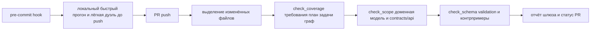

# Прикладная часть 7. Specification CI: спецификация как исполняемый артефакт

**Статус: Рекомендация.** Запускать проверки спецификации в CI — устойчивая практика. Конкретный набор шлюзов (coverage, scope, schema, spec_gate) и формат JSON-диагностики — рекомендуемая рамка, которую большинство команд адаптирует. JSON Schema-проверка фикстур из `validation.md` — стандартное использование инструмента.

В этой главе «**шлюз спецификации**» — короткое название контура, который проверяет спецификацию так же, как обычный CI проверяет код. Сама проверка состоит из обычных шагов: парсинг `requirements.md` и `plan.md`, валидация примеров против JSON Schema, проверка соответствий между файлами. Все остальные термины — `gate`, `fixture`, `schema-check`, `coverage-check` — вводятся ниже в тех местах, где они реально появляются в команде или скрипте; в одну вступительную строку их сводить не нужно.

Шлюз спецификации — это автоматизация ровно той процедуры, которую [часть 9 первого тома](../book/part-09-feature-validation.md) проводила глазами, а [часть 16](../book/part-16-team-code-review.md) — командно в пулл-реквесте. В учебном AgentClinic REQ-идентификаторы и схемы полезной нагрузки для отзывов из [части 12](../book/part-12-mvp.md) ещё могли оставаться договорённостью. В production такого запаса доверия нет. Те же связи требуется превратить в обязательный шлюз, который зелёные модульные тесты не могут обойти.

## Перед чтением

- Опора из первого тома: часть 9 связывает `validation.md` с фактами, часть 16 показывает ревью пакета доказательств.
- Локальный учебный кейс: `incident payload`, потому что coverage и JSON Schema можно проверить локально без CI.
- След для `capstone/`: одна строка Spec CI для `high_memory_usage`: команда, доказанный факт и отрицательный пример.
- Главный термин первого прохода: Spec CI. `gate`, `fixture`, `schema-check`, `coverage-check` — справочные, появляются прямо в команде и комментарии скрипта.
- Что отложить: GitHub Actions workflow, scope-gate и извлечение фикстур из произвольного `validation.md`.

## Цель

В этой главе шлюз спецификации превращается из идеи «проверять документы» в рабочий контур GitHub Actions для инцидентного проекта. Каждый `push` и каждый пулл-реквест проходят обязательный шлюз. Шлюз блокирует слияние при трёх классах нарушений:

- невыполнение требований,
- выход за границы (out-of-scope),
- ошибки JSON Schema.

Читатель получит практическую схему репозитория, где `requirements.md`, `plan.md`, `validation.md` и API-контракты проверяются как исполняемые артефакты, а не как справочная документация.

Главный выигрыш — команда получает воспроизводимый механизм блокировки в CI. Спор о качестве спецификации сводится к конкретной строке, правилу и действию для исправления.

## Минимальный учебный сценарий

### Учебный кейс

`incident payload`: проверить, что `requirements.md` связан с `plan.md`, а JSON-фикстуры (примеры входных данных, которые мы достаём из `validation.md`) содержат обязательный `incident_id`. Цель — увидеть Spec CI как маленький локальный шлюз (обязательную проверку, без которой слияние блокируется), а не как большой GitHub Actions-процесс.

### Подготовка

- `book2/examples/spec-ci/requirements.md`.
- `book2/examples/spec-ci/plan.md`.
- `book2/examples/spec-ci/fixtures/valid-incident.json`.
- `book2/examples/spec-ci/fixtures/invalid-missing-incident-id.json`.
- Скрипты `check_coverage.py` и `validate_schema.py`.

### Шаги

1. `cd book2/examples/spec-ci`. *Ожидание: вы в каталоге runnable-примера.*
2. `python3 scripts/check_coverage.py --requirements requirements.md --plan plan.md`. *Ожидание: код возврата 0, все `REQ-*` имеют связь с планом.*
3. `python3 scripts/validate_schema.py --schema schemas/incident_payload.schema.json --fixtures fixtures`. *Ожидание: валидная фикстура проходит, отрицательная падает предсказуемо.*
4. Откройте сообщение об ошибке для отрицательной фикстуры. *Ожидание: понятно, какое поле отсутствует и какой файл исправлять.*
5. Запишите в `validation.md`, что именно блокирует шлюз: покрытие, область охвата или схема.

### Контрольный факт

Один локальный прогон показывает два типа истины: требование связано с планом, а данные соответствуют контракту. Если ошибка CI не указывает файл, правило и действие, она не готова для команды.

### Как это попадает в `capstone/`

Перенесите в `capstone/validation.md` одну строку Spec CI: какая команда запускалась, что она доказала, какой отрицательный пример был заблокирован. Не переносите полный GitHub Actions workflow, если он не создан; для учебного минимума достаточно runnable-аналога из `examples/spec-ci`.

Минимальный фрагмент:

```markdown
| Spec CI | `python3 scripts/check_coverage.py ...` | все REQ-* связаны с plan | PASS |
| Schema negative | `python3 scripts/validate_schema.py ...` | missing incident_id заблокирован | PASS |
```

### Перенос на `high_memory_usage`

Учебный пример работает на `incident payload`, но в `capstone/` нужна строка для `high_memory_usage`. Подставьте те же два класса проверок к своим требованиям:

| Что проверяем | Команда (учебная) | Что доказывает для `high_memory_usage` |
|---|---|---|
| Coverage | `check_coverage.py --requirements requirements.md --plan plan.md` | требование REQ-HM-01 «не перезапускать pod без подтверждённого RSS > 90% в течение 5 минут» связано с задачей в `plan.md` |
| Schema negative | `validate_schema.py --schema schemas/incident_payload.schema.json --fixtures fixtures` | фикстура без `incident_id` или с `severity: "P0"` без `backup_verified` блокируется |

Если строки Coverage и Schema negative для `high_memory_usage` написать нельзя — значит, в `requirements.md` ещё нет проверяемого требования или схема ещё не различает P0 без бэкапа.

### Ревьюируемый след

В учебном пакете сохраняйте изменения в `requirements.md`, `plan.md`, `validation.md` или схеме. Временные фикстуры, созданные только для локальной диагностики, не нужны, если они не стали частью регрессионного набора.

## Ключевые идеи

Здесь «исполняемый артефакт» означает не запуск Markdown как программы. Речь о проверке требований, плана и примеров обычными CI-скриптами.

Запускайте обязательный шлюз GitHub Actions и на `pull_request`, и на `push` в защищённую ветку. Почему оба триггера. Нарушение спецификации может попасть двумя путями: через обычный пулл-реквест или через прямое обновление служебных файлов.

Минимальный набор отслеживаемых артефактов:

- `requirements.md`,
- `plan.md`,
- `validation.md`,
- `contracts/**`,
- `constitution.md` — при необходимости, если в ней зафиксированы доменные ограничения инцидентного конвейера.

В настройках защиты ветки (branch protection) пометьте именно итоговую задачу `spec_gate` как обязательную. Иначе зелёные модульные тесты смогут обойти смысловую проверку. Такая схема соответствует SDD-подходу, где требования, план и задачи становятся проверяемыми слоями, а не статичным текстом ([GitHub Spec Kit](https://github.com/github/spec-kit)).

> **[project script]** — `.github/workflows/spec-ci.yml` вызывает проектные скрипты `scripts/spec_ci/*.py`.

```yaml
name: spec-ci

on:
  pull_request:
    paths:
      - 'requirements.md'
      - 'plan.md'
      - 'validation.md'
      - 'contracts/**'
      - 'constitution.md'
  push:
    branches: [main]
    paths:
      - 'requirements.md'
      - 'plan.md'
      - 'validation.md'
      - 'contracts/**'
      - 'constitution.md'

jobs:
  coverage:
    runs-on: ubuntu-latest
    steps:
      - uses: actions/checkout@v4
      - run: python3 scripts/spec_ci/check_coverage.py --requirements requirements.md --plan plan.md --out out/spec-ci/coverage-report.json

  scope:
    runs-on: ubuntu-latest
    needs: [coverage]
    steps:
      - uses: actions/checkout@v4
      - run: python3 scripts/spec_ci/check_scope.py --domain models/incident-response.yaml --plan plan.md --contracts contracts/api.md --out out/spec-ci/scope-violations.ndjson

  schema:
    runs-on: ubuntu-latest
    needs: [coverage, scope]
    steps:
      - uses: actions/checkout@v4
      - run: python3 scripts/spec_ci/extract_fixtures.py --from validation.md --out out/spec-ci/fixtures
      - run: python3 scripts/spec_ci/validate_schema.py --schemas schemas --fixtures out/spec-ci/fixtures --out out/spec-ci/schema-audit.json

  spec_gate:
    runs-on: ubuntu-latest
    needs: [coverage, scope, schema]
    steps:
      - run: echo "Specification gate passed"
```

Проверка покрытия начинается с графа `requirements → plan`, а не с поиска совпадающих слов. Введём правила трассировки:

- каждая пользовательская история из `requirements.md` получает стабильный идентификатор `REQ-*`;
- каждая задача или шаг в `plan.md` обязан ссылаться на один или несколько таких идентификаторов через поле вроде `implements: [REQ-014]`.

Что считать ошибкой. Если история не имеет трассируемой задачи, завершайте процесс с `fail`: команда уже потеряла обещание пользователю до начала реализации. Обратное нарушение тоже важно. Задача без `implements` превращается в неприкаянную (rogue task). Это значит, что план начал добавлять функциональность, не подтверждённую требованиями.

> **[project script]** — `scripts/spec_ci/check_coverage.py`; запускаемый аналог — [`examples/spec-ci/scripts/check_coverage.py`](examples/spec-ci/).

```bash
python3 scripts/spec_ci/check_coverage.py \
  --requirements requirements.md \
  --plan plan.md \
  --out out/spec-ci/coverage-report.json
```

Детектор выхода за границы нужен для случаев, когда формальная трассировка есть, но содержание шага выходит за пределы инцидентного домена. Сопоставляйте действия из `plan.md` с доменной моделью `incident-response`. Допустимые операции, например:

- `acknowledge`,
- `escalate`,
- `annotate`,
- `rollback`,
- `notify_on_call`.

Произвольные бизнес-действия (вроде `notify_finance`, `close_customer_contract` или `force_resolve_without_operator`) сюда не входят.

Учитывайте не только глагол. Проверяйте также:

- актёра,
- конечную точку (endpoint),
- условие запуска.

Почему так. `resolve incident` может быть разрешён ручному дежурному оператору и запрещён автономному агенту. Практическое правило простое: если шаг нельзя объяснить через модель инцидента и разрешённый API-контракт, он блокирует пулл-реквест.

> **[project script]** — `scripts/spec_ci/check_scope.py`. Готового аналога нет; реализуйте сами поверх доменной модели и API-контракта.

```bash
python3 scripts/spec_ci/check_scope.py \
  --domain models/incident-response.yaml \
  --plan plan.md \
  --contracts contracts/api.md \
  --out out/spec-ci/scope-violations.ndjson
```

Проверки JSON Schema закрывают слой фикстур и примеров полезной нагрузки, где часто возникают тихие регрессии интеграций. Что нужно делать:

- извлекайте из `validation.md` все JSON-блоки;
- преобразовывайте их в отдельные фикстуры;
- валидируйте против схем из `schemas/**` — например, `incident_payload.schema.json`, `pagerduty_webhook.schema.json` или `grafana_alert.schema.json`.

Следите за двумя направлениями. Валидные примеры должны проходить без ошибок. Специально отрицательные примеры должны падать предсказуемо. Если отрицательная полезная нагрузка проходит, схема слишком мягкая и не защищает контракт.

До слияния в защищённую ветку это проверяется так же строго, как тесты приложения. Неверный `incident_id`, некорректный `severity` или пустой `source` способны сломать весь контур ремедиации.

> **[project script]** — `scripts/spec_ci/extract_fixtures.py` и `scripts/spec_ci/validate_schema.py`; запускаемый аналог проверки схемы — [`examples/spec-ci/scripts/validate_schema.py`](examples/spec-ci/). Шаг извлечения реализуйте сами под формат `validation.md` вашего проекта.

```bash
python3 scripts/spec_ci/extract_fixtures.py \
  --from validation.md \
  --out out/spec-ci/fixtures

python3 scripts/spec_ci/validate_schema.py \
  --schemas schemas \
  --fixtures out/spec-ci/fixtures \
  --out out/spec-ci/schema-audit.json
```

Делайте диагностический формат CI-отклонений рассчитанным на быстрое исправление, а не на расследование по логам процесса.

**Плохо:**
> `Coverage failed: missing REQ`

Проблема: ревьюер не знает, какое требование осиротело и куда смотреть. Ошибку нельзя исправить без отдельного расследования.

**Хорошо:**
> `requirements.md:42: REQ-014 не имеет ссылки в plan.md. Добавьте в plan.md задачу с implements: REQ-014 или удалите требование.`

В каждой ошибке указывайте четыре элемента:

- понятную причину,
- ссылку на файл и строку,
- идентификатор нарушенного правила,
- конкретное действие для команды спецификации.

Типы ошибок выглядят так. Для покрытия это может быть `REQ-021 has no implementing plan item; add implements: [REQ-021] to plan.md or remove the requirement`. Для области охвата — `plan.md:48 uses force_resolve without domain permission`. Для схемы — `validation.md:72 missing required property incident_id`.

Такой формат снижает нагрузку на ревьюера. Человек проверяет смысл правки, а не восстанавливает, что именно сломал CI.

```json
{
  "status": "failed",
  "check": "scope",
  "file": "plan.md",
  "line": 48,
  "rule": "IR-SCOPE-007",
  "reason": "Autonomous force resolve is outside the incident-response domain model",
  "action": "Replace with POST /incidents/{id}/ack or add an approved requirement and domain rule"
}
```

## Примеры и применение



Типовой пулл-реквест в учебном инцидентном репозитории меняет три файла:

- `requirements.md`,
- `plan.md`,
- `validation.md`.

Автор описывает историю `REQ-014: как дежурный (on-call) инженер, я хочу получать подтверждение эскалации`. Затем в плане добавляет задачу `TASK-033` с `implements: [REQ-014]`. А в `validation.md` кладёт пример полезной нагрузки вебхука с полями `incident_id`, `severity`, `source` и `escalation_target`.

Что проверяется. Проверка покрытия проходит, если связь `REQ-014 → TASK-033` существует. Проверка области охвата проходит, если действие соответствует доменной модели. Проверка схемы проходит, если полезная нагрузка совпадает с контрактом. Если любой из трёх слоёв ломается, `spec_gate` возвращает красный статус и GitHub не разрешает слияние.

Показательный сбой: автор пытается «ускорить» обработку и добавляет в `plan.md` шаг `POST /pagerduty/force-resolve` без отдельного требования и без разрешения в доменной модели. Покрытие может остаться зелёным, если шаг формально привязан к существующей истории. Но проверка области охвата заблокирует пулл-реквест: автономное закрытие инцидента без подтверждения дежурного не входит в согласованные операции.

Если тот же пулл-реквест добавляет в `validation.md` полезную нагрузку с `event_code` вместо обязательного `incident_id`, проверка схемы выдаёт независимый блокер. Команда получает два разных класса ошибок:

- смысловой выход за границы,
- нарушение структуры данных.

Локальный быстрый прогон перед push экономит время и делает шлюз спецификации привычной частью рабочего цикла. В `pre-commit` запускайте только изменённые файлы. Полный процесс оставляйте GitHub Actions, чтобы не тормозить разработчика длинной проверкой всех фикстур.

Для инцидентного проекта достаточно команды, которая делает три вещи:

- строит граф покрытия,
- проверяет область охвата по различиям (diff),
- валидирует затронутые JSON-блоки.

Если локальный отчёт уже показывает `orphan requirement`, `rogue task` или `schema mismatch`, автор исправляет спецификацию до создания пулл-реквеста, а не после получения красного статуса в удалённом CI.

> **[project script]** — пример локальной обёртки для `scripts/spec_ci/*.py`.

```bash
#!/usr/bin/env bash
set -euo pipefail

python3 scripts/spec_ci/check_coverage.py \
  --requirements requirements.md \
  --plan plan.md \
  --out out/spec-ci/coverage-report.json

python3 scripts/spec_ci/check_scope.py \
  --domain models/incident-response.yaml \
  --plan plan.md \
  --contracts contracts/api.md \
  --out out/spec-ci/scope-violations.ndjson

python3 scripts/spec_ci/extract_fixtures.py \
  --from validation.md \
  --out out/spec-ci/fixtures

python3 scripts/spec_ci/validate_schema.py \
  --schemas schemas \
  --fixtures out/spec-ci/fixtures \
  --out out/spec-ci/schema-audit.json
```

## Итог

Шлюз спецификации делает спецификацию исполняемым арбитром репозитория. GitHub Actions блокирует пулл-реквест при трёх классах нарушений:

- непокрытые пользовательские истории,
- посторонние сценарии в плане,
- ошибки JSON Schema в валидационных примерах.

Для команды это меняет характер ревью. Вместо субъективного спора о полноте требований появляется диагностический отчёт с файлом, строкой, правилом и действием.

В инцидентной автоматизации такая строгость особенно важна. Неверная область охвата или слабый контракт полезной нагрузки могут привести к трём последствиям:

- ложные эскалации,
- опасные автооперации,
- потеря доверия к ремедиации.

Далее этот контур станет основой для файлового арбитража спорных изменений.

Минимальный запускаемый набор для этой главы лежит в [examples/spec-ci/](examples/spec-ci/README.md). Пройдите его до внедрения полноценного процесса GitHub Actions. Сначала добейтесь зелёного локального шлюза. Затем переносите те же команды в CI.

> **[runnable]** — запускаемый пример: `examples/spec-ci/scripts/check_coverage.py` и `examples/spec-ci/scripts/validate_schema.py`.

```bash
cd book2/examples/spec-ci
python3 scripts/check_coverage.py --requirements requirements.md --plan plan.md
python3 scripts/validate_schema.py --schema schemas/incident_payload.schema.json --fixtures fixtures
```

## AoT-шлюз для агентных планов

Spec CI проверяет не только текстовые требования. Если агент строит план как набор атомарных действий, этот план тоже становится проверяемым артефактом. Формат может быть простым: `atoms[]`, где каждый атом имеет `id`, `kind`, `name`, `input` и `dependsOn`.

Минимальное правило: LLM имеет право предложить атомы, но не имеет права исполнять их до проверки. Локальный шлюз должен отклонить:

- неизвестное имя инструмента;
- отсутствующие обязательные параметры;
- ссылку на результат несуществующего атома;
- цикл зависимостей;
- действие за пределами доменной модели incident-response.

Для `high_memory_usage` это выглядит так:

```json
{
  "atoms": [
    {"id": 1, "kind": "tool", "name": "read_metrics", "input": {"window": "10m"}, "dependsOn": []},
    {"id": 2, "kind": "tool", "name": "check_readiness", "input": {"incident_id": "HM-2026-05-17-01"}, "dependsOn": [1]},
    {"id": 3, "kind": "tool", "name": "dry_run", "input": {"action": "restart_pod"}, "dependsOn": [2]}
  ]
}
```

Такой план нельзя принимать по убедительности текста. Его нужно валидировать как граф: топологическая сортировка, список разрешённых `name`, JSON Schema для `input` каждого инструмента и отдельная проверка радиуса последствий. Это тот же принцип, что и для `requirements.md → plan.md`: спецификация полезна только тогда, когда её можно отклонить машинно.

## Артефакты и критерии готовности

| Артефакт | Готов, когда |
|---|---|
| Локальный прогон `book2/examples/spec-ci` | smoke-pass без внешних зависимостей |
| Проверка покрытия `requirements → plan` | каждая `REQ-*` имеет реализующую задачу, каждая задача имеет `implements` |
| Проверка JSON Schema | валидная фикстура проходит, отрицательная падает предсказуемо |
| Проверка атомарного плана | неизвестные инструменты, циклы и действия вне домена блокируются до выполнения |
| Запись в `validation.md` | сообщение об ошибке шлюза указывает файл, правило и действие для исправления |

Полный трек добавляет `.github/workflows/spec-ci.yml` или его проектный аналог, `out/spec-ci/coverage-report.json` для графа `requirements → plan`, `out/spec-ci/scope-violations.ndjson` с нарушениями доменной модели, `out/spec-ci/schema-audit.json` по фикстурам из `validation.md` и локальную обёртку быстрого прогона. Считайте его готовым, если проверка области охвата блокирует автономные действия вне модели incident-response, задача `spec_gate` обязательна в защищённой ветке, а диагностический формат CI указывает файл, строку, идентификатор правила и действие.

## Практика

1. `cd book2/examples/spec-ci && python3 scripts/check_coverage.py --requirements requirements.md --plan plan.md` — *ожидание: код 0, stdout — одна строка `coverage ok: 3 requirements covered`.*
2. `python3 scripts/validate_schema.py --schema schemas/incident_payload.schema.json --fixtures fixtures` — *ожидание: код 0; stdout содержит `valid-incident.json: valid` и `invalid-missing-incident-id.json: expected invalid, rejected: missing required property incident_id` (отрицательная фикстура помечена `_expected_invalid: true` и поэтому считается успешно отклонённой).*
3. Перенесите в `capstone/validation.md` одну строку Spec CI: «coverage ok: 3/3, schema ok: 2/2 (отрицательная отклонена по `missing required property incident_id`)». *Ожидание: при следующем регрессе строка позволяет восстановить, что именно блокирует слияние, без чтения логов CI.*

## Контрольные вопросы

1. Почему покрытие по словам слабее графа `requirements → plan`?
2. Какие нарушения должна ловить проверка области охвата, а какие — нет?
3. Что делает CI-ошибку исправляемой без расследования?
4. Шлюз спецификации блокирует слияние из-за несовпадения `REQ-ID`. Программист хочет добавить `REQ-ID` к существующему пункту плана и слить пулл-реквест. Что в этом подходе опасно?
