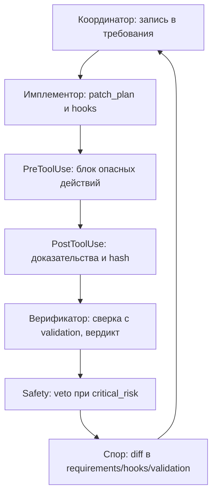

# Прикладная часть 8. Файловый арбитраж спорного изменения: роли, вердикты и прецеденты

**Статус: Фронтир.** Файловый арбитраж Верификатор/Имплементор/Safety (голосуют) с протоколом Координатора и записью в `judgment.md` (решение по спору) и `precedents.md` (прецеденты) — техника, которую применяют, но в Qwen Code она не встроена. Совместимость и ограничения — в [appendix-b-qwen-code-compatibility.md](appendix-b-qwen-code-compatibility.md).

Для учебного прохождения достаточно получить `judgment.md` из runnable-примера и понять, какие доказательства принимает Верификатор. Ротация ярусов, внешний Координатор и матрица моделей относятся к полному production-треку.

Граница с главой 4 такая: LLM-дуэль отвечает на вопрос «нашёлся ли минимальный контрпример и чем его закрыли». Файловый арбитраж отвечает на другой вопрос: «какой официальный вердикт принимает команда ролей, какие доказательства признаны допустимыми и какой прецедент останется для будущих споров».

Файловый арбитраж не ищет все дефекты сам. Он принимает результаты других механизмов как доказательства: контрпример из дуэли, отчёт Spec CI, anti-Goodhart-инвариант, шлюз готовности (readiness gate) или запись о мутанте. Если доказательства нет в файле, Координатор не должен превращать впечатление агента в вердикт.

Командное ревью из [части 16 первого тома](../book/part-16-team-code-review.md) — это базовая схема: ревьюер-человек проверяет пулл-реквест по пакету доказательств. Здесь та же схема поднята уровнем выше. Вместо одного человека работают роли: Верификатор (Verifier), Имплементор (Implementor) и Safety голосуют; Координатор (Coordinator) ведёт протокол и не голосует. Вместо комментариев в PR — два файла: `judgment.md` (журнал решений по спорам) и `precedents.md` (база повторяющихся споров). Опора при этом не меняется: вердикты сверяются с фактами `validation.md` из [части 9](../book/part-09-feature-validation.md), а итоги пересматривают дорожную карту так же, как при перепланировании из [части 10](../book/part-10-project-replanning.md).

## Перед чтением

- Опора из первого тома: часть 16 задаёт командное ревью, часть 10 показывает перепланирование после фактов.
- Локальный учебный кейс: `autoscale_200pct`, потому что для него уже есть дуэль, инварианты и `judgment.md`.
- След для `capstone/`: один вердикт `APPROVE`, `DENY` или `DEFERRED` с `evidence_ref` для `high_memory_usage`.
- Главные термины первого прохода: файловый арбитраж и `judgment.md`. Роли (Верификатор/Имплементор/Safety + Координатор-протоколист) уже введены в части 3 — здесь они получают процедурное оформление.
- Что отложить: матрицу моделей, внешний Координатор и постоянную базу `precedents.md`.

## Цель

Вы научитесь проводить файловый арбитраж спорного изменения. Это коллективная проверка одного изменения несколькими ролями, где результат фиксируется в файлах, а не в чате. Цель — спроектировать схему, в которой одна спецификация проверяется воспроизводимо даже при ротации ролей, моделей и режимов строгости.

Ротация ролей — это запуск той же спецификации через разные пары Имплементор/Верификатор (локальный или сильный агент в каждой позиции). Она нужна, чтобы вердикт не зависел от конкретной модели.

Практический выигрыш простой: спор перестаёт быть обменом мнениями в чате и превращается в цепочку доказательств. Координатор ведёт процесс. Имплементор предлагает изменения. Верификатор принимает или отклоняет их по формальным критериям. Safety получает veto при `critical_risk`. Итог фиксируется в артефактах проекта.

Такой подход продолжает логику SDD: спецификация остаётся источником истины для поведения системы, а не необязательным описанием намерений разработчика ([GitHub Spec Kit](https://github.com/github/spec-kit)).

Инженерное название механизма — файловый протокол арбитража спорного изменения несколькими ролями. Имя `tribunal` остаётся техническим ярлыком каталога runnable-примера, а не отдельным продуктом Qwen Code.

## Минимальный учебный сценарий

### Учебный кейс

Тот же `autoscale_200pct`, но теперь нужен не только контрпример, а официальный протокол: дуэль, anti-Goodhart-инварианты и итоговый `judgment.md`.

### Подготовка

- `book2/examples/tribunal/specs/autoscale_spec.yaml`.
- `book2/examples/tribunal/cases/`.
- `book2/examples/tribunal/metrics/validation_metrics.json`.
- Скрипты `run_duel.py`, `check_invariants.py`, `write_judgment.py`.

### Шаги

1. `cd book2/examples/tribunal`. *Ожидание: вы в каталоге runnable-примера.*
2. `python3 scripts/run_duel.py --spec specs/autoscale_spec.yaml --cases cases/ --out out/duel.json`. *Ожидание: дуэль записала вердикты по кейсам.*
3. `python3 scripts/check_invariants.py --metrics metrics/validation_metrics.json --out out/invariants.json`. *Ожидание: anti-Goodhart-инварианты проверены отдельно от дуэли.*
4. `python3 scripts/write_judgment.py --duel-out out/duel.json --invariants-out out/invariants.json --to out/judgment.md`. *Ожидание: появился итоговый markdown-протокол.*
5. Откройте `out/judgment.md` и перенесите один повторяемый конфликт в `precedents.md`: условие, доказательство, решение, применимость.

### Контрольный факт

`judgment.md` содержит не только `PASS/FAIL`, но и основание: какой кейс проверялся, какой инвариант сработал, что должен сделать Имплементор при повторном споре. Без этого файловый арбитраж остаётся дуэлью из главы 4.

### Как это попадает в `capstone/`

Перенесите в `capstone/judgment.md` один вердикт, причину, `evidence_ref` и следующий проверяемый шаг. Если конфликт повторяемый, добавьте короткую запись прецедента. Не переносите весь `out/duel.json`, если его можно воспроизвести командой из runnable-примера.

Минимальный фрагмент:

```yaml
verdict: DEFERRED
reason: "readiness passes by score, but stateful blocker has no backup evidence"
evidence_ref: "fixtures/readiness_block_stateful.json"
next_step: "add backup_verified evidence or keep remediation manual"
```

### Ревьюируемый след

Сохраняйте `judgment.md` или выдержку в `precedents.md`, если они стали частью учебного пакета доказательств. Локальные `out/duel.json` и `out/invariants.json` можно оставить вне репозитория, если их можно воспроизвести командой.

## Ключевые идеи

Контракт этапов файлового арбитража начинается с роли Координатор. Он открывает сессию, задаёт порядок раундов, ведёт очередь споров и отвечает за официальный протокол в `judgment.md`. Сам `judgment.md` — это журнал решений сессии: какой раунд прошёл, какое различие (diff) рассмотрено, какие доказательства признаны достаточными.

Минимальный цикл такой: Координатор принимает исходную спецификацию, раскладывает её по проверяемым файлам, назначает роли Имплементора, Верификатора и Safety для критичных рисков и запрещает переход к следующему этапу без записи результата предыдущего. Полный устав ролей с весами голосования (`vote_weight`), кворумом и veto-условиями — в [части 3](part-03-project-constitution.md#ключевые-идеи). Здесь нас интересует, как эти же роли работают вокруг одного конкретного спорного изменения.

Что это значит на практике. Возьмём короткий вердикт из чата:

**Плохо:**
> «Верификатор отклонил предложение Имплементора.»

Проблема: нет основания и нет ссылки-доказательства (`evidence_ref`), спор невоспроизводим. Следующий ревьюер не сможет ни оспорить, ни поддержать вердикт.

**Хорошо:**
> `verdict=DENY, reason=violates_invariant:silent_p0, evidence_ref=tests/regression_001.json, next_step=Имплементор добавляет проверку severity перед автоэскалацией`

`evidence_ref` здесь — та же пометка-доказательство, что и в [части 1](part-01-spec-archaeology.md): ссылка на конкретное место в файле, а не пересказ. `silent_p0` — инвариант «ни один P0-инцидент не должен закрыться без эскалации». Если Верификатор возвращает `DENY`, не закрывайте спор вручную. Требуйте от стороны формального основания: ссылку на конкретное требование, лог хука, нарушение схемы или недоказанный сценарий. Так `judgment.md` становится не отчётом «кто победил», а журналом процессуального состояния.

В Qwen Code такой арбитраж — не одна встроенная команда. Минимальная реализация собирается из `/review`, безголовых (headless) запусков `qwen -p`, проектных скриптов и, если нужно, пользовательских команд. Все вердикты сохраняйте в файлы, чтобы другой инженер мог повторить спор без истории чата. Подробное соответствие ролей и встроенных возможностей CLI — в [`appendix-b-qwen-code-compatibility.md`](appendix-b-qwen-code-compatibility.md).

> **[runnable]** — запускаемый пример файлового арбитража лежит в [`examples/tribunal/`](examples/tribunal/) (см. [`examples/tribunal/README.md`](examples/tribunal/README.md)). Реальный запуск собирается из трёх скриптов:

- `run_duel.py` пишет JSON-результат дуэли;
- `check_invariants.py` проверяет пороги anti-Goodhart (правило, запрещающее улучшать одну метрику за счёт деградации других);
- `write_judgment.py` собирает итоговый `judgment.md` из двух предыдущих выходов.

Запускать из каталога `book2/examples/tribunal`.

```bash
cd book2/examples/tribunal
python3 scripts/run_duel.py \
  --spec specs/autoscale_spec.yaml \
  --cases cases/ \
  --out out/duel.json

python3 scripts/check_invariants.py \
  --metrics metrics/validation_metrics.json \
  --out out/invariants.json

python3 scripts/write_judgment.py \
  --duel-out out/duel.json \
  --invariants-out out/invariants.json \
  --to out/judgment.md
```

`run_duel.py` читает спецификацию и прогоняет контрпримеры из `cases/`. `check_invariants.py` сверяет фактические метрики с порогами. `write_judgment.py` собирает финальный markdown-протокол. Никаких внешних «координаторов» или «верификаторов» как отдельных процессов нет. В production такой арбитраж собирается из встроенной команды `/review`, безголовых вызовов `qwen -p` с разными ролями в подсказке и проектных скриптов — каждый со своим артефактом на диске.

A/B-сравнение одной спецификации между разными конфигурациями Имплементор/Верификатор показывает, насколько вердикт зависит от агента того или иного яруса. Ярус модели (tier) здесь — это уровень модели: дешёвая локальная (`local-coder`) или сильная облачная (`frontier-reviewer`). Одна и та же `rate_limit_spec.md` запускается через несколько пар:

- C1: дешёвый локальный Имплементор против сильного Верификатора;
- C2: сильный Имплементор против локального Верификатора;
- C3: симметричная локальная пара;
- C4: симметричная дорогая пара.

Если C1 и C4 дают `PASS`, а C2 стабильно возвращает `FAIL`, это сигнал не к немедленной замене модели. Сначала проверьте доказательную рамку: Верификатор с более слабым ярусом мог не увидеть неявной связи между лимитом запросов, окном остывания (cooldown) и безопасным состоянием очереди.

Тест полезен именно потому, что сохраняет спецификацию неизменной и меняет только конфигурацию ролей.

Учебный runnable-аналог лежит в [`examples/tribunal/matrix/`](examples/tribunal/matrix/README.md): тот же `judge()` из дуэта прогоняется по четырём парам ярусов, описанным в `matrix/tiers.json`. Конфиг моделирует разрыв между формами доказательств — `local-coder` отдаёт короткий `diagnostic_code` (`minimal_form`), `frontier-reviewer` — структуру `evidence_by_invariant` (`extended_form`), а слабый Верификатор распознаёт только `minimal_form`. Поэтому пара C2 (сильный Имплементор + слабый Верификатор) стабильно падает, остальные три проходят — это и есть учебный `signal: tier_dependent_spec`.

```bash
cd book2/examples/tribunal
python3 scripts/matrix.py \
  --spec specs/autoscale_spec.yaml \
  --cases cases/ \
  --tiers matrix/tiers.json \
  --out out/matrix.json

#### контроль: summary.signal != "tier_dependent_spec" — повод объяснить расхождение в validation.md или вынести в precedents.md
```

На production-проекте за этим выводом стоит `scripts/tribunal_matrix.py` — он подменяет `judge()` на реальные вызовы `qwen -p` с разными ролями в подсказке, но интерфейс артефакта (`summary.signal`, `pairs[*].verdict`, `pairs[*].cases[*].reasons`) остаётся тот же. Если матрица в учебнике выдаёт расхождение — выход 1, и в `smoke_all.sh` это обёрнуто в `expect_fail`: расхождение тут — целевой учебный сигнал, а не сбой.

Формулируйте для Верификатора не общий запрос «проверь решение», а строгие доказательные требования. Их три: логи хуков, соответствие JSON Schema и формальные сценарии `Given/When/Then`.

Логи `PreToolUse` показывают, какие вызовы инструментов были разрешены или заблокированы до исполнения. Логи `PostToolUse` фиксируют фактический результат, код выхода, контрольную сумму различия (diff) и ссылку на событие в доказательствах.

JSON Schema закрывает класс ошибок, где агент генерирует убедительный текст, но нарушает контракт данных. Примеры таких нарушений:

- отсутствует обязательное поле;
- тип параметра меняется с integer на string;
- лимит задаётся вне допустимого диапазона.

Сценарии `Given/When/Then` добавляют причинную проверку: при каких исходных условиях действие допустимо, какое событие его запускает и какой наблюдаемый результат должен подтвердить безопасность.



Конфликт разрешается только через различия (diff) в `requirements.md`, `hooks.md`, `validation.md`. Любые скрытые правки в диалоге чата исключаются из доказательной базы.

Если Имплементор считает отказ ошибочным, он не переписывает объяснение в свободной форме. Вместо этого он добавляет проверяемое изменение: уточняет требование, усиливает хук или расширяет валидационный сценарий.

Координатор принимает повторный раунд только после того, как различие связано с исходной спецификацией и с конкретным событием-доказательством. Иначе спор превращается в невоспроизводимую приватную историю. При повторном конфликте переносите решение в `precedents.md` — журнал прецедентов, где для каждого случая фиксируются ровно пять полей:

- `case_id` — стабильный идентификатор прецедента;
- `verdict` — итог по правилу арбитража (`APPROVE` / `DENY` / `DEFERRED`);
- `evidence_ref` — ссылка на различие, лог хука, схему или сценарий, доказавший вердикт;
- `applies_to` — границы применимости прецедента (ярусы, режимы строгости, домены);
- `next_check` — условие, при котором прецедент нужно пересмотреть.

```yaml
- case_id: PREC-021
  verdict: DENY
  evidence_ref: "tests/rate_limit_tenant_isolation.json"
  applies_to: "rate-limit без дедупликации tenant_id, все ярусы, strict_guardrails_prompt"
  next_check: "burst_window_sec повышается выше 60 или появляется доказательство изоляции tenant_id"
```

Правило anti-Goodhart защищает файловый арбитраж от ситуации, где одна метрика улучшается за счёт деградации системы. MTTR (mean time to recovery, среднее время восстановления) не может оправдать рост ложных эскалаций, тихих провалов (silent failure) или дрожания откатов (rollback-flapping). Это верно, даже если отдельный раунд показывает быстрый `PASS`.

Поэтому задавайте в `validation.md` жёсткие стоп-условия:

- `false_escalation_rate <= 0.05`;
- `rollback_flapping < 3/ч`;
- `silent_p0_ratio == 0`.

Превышение любого порога переводит вердикт в `FAIL` независимо от выигрыша по времени. Это превращает защиту от Гудхарта из морального предупреждения в исполняемое правило арбитража.

## Примеры и применение

Пример: спецификация для автоматического ограничения частоты (rate limiting) в API-шлюзе требует при всплеске запросов временно ограничивать конкретного клиента (tenant), но не блокировать весь сервис и не эскалировать каждый всплеск как P0.

Имплементор предлагает патч:

- добавить `tenant_id` в ключ дедупликации;
- ввести окно `burst_window_sec=60`;
- писать событие в `evidence/rate_limit.ndjson` после каждого применения лимита.

Верификатор принимает решение только при наличии трёх доказательств:

- JSON Schema требует `tenant_id`, `limit_reason`, `expires_at`;
- `PreToolUse` запрещает изменение глобального лимита без области действия конкретного клиента;
- `Given/When/Then` показывает, что всплеск одного клиента не снижает квоту соседнего клиента.

Если одного из этих доказательств нет, Верификатор возвращает `DENY`, даже если патч выглядит технически правдоподобным.

В A/B-раунде конфигурация `Implementor=local-coder, Verifier=frontier-reviewer` может пройти. Сильный Верификатор распознаёт достаточную связку между схемой, логами хуков и сценариями.

Обратная конфигурация `Implementor=frontier-reviewer, Verifier=local-coder` может отклонить тот же подход. Так бывает, если доказательство безопасности спрятано в длинном рассуждении Имплементора, а не вынесено в `validation.md`.

Это не означает, что один агент «прав», а другой «ошибся». Арбитраж выявляет, что требование недостаточно переносимо между ярусами модели. Исправление должно появиться как различие (diff) — например, добавление сценария `Given tenant A exceeds burst limit / When tenant B sends normal traffic / Then tenant B quota remains unchanged`.

```gherkin
Scenario: Изоляция tenant-а при всплеске нагрузки
  Given tenant A отправляет 800 req/min
  And tenant B отправляет 40 req/min
  When rate-limit hook применяет ограничение
  Then tenant A получает временный лимит на 60 секунд
  And tenant B сохраняет базовую квоту
  And evidence содержит tenant_id, limit_reason и expires_at
```

Стресс против ловушки Гудхарта проводится отдельным мини-разбором. Имплементор получает задачу снизить MTTR с 6 до 2 минут и предлагает агрессивную автоматическую эскалацию при первом тревожном событии.

Заставьте Верификатора проверять не только скорость, но и побочные эффекты:

- долю ложных эскалаций;
- частоту дрожания откатов (rollback-flapping, повторяющихся откатов в короткое окно);
- объём повторных уведомлений;
- наличие окна остывания (cooldown).

Если быстрый план увеличивает `false_escalation_rate` выше допустимого порога, Координатор фиксирует `FAIL(reason=metric corruption)` в `judgment.md` и требует правку `validation.md`, а не косметическое объяснение в чате. Так арбитраж учится отличать настоящее улучшение от оптимизации одной цифры ценой операционной устойчивости.

## Итог

Файловый арбитраж делает разрешение споров воспроизводимым. Координатор управляет этапами и протоколом. Имплементор меняет только контролируемые артефакты. Верификатор требует логи хуков, JSON Schema и `Given/When/Then`. Все конфликты проходят через различия в `requirements.md`, `hooks.md`, `validation.md` и при необходимости попадают в `precedents.md`.

Ротация ролей превращает разные ярусные агенты в инструмент проверки устойчивости спецификации. Если вердикт меняется при смене пары Имплементор/Верификатор, усиливайте доказательства, а не полагайтесь на авторитет конкретной модели.

Правило anti-Goodhart завершает контур: оно запрещает принимать быстрые решения, которые улучшают MTTR ценой ложных эскалаций, тихих провалов или дрожания откатов. Далее этот арбитражный контур перейдёт в экономику ярусной маршрутизации и распределение токенов между ролями.

## Decision trace вместо скрытого рассуждения

Арбитражу не нужен полный поток мыслей модели. Ему нужен воспроизводимый протокол решения: какие факты извлечены, какие красные флаги проверены, какая политика применена и какой вердикт получился. Поэтому спорный вывод оформляется как фазовый `decision_trace`, а не как свободный текст «модель подумала».

Минимальная структура:

```yaml
case_id: "JDG-001"
facts:
  - "readiness_block_audit.json даёт score=22/25"
  - "audit_trace_coverage=0.7"
checks:
  - rule: "auto mode requires audit_trace_coverage=1.0"
    status: "fail"
  - rule: "score >= 23"
    status: "fail"
policy_outcome: "deny_auto_mode"
verdict: "DENY"
evidence_ref: "fixtures/readiness_block_audit.json"
customer_safe_summary: "автоматический режим заблокирован до полного audit_trace"
internal_note: "исправить Process evidence, затем повторить readiness"
```

Такой trace можно отдать другому Верификатору или Safety-роли без истории чата. Если вердикт меняется, команда сравнивает поля `facts`, `checks` и `policy_outcome`, а не спорит о стиле объяснения.

## Артефакты и критерии готовности

| Артефакт | Готов, когда |
|---|---|
| `judgment.md` (или его выдержка) | у вердикта есть причина и `evidence_ref` на различие, лог хука, схему или Given/When/Then, а не на пересказ |
| `decision_trace` | факты, проверки, policy outcome и итоговый вердикт отделены друг от друга |
| `out/duel.json` и `out/invariants.json` | локально воспроизводимы; запускаемый пример в `book2/examples/tribunal` проходит smoke-pass |
| Запись `precedents.md` | создаётся, если конфликт повторяемый; иначе пропускается |

Полный трек добавляет `judgment.md` с раундами голосующих ролей (Верификатор/Имплементор/Safety) под протоколом Координатора, матрицу вердиктов по парам ярусов для одной неизменной спецификации и anti-Goodhart-инварианты как обязательную часть арбитража. Считайте его готовым, если расхождение вердиктов по парам ярусов объяснено различием в `validation.md`, пороги anti-Goodhart блокируют быстрый, но вредный план, а повторяющиеся конфликты занесены в `precedents.md`.

## Практика

1. `cd book2/examples/tribunal && python3 scripts/run_duel.py --spec specs/autoscale_spec.yaml --cases cases --out out/duel.json && python3 scripts/check_invariants.py --metrics metrics/validation_metrics.json --out out/invariants.json && python3 scripts/write_judgment.py --duel-out out/duel.json --invariants-out out/invariants.json --to out/judgment.md` — *ожидание: в `out/judgment.md` итоговый `verdict` с `evidence_ref` на конкретный кейс.*
2. Зафиксируйте доказательства, которые Верификатор имеет право принимать: различие, лог хука, схему, Given/When/Then. *Ожидание: в `out/judgment.md` поле `evidence_ref` указывает на файл, а не на пересказ.*
3. Перенесите повторяющийся конфликт в `capstone/precedents.md` по такой болванке (минимум полей):

   ```yaml
   - case_id: "PREC-001"
     verdict: "DENY"
     evidence_ref: "tests/regression_001.json"
     applies_to: "auto-remediation без полного audit_trace"
     next_check: "повторить дуэль при изменении manual_review_floor"
   ```

   *Ожидание: следующий аналогичный спор разрешается ссылкой на `PREC-001`, а не повторным раундом.*

## Контрольные вопросы

1. Чем Координатор отличается от Верификатора и Safety и почему он не голосует наравне с ними?
2. Почему спор должен разрешаться различиями (diff), а не перепиской?
3. Что показывает расхождение вердикта при смене ярусных агентов?
4. Имплементор и Верификатор три раунда подряд не приходят к решению, очередь инцидентов растёт. Какое стоп-условие и какой артефакт вы зафиксируете до передачи спора человеку?
