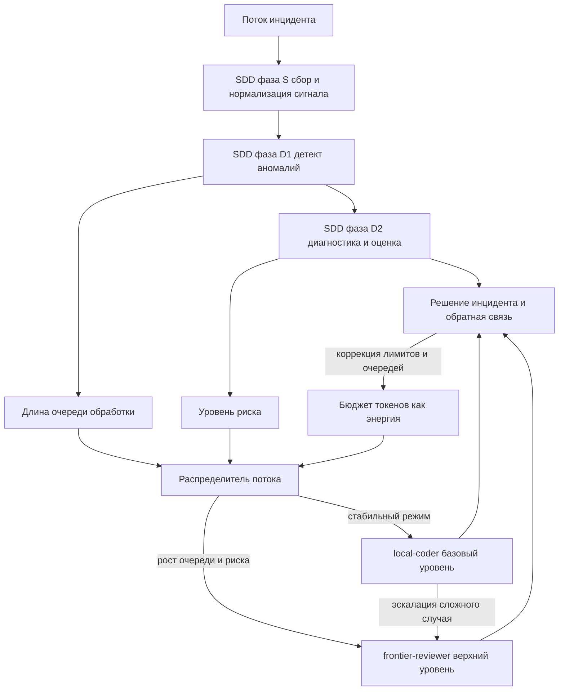

# Прикладная часть 9. Маршрутизация моделей и бюджет токенов

**Статус: Рекомендация.** Разводить дешёвую модель для рутины и дорогую модель для критических ревью — устойчивая практика. Конкретные пороги, формула переключения при отказе (fallback) и хранитель бюджета как отдельный сервис — фронтир: Qwen Code сам бюджетом не управляет, реализация зависит от инфраструктуры.

Для учебного прохождения достаточно проиграть отказ `local-coder` в `examples/budget-keeper/` и проверить, что не вся очередь уходит в дорогой ярус. Отдельный хранитель бюджета и интеграция с провайдерами относятся к полному production-треку.

В учебном AgentClinic мы выбирали одну модель в [части 4 первого тома](../book/part-04-environment.md) и держали процесс независимым от неё ([часть 15](../book/part-15-agent-replaceability.md)). В production одной модели мало. Дорогая не должна стихийно поглощать всю очередь инцидентов. Дешёвая — молча деградировать на спорных кейсах. Здесь добавляется измерение, которого в учебном проекте не было: управление смесью моделей по фазам конвейера. Маршрутизация удобно ложится в пользовательскую команду или хук — приёмы из [части 14. Собственный процесс через навыки Qwen Code](../book/part-14-build-your-own-workflow.md).

## Перед чтением

- Опора из первого тома: часть 15 требует заменяемости агента, часть 14 показывает проектные навыки и хуки.
- Локальный учебный кейс: `autoscale_200pct`, потому что отказ дешёвого яруса даёт наблюдаемую бюджетную симуляцию.
- След для `capstone/`: один риск для `high_memory_usage`: что происходит при отказе `local-coder`, сколько задач допускается в `frontier-reviewer`, какой `token_health` блокирует переключение.
- Главные термины первого прохода: ярус (tier) и `token_health`. Хранитель бюджета (budget keeper), `failover_to_frontier`, `manual_queue_after_120s` — справочные.
- Что отложить: интеграцию с провайдерами, отдельный сервис budget keeper и регулярные drills.

## Цель

Цель главы — превратить суточный бюджет токенов (в примере — 10M) из статического лимита в управляемую таблицу маршрутизации SDD-конвейера. Это и есть ярусные бюджеты (tier-budgeting): распределение токенов между уровнями моделей по фазам работы. Дешёвая модель (`local-coder`) берёт рутину. Дорогая (`frontier-reviewer`) включается только на критических ревью и спорных решениях.

Цифра 10M подобрана так, чтобы покрывать поток порядка 200 инцидентов в день при средней стоимости фазы около 50K токенов. Для более крупных потоков масштабируйте бюджет пропорционально, для меньших — уменьшайте, сохраняя пропорции между фазами. Разбивка `9M / 1M` между ярусами отражает наблюдение: в спокойном режиме на спорные ревью уходит около 10% общего бюджета. Если ваш проект чаще ставит сложные задачи, увеличьте долю верхнего яруса до 15–20%.

После раздела вы сможете построить распределение токенов по фазам инцидент-менеджмента, задать SLA-пороги для каждого яруса, проверить поведение системы при падении дешёвой модели и доказать, что экономия не разрушает MTTR (среднее время восстановления), качество эскалаций и устойчивость пост-аналитики. `local-coder` и `frontier-reviewer` — это роли в вашей инфраструктуре, а не имена моделей: в одном проекте это могут быть разные модели одного провайдера, в другом — локальная и облачная модели.

## Минимальный учебный сценарий

### Учебный кейс

Production-инцидент `autoscale_200pct` для MVP-фазы `appointments-api` из [book/part-12-mvp.md](../book/part-12-mvp.md). Утром локальный ярус недоступен 45 минут (11:00–11:45), в очередь падают 20 инцидентов, ручной тайм-аут — 120 секунд. Цель учебного прогона — убедиться, что переключение при отказе пропускает на верхний ярус только высокий риск, а не всю очередь, и сохраняет `token_health_min` выше безопасного порога.

### Подготовка

- `book2/examples/budget-keeper/specs/budget_network.yaml` — описание плана на 10M токенов.
- `book2/examples/budget-keeper/specs/budget_network_5m.yaml` — готовый калибровочный вариант на 5M токенов с теми же пропорциями.
- `book2/examples/budget-keeper/scenarios/fail_local_45m.json` и `fail_local_15m.json` — два сценария отказа.
- `book2/examples/budget-keeper/outputs/budget_plan.example.json`, `outputs/fail_result.example.json` — эталоны для сравнения.
- `book2/examples/budget-keeper/scripts/compile.py`, `simulate.py`, `inspect.py`.

### Шаги

1. `cd book2/examples/budget-keeper`. *Ожидание: вы в каталоге примера, дополнительных зависимостей нет.*
2. `python3 scripts/compile.py --budget-spec specs/budget_network.yaml --out out/budget_plan.json`. *Ожидание: в `out/budget_plan.json` поле `daily_budget_tokens: 10000000`, сумма local-яруса равна 9 000 000, frontier — 1 000 000 (90/10).*
3. Сравнить `out/budget_plan.json` с `outputs/budget_plan.example.json` через `diff`. *Ожидание: расхождений нет, либо отклонения только в комментариях.*
4. `python3 scripts/simulate.py --plan out/budget_plan.json --scenario scenarios/fail_local_45m.json --out out/fail_result.json`. *Ожидание: `failover_to_frontier == 5`, `degraded_queue == 15`, `token_health_min >= 0.5`.*
5. `python3 scripts/inspect.py --result out/fail_result.json --query "failover_to_frontier==5 && degraded_queue==15 && manual_queue_after_120s==15 && token_health_min>=0.5"`. *Ожидание: код возврата 0, все четыре условия выполнены одновременно.*

   **Плохо:** проверять одну метрику за раз — на frontier ушло 5 задач, остальное «вроде ок», `token_health` забыли.
   **Хорошо:** один прогон inspect с четырьмя условиями в `&&` — отказ хотя бы одной метрики ломает прогон.

6. Короткий отказ. `python3 scripts/simulate.py --plan out/budget_plan.json --scenario scenarios/fail_local_15m.json --out out/fail_15m_result.json && python3 scripts/inspect.py --result out/fail_15m_result.json --query "token_health_min>=0.7"`. *Ожидание: код возврата 0, `token_health_min >= 0.7` (короткий отказ менее агрессивно жжёт frontier).*
7. Зафиксировать прогон как короткий бюджетный вывод: `local-coder` недоступен, верхний ярус получает только 5 задач, остальное уходит в degraded/manual, `token_health_min` остаётся выше порога. *Ожидание: при следующем регрессе по `token_health` сравнение идёт не «зелёный против старого baseline», а против обеих симуляций.*

Если у вас установлен Qwen Code и нужно объяснение для ревью, выполните отдельный необязательный шаг:

```bash
qwen -p "Прочитай @out/fail_result.json и @out/fail_15m_result.json. Объясни, почему 45-минутный отказ снижает token_health сильнее, чем 15-минутный. Файлы не меняй." --approval-mode plan
```

Такой вывод полезен как комментарий, но не заменяет `inspect.py` и не считается runnable-фактом.

### Контрольный факт

Четыре условия из шага 5 выполняются одновременно. `token_health_min` падает не ниже 0.5 при 45-минутном отказе и не ниже 0.7 при 15-минутном. Без обеих симуляций сценарий считается неполным: одна точка не показывает чувствительность бюджета к длительности падения.

### Как это попадает в `capstone/`

Перенесите в `capstone/budget-note.md` не таблицу всего бюджета, а один риск и один ограничитель: что случится при отказе `local-coder`, сколько задач уйдёт в `frontier-reviewer`, какой порог `token_health` блокирует дальнейшее переключение. Если основной зачётный кейс — `high_memory_usage`, запишите этот прогон как бюджетный риск для того же контура: не весь `autoscale_200pct`, а принцип «дорогой ярус не принимает всю очередь при отказе дешёвого». Полный `budget_plan.json` нужен только полному треку.

Минимальный фрагмент:

```yaml
risk: "local-coder недоступен 45m"
effect: "5 задач уходят в frontier-reviewer, 15 остаются degraded/manual"
simulated_floor: "token_health_min == 0.5 (просадка при 45m)"
alert_threshold: "token_health_min < 0.60 (сторож из anti-Goodhart-таблицы)"
decision: "не переводить всю очередь на дорогой ярус"
```

Два разных порога не должны путать. `0.5` — наблюдаемое дно симуляции; `0.60` — линия, ниже которой сторож блокирует автоматическое переключение в production. Учебный сценарий показывает, что 45-минутный отказ пробивает сторож и поэтому требует ручного решения.

### Ревьюируемый след

Каталог `out/` — локальный результат симуляции и не должен попадать в репозиторий. Для учебного прохода достаточно строки в `capstone/budget-note.md` с риском, эффектом, guard-порогом и решением.

В своём production-репозитории можно дополнительно хранить короткий отчёт о drill-прогоне: ссылки на сценарии 45m и 15m, инвариант `token_health_min` и решение не переводить всю очередь на дорогой ярус. Такой отчёт полезен только если его читает ревьюер или CI; сам по себе коммит не является фактом SDD.

## Ключевые идеи

Маршрутизация моделей начинается с разделения инцидента на фазы: `triage` (первичный разбор), классификация, диагностика, план, ремедиация, пост-анализ. Для каждой фазы зафиксируйте три параметра: какая модель её обслуживает, какая ожидаемая стоимость в токенах и при каком риске происходит эскалация на верхний ярус.

Triage и классификация — плотный, шаблонный поток, чувствительный к задержке. Поэтому `local-coder` берёт его как основной потребитель рутины: быстро нормализует оповещения, группирует похожие симптомы, извлекает сервис, severity, последние события и первичный радиус последствий (blast radius, область возможного ущерба).

`frontier-reviewer` занимает верхний уровень сети для спорных диагнозов, конфликтующих планов, критичных ремедиаций и пост-мортемов. Это случаи, где ошибка может стоить дороже, чем весь вызов модели.

Проводите границу между ярусами не по престижу модели, а по восстановимости решения. Если действие легко откатить и его можно проверить локальным валидатором, оно остаётся в дешёвом контуре. Если откат дорогой или последствия затрагивают несколько сервисов, нужен дорогой контур.



Диаграмма выше показывает только входные и решающие фазы SDD-цикла (сбор сигнала, детект, диагностика); полный цикл инцидента продолжается фазами `plan`, `remediation`, `postmortem`, у которых отдельные SLA и квоты — они появляются в YAML ниже. То есть три абстрактные фазы диаграммы (`S`, `D1`, `D2`) разворачиваются в шесть конкретных квот (`triage`, `classification`, `diagnosis`, `plan`, `remediation`, `postmortem`) плюс `control_reserve` как буфер.

Стройте квоты токенов по форме нагрузки, а не только по желаемой экономии. Для 10M токенов в сутки базовая раскладка может закрепить 9M за `local-coder` и 1M за `frontier-reviewer`. Дешёвый ярус покрывает triage, классификацию, черновую диагностику и предварительный план. Дорогой ярус получает резерв на валидацию, спорные действия ремедиации и пост-анализ.

Задавайте SLA-пороги отдельно для каждой фазы. Например: triage обязан укладываться в десятки секунд, диагностика может тратить больше контекста, а пост-мортем допускает более долгий проход ради полноты цепочки доказательств.

Не превращайте резерв в «остаток на всё подряд». Резерв — это страховочный слой, который активируется только при росте риска, очереди или неопределённости.

Шаблон проектного файла: `.specify/memory/budget_network.yaml`.

```yaml
daily_budget_tokens: 10000000
phases:
  triage:
    local-coder: 3000000
    frontier-reviewer: 120000
    sla_p95: "30s"
  classification:
    local-coder: 2000000
    frontier-reviewer: 140000
    sla_p95: "45s"
  diagnosis:
    local-coder: 1500000
    frontier-reviewer: 180000
    sla_p95: "90s"
  plan:
    local-coder: 800000
    frontier-reviewer: 120000
    sla_p95: "120s"
  remediation:
    local-coder: 700000
    frontier-reviewer: 200000
    sla_p95: "180s"
  postmortem:
    local-coder: 300000
    frontier-reviewer: 240000
    sla_p95: "10m"
  control_reserve:
    local-coder: 700000
    frontier-reviewer: 0
```

В своём проекте те же шаги оформляются как `tools/budget_keeper.py compile|assert|simulate|inspect` поверх интеграции с провайдерами и CI. Внутри учебника запускается runnable-аналог:

> **[runnable]** — запускаемый пример хранителя бюджета лежит в [`examples/budget-keeper/`](examples/budget-keeper/) (см. [`examples/budget-keeper/README.md`](examples/budget-keeper/README.md)): там образец `budget_network.yaml`, скрипты `compile.py`, `simulate.py`, `inspect.py` и сценарии переключения при отказе.

```bash
cd book2/examples/budget-keeper
python3 scripts/compile.py \
  --budget-spec specs/budget_network.yaml \
  --out out/budget_plan.json
```

Моделируйте каскад отказов как ранжированное переключение при отказе, а не как простую замену одной модели другой. Переключение при отказе (failover) здесь — это план переключения нагрузки при отказе яруса. Посмотрим на разницу подходов.

**Плохо:**
> При падении local-coder весь трафик идёт в frontier-reviewer.

Проблема: дорогой ярус съест дневную квоту за минуты и не сможет обслужить настоящие P0/P1, когда они придут.

**Хорошо:**
> При падении local-coder в frontier-reviewer уходят только задачи с `severity in [P0, P1]` и `age > 90s`, остальные — в очередь деградации (degraded queue).

Если `local-coder` падает, не пускайте весь входящий поток автоматически в `frontier-reviewer`. Иначе дорогой ярус быстро исчерпает квоту и потеряет способность обслуживать действительно критичные случаи.

Вместо этого хранитель бюджета (budget-keeper, служба контроля бюджета токенов) каждую минуту считает несколько параметров: `spent[p]` и `queue[p]` (потрачено и длина очереди в фазе p), `quota[p]` (оставшаяся квота), возраст инцидента, радиус последствий (blast radius) и разрыв в уверенности модели (confidence-gap). На основании этого он выбирает только те задачи, где задержка опаснее расхода. Такое ранжированное переключение при отказе меняет время эскалации: часть инцидентов уходит в `frontier-reviewer` немедленно, часть остаётся в режиме деградации (degraded mode), а часть переводится в ручной канал после заданного тайм-аута.

Аварийный режим, или «красная кнопка» (red button), — это переключатель в защищённый режим. Образное название допустимо, но в артефактах фиксируйте именно условия аварийного режима. Он нужен как отдельный режим управления, потому что автоматическое переключение при отказе само может стать источником аварии. Условия включения формальные: два последовательных окна с ростом риска `token_health` (сводный показатель здоровья бюджета токенов), очередь выше лимита, превышение SLA по критичным severity или падение локальной конечной точки, обслуживающей `local-coder`.

После срабатывания система ограничивает новую очередь, запрещает массовые автоматические ремедиации, сохраняет `frontier-reviewer` для P0/P1 и переводит остальные решения в ручной или квази-ручной режим. Ручной режим — это не откат к хаосу. Пусть он наследует тот же файловый протокол, цепочку доказательств и проверки `PostToolUse`, чтобы после стабилизации можно было восстановить причины каждого решения.

Логика anti-Goodhart в `validation.md` закрывает главный риск бюджетной оптимизации: улучшение отчётных метрик за счёт скрытого ухудшения реального инцидент-менеджмента. Правило anti-Goodhart — это запрет считать релиз удачным, если одна метрика выросла за счёт деградации других.

Если контролировать только MTTR, система может быстрее закрывать сложные инциденты как некритичные, занижать долю эскалаций или вытеснять неудобные P0 в ручные каналы без полноценного пост-мортема. Поэтому MTTR валидируйте вместе с четырьмя сторожевыми метриками и одним условием активации проверки. Их роль удобно держать в одной таблице.

| Метрика | Что меряет | Что блокирует |
|---|---|---|
| `escalation_share` | доля эскалаций к общему потоку | условие активации проверки — падение ниже исторического коридора одновременно с быстрым MTTR |
| `silent_p0` | доля закрытых P0 без эскалации | рост выше 2% |
| `unresolved_manual_ratio` | доля незакрытых ручных задач | рост выше 5% |
| `postmortem_gap` | пропуски в пост-аналитике | пропуски выше 10% |
| `token_health_min` | минимальный уровень здоровья бюджета | падение ниже 0.6 |

Считайте улучшение MTTR недействительным, если хоть одна сторожевая метрика ушла за свою границу. Парная проверка ровно для этого: красивый отчётный показатель не должен закрывать собой деградацию устойчивости, тихие провалы P0 или разрыв доказательной цепочки.

Фрагмент для `validation.md` с правилами бюджетного шлюза.

```yaml
checks:
  - id: anti_goodhart_budget
    if:
      all:
        - mttr_p95 < "5m"
        - escalation_ratio < 0.08
    then:
      fail_if:
        - silent_p0 > 0.02
        - unresolved_manual_ratio > 0.05
        - postmortem_gap > 0.10
        - token_health_min < 0.60

  - id: ecology_warn
    if:
      any:
        - token_health_trend_5m < -0.12
        - queue_pressure > 0.80
        - degraded_mode_duration > "120s"
    then:
      require:
        - red_button_review == true
        - manual_channel_open == true
        - frontier_reserved_for_p0_p1 == true
```

В своём проекте эту проверку оформляют как `python3 tools/validation_runner.py run --spec validation.md --out .specify/artifacts/validation_health.json` с последующей `jq`-проверкой `anti_goodhart_budget` и `ecology_warn`. Близкий запускаемый аналог самих anti-Goodhart-проверок — `examples/goodhart-validator/scripts/run_validation.py` (см. главу 10).

## Полный трек: калибровка порогов

Таблица «Низкий / По умолчанию / Высокий» для размера бюджета, пропорций local/frontier и `manual_timeout_sec`, упражнение со сжатым 5M-вариантом и сигналы для пересмотра — в [Приложении D, раздел D.3](appendix-d-threshold-calibration.md#d3-ярусные-бюджеты-глава-9). На первом проходе достаточно двух симуляций отказа и строки `token_health` в `budget-note.md`.

## Примеры и применение

Практическая симуляция сценария B проверяет, что падение `local-coder` не превращает `frontier-reviewer` в аварийный резерв для всей очереди. В 11:00 локальная конечная точка дешёвой модели недоступна на 45 минут. Очередь содержит 20 инцидентов. Ручной тайм-аут равен 120 секундам.

Политика выбирает три направления: 5 задач с максимальным радиусом последствий и возрастом уходят в `frontier-reviewer`, 15 задач остаются в очереди деградации, через две минуты открывается ручной канал. Проверка считается успешной не потому, что все задачи обработаны автоматически. Успех в другом: система сохранила дорогой ярус, ограничила очередь и не допустила падения `token_health_min` ниже безопасного порога.

В своём проекте этот сценарий запускается как `tools/budget_keeper.py simulate ... --failure "11:00,local-coder,down,45m" --queue 20 --manual-timeout-sec 120` с последующим `inspect` по условию `failover_to_frontier==5 && degraded_queue==15 && manual_queue_after_120s==15 && token_health_min>=0.5`. Запускаемый аналог тот же:

> **[runnable]** — сценарий `examples/budget-keeper/scenarios/fail_local_45m.json`.

```bash
cd book2/examples/budget-keeper
python3 scripts/simulate.py \
  --plan out/budget_plan.json \
  --scenario scenarios/fail_local_45m.json \
  --out out/fail_result.json

python3 scripts/inspect.py \
  --result out/fail_result.json \
  --query "failover_to_frontier==5 && degraded_queue==15 && manual_queue_after_120s==15 && token_health_min>=0.5"
```

Делайте откат после стабилизации ступенчатым: иначе восстановление дешёвого яруса создаст второй каскад. Сначала возвращайте 30% квоты `local-coder` и только для triage/classification (эти фазы легче проверить по формальным признакам и они быстрее разгружают входной поток); ещё 30% — в diagnosis/plan после трёх стабильных окон `token_health`, отсутствия роста `silent_p0_ratio` и нормализации очереди; полный возврат разрешайте только после аудита `PostToolUse`. Причина: преждевременное снятие ручного режима может скрыть ошибки, накопленные во время деградации.

В эксплуатации эту модель удобно проверять как ежедневный бюджетный учебный прогон (budget-drill). Команда берёт вчерашний поток оповещений, проигрывает его через текущий `budget_network.yaml` и искусственно отключает `local-coder` на 15, 30 и 45 минут. Затем сравниваются четыре показателя: MTTR, доля эскалаций, объём ручной очереди и минимальный `token_health`.

Сигналы для разбора:

- если при коротком отказе `frontier-reviewer` начинает обслуживать некритичные задачи — переключение при отказе слишком широкое;
- если ручной канал открывается уже при умеренной очереди — SLA-пороги слишком нервные.

Цель прогона — найти такой профиль, где деградация предсказуема, а не невидима до момента исчерпания квоты.

## Итог

Токеновый бюджет становится управляемым ресурсом только тогда, когда пять элементов связаны в один контур управления: фазы SDD, ярусирование моделей (model tiering), SLA-пороги, переключение при отказе и валидация. В этом контуре `local-coder` даёт пропускную способность для массовой рутины; `frontier-reviewer` защищает спорные и высокорисковые решения; аварийный режим ограничивает автоматизацию при росте риска; `validation.md` не позволяет улучшать MTTR ценой скрытых P0 и разрушенной пост-аналитики. Такая схема показывает не только текущий расход, но и порядок деградации: какие фазы начнут голодать первыми, какие задачи должны перейти в дорогой ярус и когда ручной режим безопаснее дальнейшей автоматизации. Далее этот контур перейдёт к метрикам Гудхарта и парным сторожевым метрикам.

## Артефакты и критерии готовности

| Артефакт | Готов, когда |
|---|---|
| Локальный прогон `book2/examples/budget-keeper` | сумма квот соответствует 10M токенов и заданному разделению local/frontier |
| `out/budget_plan.json`, `out/fail_result.json`, `out/fail_15m_result.json` | сценарий 45 минут даёт `failover_to_frontier==5`, `degraded_queue==15`, `manual_queue_after_120s==15`, `token_health_min>=0.5`; сценарий 15 минут сохраняет `token_health_min>=0.7`; `out/` не коммитится |
| Запись в `precedents.md` или `capstone/budget-note.md` | объясняет, что происходит при отказе `local-coder`, какие задачи уходят в `frontier-reviewer` и какой порог `token_health_min` защищает бюджет |

Полный трек добавляет `.specify/memory/budget_network.yaml` с фазами и SLA, `budget_plan.json` после `compile`, `fail_scenario_B.json`, `validation.md` с бюджетным шлюзом anti-Goodhart и `validation_health.json`. Считайте его готовым, если аварийный режим сохраняет frontier для P0/P1 и открывает ручной канал, шлюз anti-Goodhart блокирует экономию ценой `silent_p0` или разрыва аудита, а бюджетная симуляция включена в регулярный drill или CI.

## Практика

1. `cd book2/examples/budget-keeper && python3 scripts/compile.py --budget-spec specs/budget_network.yaml --out out/budget_plan.json` — *ожидание: `daily_budget_tokens == 10_000_000`, сумма local-яруса 9M, frontier 1M (90/10).*
2. `python3 scripts/simulate.py --plan out/budget_plan.json --scenario scenarios/fail_local_45m.json --out out/fail_result.json && python3 scripts/inspect.py --result out/fail_result.json --query "failover_to_frontier==5 && degraded_queue==15 && manual_queue_after_120s==15 && token_health_min>=0.5"` — *ожидание: код 0, четыре условия выполнены одновременно.*
3. Перенесите в `capstone/budget-note.md` пять строк: `risk`, `effect`, `simulated_floor`, `alert_threshold`, `decision`. *Ожидание: формат совпадает с эталоном из раздела «Как это попадает в `capstone/`»; полный `budget_plan.json` в `capstone/` не попадает.*

## Контрольные вопросы

1. Почему failover не должен пускать всю очередь в дорогой ярус?
2. Какие метрики выдают деградацию бюджетной маршрутизации?
3. Когда ручной режим безопаснее, чем продолжение автоматики?
4. Локальная модель упала на 45 минут в пиковое время. У вас 60% дневного бюджета, но MTTR ползёт вверх. Что вы переключите — модель, политику маршрутизации или режим triage?
