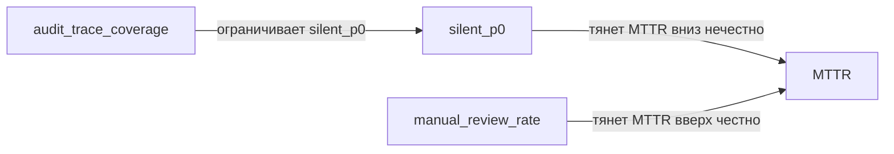

# Прикладная часть 10. Защита метрик от Гудхарта: сторожевые метрики и аварийный режим

**Статус: Рекомендация.** Защита KPI парной сторожевой метрикой (guard-метрикой) и блокирующим аварийным режимом — устоявшаяся практика, описанная в Google SRE Book. Конкретные пороги (`silent_p0`, `manual_review_floor`, `audit_trace_coverage`) и формат `validation.md v1.1` — рекомендуемая рамка, которую большинство команд адаптирует.

Для учебного прохождения достаточно запустить `examples/goodhart-validator/` и увидеть, как хороший MTTR блокируется ростом `silent_p0`. Сеть метрик, trace-поля и калибровка порогов относятся к полному production-треку. Если ниже встречается название «красная кнопка», читайте его как короткий ярлык для формального аварийного режима.

В [части 9 первого тома](../book/part-09-feature-validation.md) одна метрика на одну проверку была достаточной: «отзыв виден после публикации», «сумма не уходит в минус». В production-сценарии `cdn_error_budget_burn` той же логики уже мало. Дашборд журнала агентов и недугов из [части 11](../book/part-11-second-feature-phase.md) после релиза показывает противоречивую картину, и одиночная метрика оказывается приманкой. Здесь мы развернём её до сети парных сторожевых метрик — это пары «KPI + страховочный показатель», где второй не даёт оптимизировать первый ценой скрытого ущерба. Каталог типичных манипуляций, против которых эта сеть защищает, систематизирован в [части 20. Антипаттерны SDD](../book/part-20-sdd-antipatterns.md).

## Перед чтением

- Опора из первого тома: часть 9 учит проверять факт, а не убедительную прозу; часть 20 показывает, как процесс начинает защищать неправильную цель.
- Локальный учебный кейс: `cdn_error_budget_burn`, потому что улучшенный MTTR можно заблокировать ростом `silent_p0`.
- След для `capstone/`: одна целевая метрика, одна guard-метрика и один заблокированный пример для `high_memory_usage`.
- Главные термины первого прохода: guard-метрика и аварийный режим («красная кнопка»). Остальные — `silent_p0`, `manual_review_floor`, `audit_trace_coverage`, `edge_drift`, поля трассировки, сеть метрик — справочные, открывайте их только тогда, когда они нужны для одной строки `capstone/goodhart-note.md`.
- Что отложить: сеть метрик, trace-поля, drift-калибровку и полноценный аварийный режим.

## Цель

К концу раздела вы соберёте `validation.md`, который заранее ловит ловушки Гудхарта и не позволяет LLM-инцидентному конвейеру улучшать отчётные KPI ценой деградации triage.

Главный выигрыш такой: вы разделите метрики на управляемые цели и неприкосновенные инварианты качества. Затем закрепите для них проверяемые пороги, доказательства в следах (trace) и блокировки в CI.

«Метрики-приманки» здесь означают KPI, которые полезны как сигнал, но становятся опасными, если оптимизировать их отдельно от инвариантов качества. KPI (key performance indicator) — это ключевой показатель, который команда стремится улучшить релизом.

Такой подход продолжает SDD-цикл: спецификация, критерии проверки и итерации фиксируются до внедрения изменений, а не подгоняются после получения красивого результата ([GitHub Spec Kit Quickstart](https://github.github.io/spec-kit/quickstart.html)).

Сам эффект «когда мера становится целью, она перестаёт быть хорошей мерой» классически известен как закон Гудхарта ([Wikipedia: Goodhart's law](https://en.wikipedia.org/wiki/Goodhart%27s_law)) — хотя у самого Чарльза Гудхарта (1975) формулировка была иной: «любая наблюдаемая статистическая закономерность разрушается, как только на неё начинают давить в целях управления»; афористичную версию сформулировал Кит Хоскин (1996), а популяризовала Мэрилин Стрэферн (1997). Определение SLO у Google SRE перекликается с этой осторожностью ([SRE Book: Service Level Objectives](https://sre.google/sre-book/service-level-objectives/)).

## Минимальный учебный сценарий

### Учебный кейс

Production-инцидент `cdn_error_budget_burn`, спроецированный на учебный журнал агентов из [book/part-11-second-feature-phase.md](../book/part-11-second-feature-phase.md). Релиз улучшил MTTR с 660s до 290s, формально выглядит как успех. Но `silent_p0` подскочил с 0.02 до 0.18, `manual_review_rate` упал с 0.18 до 0.12. Цель — увидеть, что CI-шлюз ловит этот сдвиг и блокирует слияние, несмотря на «зелёный» MTTR.

### Подготовка

- `book2/examples/goodhart-validator/specs/validation.yaml` — инварианты и проверка красной кнопки.
- `book2/examples/goodhart-validator/fixtures/baseline_metrics.json` — эталон (MTTR 660s, silent_p0 0.02).
- `book2/examples/goodhart-validator/fixtures/new_metrics_good.json` — улучшение без слепых зон.
- `book2/examples/goodhart-validator/fixtures/new_metrics_bad.json` — «MTTR-слепота» (290s, silent_p0 0.18).
- `book2/examples/goodhart-validator/fixtures/new_metrics_drift.json` — дрейф по корреляциям рёбер.
- `book2/examples/goodhart-validator/scripts/run_validation.py`, `compare_drift.py`, `ci_gate.py`.

### Шаги

1. `cd book2/examples/goodhart-validator`. *Ожидание: вы в каталоге примера, дополнительных зависимостей нет.*
2. Прогон «хороший»: `python3 scripts/run_validation.py --validation specs/validation.yaml --metrics fixtures/new_metrics_good.json`. *Ожидание: код возврата 0, статус `PASS`, все три инварианта `OK`.*
3. Прогон «MTTR-слепота»: `python3 scripts/run_validation.py --validation specs/validation.yaml --metrics fixtures/new_metrics_bad.json`. *Ожидание: код возврата 1, `red_button_mttr_blindness` срабатывает, `manual_review_floor` и `silent_p0_cap` помечены FAIL.*

   **Плохо:** смотреть только на MTTR — релиз быстрее, кажется «лучше».
   **Хорошо:** запускать валидацию с инвариантами — «быстрее» при `silent_p0=0.18` блокируется автоматически.

4. Прогон дрейфа против drift-фикстуры: `python3 scripts/compare_drift.py --baseline fixtures/baseline_metrics.json --new fixtures/new_metrics_drift.json`. *Ожидание: `edge_drift > 0.12`, код возврата 1.*
5. Контроль: тот же `compare_drift.py` против хороших метрик. *Ожидание: `edge_drift <= 0.12`, код возврата 0.*
6. Полный CI-шлюз: `python3 scripts/ci_gate.py --validation specs/validation.yaml --baseline fixtures/baseline_metrics.json --new fixtures/new_metrics_bad.json`. *Ожидание: код возврата 1, в `reasons` перечислены конкретные нарушенные инварианты, а не общее `FAIL`.*
7. Зафиксировать прогон как короткий anti-Goodhart-вывод: целевая метрика улучшилась, но `silent_p0_cap` и `manual_review_floor` заблокировали релиз. *Ожидание: при следующем пулл-реквесте с ускорением MTTR валидатор сравнивает не «зелёный против старого baseline», а против good/bad/drift-фикстур.*

Если у вас установлен Qwen Code и нужно объяснение для ревью, выполните отдельный необязательный шаг:

```bash
qwen -p "Прочитай @fixtures/new_metrics_bad.json и @specs/validation.yaml. Какой инвариант нельзя обходить даже при MTTR=290s? Файлы не меняй." --approval-mode plan
```

Такой вывод полезен как пояснение, но не заменяет `run_validation.py`, `compare_drift.py` и `ci_gate.py`.

### Контрольный факт

Шаг 2 даёт код возврата 0, шаги 3 и 4 — код возврата 1 с конкретным указанием нарушенных инвариантов. Шаг 6 показывает то же поведение в составном шлюзе. Если CI-шлюз пропускает `new_metrics_bad.json`, конфигурация валидатора ослаблена — порог `silent_p0_cap` или `manual_review_floor` сдвинут.

### Как это попадает в `capstone/`

Перенесите в `capstone/goodhart-note.md` одну целевую метрику, одну guard-метрику и один заблокированный пример. Если основной зачётный кейс — `high_memory_usage`, запишите этот прогон как anti-Goodhart-риск для того же контура: memory или MTTR нельзя улучшать ценой `silent_p0`, ручного аудита или 5xx. Не переносите всю сеть метрик, если она не пересчитывалась; для учебного минимума достаточно показать, что улучшенный KPI не проходит без защитного инварианта.

Минимальный фрагмент:

```yaml
target_metric: "MTTR <= 5m"
guard_metric: "silent_p0 <= 0.05 and manual_review_rate >= 0.15"
blocked_example: "new_metrics_bad.json"
reason: "MTTR improved, but silent_p0 and manual_review_floor fail"
```

### Ревьюируемый след

Скрипты `run_validation.py`, `compare_drift.py` и `ci_gate.py` пишут результаты в stdout, отдельной директории `out/` не создают. Для учебного маршрута перенесите итог в `capstone/goodhart-note.md`: целевая метрика, guard-метрика, заблокированный пример и причина.

Если в своём проекте вы сохраняете `outputs/goodhart.last-run.txt`, он должен быть читаемым приложением к ревью, а не пустым маркером. В SDD фактом считается воспроизводимая команда или читаемый артефакт, а не само наличие коммита.

## Ключевые идеи

Сначала определите, какие показатели остаются инвариантами качества, а какие становятся целями оптимизации и поэтому поддаются манипуляции. Инвариант нельзя «улучшать» прямым давлением: он описывает минимально допустимое состояние системы. Примеры инвариантов:

- полнота аудита;
- доля ручной проверки;
- верхняя граница `silent_p0` (это доля «тихих» критических инцидентов, закрытых без эскалации).

Цель оптимизации, наоборот, можно снижать или повышать, но только внутри защитного коридора. MTTR полезен как показатель скорости восстановления, но опасен как единственная награда для модели или команды.

В `validation.md` сделайте это различие явным. `MTTR<=5m` может быть целью. А `manual_review_rate>=15%`, `silent_p0<=5%` и `audit_trace_coverage==100%` оставьте условиями допуска.

**Плохо:**

> `Достичь MTTR ниже 5 минут.`

Проблема: голая цель без сторожевых метрик, прямой путь к `silent_p0`.

**Хорошо:**

> `MTTR <= 5m AND silent_p0 <= 5% AND manual_review_rate >= 15% AND audit_trace_coverage == 100%` — нарушение любого условия = `CI_BLOCK`.

Ловушка Гудхарта проявляется, когда метрика становится заменителем реальности. Система начинает оптимизировать способ измерения, а не качество triage. Если MTTR проверяется изолированно, модель учится быстрее закрывать инциденты, снижать долю эскалаций и избегать длинных расследований — именно они портят среднее время восстановления.

На графике это выглядит как победа: MTTR падает до 5 минут или ниже. Но в операционном контуре это может означать обратное. Сложные P0 не исчезли, а стали незаметными, потому что были ошибочно классифицированы как ложные срабатывания, низкая срочность или «самовосстановившиеся» события.

Ловушка «MTTR 5 минут» особенно опасна для редких тяжёлых инцидентов, где скорость закрытия конкурирует с полнотой расследования. На числах это выглядит так:

- эталон на 300 инцидентах в реплее: MTTR 11:00, доля эскалаций 14%, `silent_p0` 2%;
- новая оптимизированная версия: MTTR 4:50, эскалации 6%, `silent_p0` 18%.

Формально KPI улучшился. Но система стала чаще пропускать критические события без ручной проверки и эскалации. Блокируйте такой релиз: он переносит риск из видимого отчёта в будущие повторные инциденты, регрессии пост-мортема и потерянные цепочки ответственности.

Антитела в `validation.md` — формальные условия, которые не дают оптимизации переопределить смысл качества. Минимальный набор — три правила, и проверять их нужно одновременно:

| Правило | Что защищает | Граница |
|---|---|---|
| `manual_review_floor` | долю решений с ручной верификацией | не ниже 15% |
| `silent_p0_cap` | долю «тихих» P0, закрытых без эскалации | не выше 5% |
| `audit_trace_required` | полноту следа решения (prompt, diff, источник) | 100%, без исключений |

По отдельности эти правила оставляют лазейки. Высокая трассируемость не компенсирует рост `silent_p0`. Ручная проверка бесполезна, если невозможно восстановить подсказку, различие и источник решения. Настройте «красную кнопку» так, чтобы она срабатывала не на одну плохую цифру, а на нарушение защитного контура.

### Что выбрать в качестве цели и что — в качестве защиты

Не все KPI требуют одинаковой защиты. Ручная триаж-операция и автоматическая ремедиация имеют разный уровень риска, поэтому и минимальный набор инвариантов разный. Главное правило одно: чем опаснее действие, тем больше сторожевых метрик идёт в паре к целевому KPI.

| Тип решения | Что улучшаем | Что обязано идти в паре |
|---|---|---|
| Ручная триаж-операция | `MTTR` | след решения сохранён полностью |
| Авто-классификация без действия | скорость и точность классификации | нет тихих P0; след решения сохранён |
| Авто-эскалация | задержка эскалации | нет тихих P0; нет ложных эскалаций |
| Авто-ремедиация без состояния | `MTTR` | нет тихих P0; есть ручная проверка; полный аудит-след |
| Авто-ремедиация с состоянием (БД, кэш) | `MTTR` | то же + подтверждённая резервная копия |
| Релиз новой политики | точность на повторе | нет «дрейфа на границах»; полный аудит-след |

Полные англоязычные имена метрик (`silent_p0`, `manual_review_floor`, `audit_trace_coverage`, `false_escalation_rate`, `edge_drift`, `postmortem_gap`, `backup_verified`) с порогами и формулами вынесены в [Приложение D](appendix-d-threshold-calibration.md). Здесь важно правило, а не таблица имён: к каждой строке «что улучшаем» обязан быть один-два сторожа из той же области риска.

Для опасных действий (последние три строки) дополнительно включайте «красную кнопку» — блокирующий шлюз, который нельзя обойти без референдума из главы 3. Для ручных и наблюдательных операций (первые три строки) достаточно мягкого предупреждения.

Цель таблицы — не превратить её в догму, а помочь увидеть, что вы пропустили. Если в строке «авто-ремедиация с состоянием» у вас нет проверки резервной копии — это сигнал переписать `validation.md`, а не «оптимизировать MTTR».

> **[conceptual interface]** — структура `validation.md`, которую адаптируйте под свои файлы трассировки.

```yaml
#### Минимальная структура validation.md v1.1
version: 1.1
invariants:
  - name: manual_review_floor
    expression: "manual_review_rate >= 0.15"

  - name: silent_p0_cap
    expression: "silent_p0 <= 0.05"

  - name: audit_trace_required
    expression: "audit_trace_coverage == 1.0"

checks:
  - name: red_button_mttr_blindness
    when: "MTTR <= 5m"
    assert: "manual_review_rate >= 0.15 and silent_p0 <= 0.05 and audit_trace_coverage == 1.0"
    fail: "CI_BLOCK"
```

Полная форма с `artifact_inputs`, `network_consistency` и точным выражением для `audit_trace_required` через `COUNT(events_with(...))` — в [`examples/goodhart-validator/specs/validation.yaml`](examples/goodhart-validator/specs/validation.yaml).

Следующий слой защиты — детектор скрытых искажений прямо в спецификации. Считайте регрессией изменение поведения triage при неизменных KPI. Здесь регрессия — это сдвиг в распределении решений, который не виден агрегатам.

Причина: вред не всегда виден в верхнеуровневых числах. MTTR может остаться прежним, доля эскалаций может выглядеть нормальной, но модель начнёт иначе распределять спорные кейсы между `auto_close`, `manual_review` и `defer`.

Поэтому в `validation.md` сравнивайте не только агрегаты, но и поведенческие паттерны:

- матрицу переходов severity;
- распределение причин закрытия;
- долю повторно открытых инцидентов;
- задержку до метки пост-мортема;
- изменение связи между `manual_review_rate` и `silent_p0`.

Если `drift_budget` (допустимый коридор отклонения от эталона) превышен, блокируйте сборку даже при «зелёных» KPI. Это значит, что система уже сменила режим принятия решений.

Чтобы увидеть основную ловушку, достаточно трёх метрик и одного сторожа:



Читать так: можно искусственно улучшить `MTTR`, если разрешить «тихим» P0 закрываться без эскалации. Сторож `audit_trace_coverage` запрещает закрытие без следа, а `manual_review_rate` удерживает долю ручных проверок. Полная картина с дополнительными метриками (`escalation_rate`, `postmortem_regression`) — в [Приложении D](appendix-d-threshold-calibration.md); там же — формальные пороги и связи.

Привяжите проверки к логам Qwen, решениям и цепочкам различий — иначе их невозможно перенести в production без потери контекста. Минимальный состав трассировки на одно событие: `trace_id` (цепочка), `prompt_hash` (хеш подсказки), `decision` (что выбрано), `policy_version` + `diff_id` (какая версия и какое изменение её внесли) и `postmortem_label` (что подтвердил разбор). Полный набор полей с `agent`, `raw_alert_excerpt`, `reasoning_delta` и `review_outcome` относится к полному треку и собран в [`examples/templates/validation.md`](examples/templates/validation.md).

Эти пять полей позволяют ответить на инженерные вопросы после блокировки: какая версия спецификации изменила поведение, какая подсказка подтолкнула модель к автозакрытию, какое различие внесло новую эвристику. Без этой связки `validation.md` остаётся декларацией; с ней он становится воспроизводимым артефактом аудита.

Проектируйте метрики как сеть зависимостей, а не как набор независимых счётчиков. Это и есть `network_consistency`: изменение одной метрики не должно противоречить связанным. Пересчитывайте вместе MTTR, `silent_p0`, `manual_review_rate`, `escalation_rate`, `postmortem_regression`, `rollback_rate` и `audit_gap` (см. диаграмму выше). Локальное улучшение одной величины часто создаёт долг в другой. Практический критерий — согласованность рёбер: если MTTR падает, но одновременно снижается ручная проверка и растёт доля поздно подтверждённых P0, помечайте систему как рискованную. Это превращает CI из проверки «прошёл/не прошёл KPI» в проверку устойчивости поведения triage.

> **[conceptual interface]** — `scripts/metrics/network_recompute.py` показывает форму локального пересчёта сети метрик; готового CLI в репозитории учебника нет. Runnable-аналог самого CI-шлюза с anti-Goodhart-проверками — `python3 examples/goodhart-validator/scripts/run_validation.py` и `ci_gate.py` (см. ниже «Контрольный факт»).

```bash
#### Обновление сети метрик и валидационный CI-gate после изменения spec
python3 scripts/metrics/network_recompute.py \
  --spec specs/incident-spec.md \
  --replay data/replay_*.jsonl \
  --out .artifacts/metric_network.json

python3 scripts/metrics/ci_gate.py \
  --artifact validation.md \
  --metric-network .artifacts/metric_network.json \
  --traces .artifacts/qwen_trace.ndjson
```

`CONTROL: CI_GATE = PASS if (edge_drift <= 0.12 && silent_p0 <= 0.05 && manual_review_rate >= 0.15 && audit_trace_coverage == 1.0) else CI_BLOCK`

## Полный трек: калибровка порогов

Таблица «Низкий / По умолчанию / Высокий» для `silent_p0`, `manual_review_rate`, `edge_drift`, `audit_trace_coverage`, упражнение по «опасному» ослаблению двух защит сразу и полная сеть зависимостей метрик — в [Приложении D, раздел D.4](appendix-d-threshold-calibration.md#d4-защита-метрик-от-гудхарта-глава-10). На первом проходе достаточно увидеть, что плохой релиз блокируется guard-метрикой.

## Примеры и применение

Пример: команда хочет доказать готовность нового triage-конвейера к более агрессивному автозакрытию. Сначала запускается прогон-реплей с целевой оптимизацией `MTTR<=5m`. Затем тот же набор инцидентов проверяется через `red_button_mttr_blindness`.

Если результат выглядит как `MTTR=4:50`, `silent_p0=18%`, `manual_review_rate=12%`, блокируйте релиз. Причина не в плохой скорости, а в нарушении защитных инвариантов. Это важное различие: цель достигнута, но контракт качества разрушен.

> **[conceptual interface]** — `scripts/metrics/simulate.py` и `validate_red_button.py` показывают форму проверки аварийного режима; готового CLI в репозитории учебника нет. Runnable-аналог проверки тех же инвариантов на учебных фикстурах — `python3 examples/goodhart-validator/scripts/run_validation.py` (см. [examples/goodhart-validator/README.md](examples/goodhart-validator/README.md)).

```bash
#### Пример прогона красной кнопки на реплее
python3 scripts/metrics/simulate.py \
  --scenario data/replay_300.jsonl \
  --goal "MTTR<=5m" \
  --spec specs/incident-spec.md

python3 scripts/metrics/validate_red_button.py \
  --artifact validation.md \
  --mode red_button \
  --assert "silent_p0<=5% && manual_review_rate>=15% && audit_trace_coverage==1.0"
```

`CONTROL: red_button = BLOCKED (MTTR=4:50, silent_p0=18%, manual_review_rate=12%)`

Второй пример — ошибочное автозакрытие 40 P0 как «ложных срабатываний». До пост-мортема метрика выглядит чисто: инциденты закрыты быстро, эскалаций меньше, очередь не растёт.

После сверки с метками выясняется другое. Пять событий были реальными критическими отказами. Именно они должны увеличить `silent_p0`, `escalation_regret` и `postmortem_regression`.

В `validation.md` зафиксируйте такой случай как предиктивный провал triage. Не ждите пользовательского ущерба в production. Используйте реплей и истину пост-мортема как ранний сигнал блокировки.

На практике храните `validation.md` рядом со спецификацией и обновляйте только через тот же процесс ревью, что и правила triage. CI на каждое изменение пересобирает сеть метрик, прогоняет реплей, проверяет полноту трассировки и сравнивает поведение с эталоном. Изменение порога — например, поднять допустимый `silent_p0` с 5% до 7% — проводите как изменение контракта риска через mutable-правило из [части 3](part-03-project-constitution.md), а не как техническую правку YAML. Этот барьер защищает систему от постепенного размывания инвариантов под давлением удобных отчётов.

## Итог

Метрики-приманки опасны не тем, что они ложные. Они полезны до момента, когда становятся единственной целью оптимизации.

Надёжный `validation.md` решает пять задач:

- отделяет цели от инвариантов;
- блокирует улучшения MTTR при росте `silent_p0`;
- требует минимальной ручной верификации;
- проверяет дрейф поведения triage;
- сохраняет доказательную цепочку Qwen-логов, решений и различий.

> **[runnable]** — минимальный дымовой прогон для этой главы лежит в [`examples/goodhart-validator/`](examples/goodhart-validator/README.md).

```bash
cd book2/examples/goodhart-validator
python3 scripts/run_validation.py \
  --validation specs/validation.yaml \
  --metrics fixtures/new_metrics_good.json

python3 scripts/ci_gate.py \
  --validation specs/validation.yaml \
  --baseline fixtures/baseline_metrics.json \
  --new fixtures/new_metrics_good.json
```

Пример с ожидаемым провалом для сценария красной кнопки использует `fixtures/new_metrics_bad.json`: `run_validation.py` и `ci_gate.py` должны завершиться с кодом 1, потому что нарушены `manual_review_floor` и `silent_p0_cap`.

В следующей главе этот защитный контур будет подключён к реальным API мониторинга и деплоя.

## Артефакты и критерии готовности

| Артефакт | Готов, когда |
|---|---|
| Локальный прогон `book2/examples/goodhart-validator` | цель оптимизации отделена от неприкосновенного инварианта |
| Три фикстуры: good / bad / drift | `new_metrics_good.json` проходит, `new_metrics_bad.json` блокируется с конкретной причиной, `new_metrics_drift.json` блокируется `compare_drift.py` |
| Один пример блокировки из-за сторожевой метрики | MTTR улучшился, но релиз заблокирован из-за `silent_p0` или `manual_review_floor` |
| Запись в `capstone/goodhart-note.md` | три строки: целевая метрика, парная guard-метрика, блокирующее условие |

Полный трек добавляет `validation.md` с целевой метрикой и инвариантами качества, `.artifacts/metric_network.json` или запускаемый аналог сети метрик, набор для реплея и отчёт CI-шлюза с `edge_drift`, `silent_p0` и `audit_trace_coverage`. Считайте его готовым, если аварийный режим блокирует `MTTR<5m` при росте `silent_p0`, поля трассировки связывают подсказку, различие, решение и метку пост-мортема, а изменение порога оформлено как изменение контракта риска, а не косметика YAML.

## Практика

1. `cd book2/examples/goodhart-validator && python3 scripts/run_validation.py --validation specs/validation.yaml --metrics fixtures/new_metrics_good.json --json` — *ожидание: код 0, в JSON `"status": "PASS"`, все три инварианта `manual_review_floor`, `silent_p0_cap`, `audit_trace_required` имеют `"ok": true`.*
2. `python3 scripts/run_validation.py --validation specs/validation.yaml --metrics fixtures/new_metrics_bad.json --json` — *ожидание: код 1, в JSON `"status": "CI_BLOCK"`, проверка `red_button_mttr_blindness` срабатывает с `"fail": "CI_BLOCK"` и `violated_invariants: [manual_review_floor, silent_p0_cap]`. Так же `python3 scripts/compare_drift.py --baseline fixtures/baseline_metrics.json --new fixtures/new_metrics_drift.json --threshold 0.12` возвращает код 1 и печатает `edge_drift=0.18 threshold=0.12 -> FAIL`.*
3. Перенесите в `capstone/goodhart-note.md` три строки: целевая метрика (MTTR), guard-метрика (`silent_p0` или `audit_trace_coverage`), правило красной кнопки. *Ожидание: следующая попытка слияния с улучшенным MTTR, но падающим `audit_trace_coverage` блокируется автоматически.*

## Контрольные вопросы

1. Почему MTTR опасен как единственная цель оптимизации?
2. Чем инвариант качества отличается от KPI?
3. Какие поля трассировки нужны, чтобы расследовать регрессию Гудхарта?
4. После релиза MTTR упал на 30%, но `silent_p0` вырос с 4% до 12%. Что вы сделаете — примете релиз, откатите, или потребуете дополнительной диагностики? Что именно проверите?
