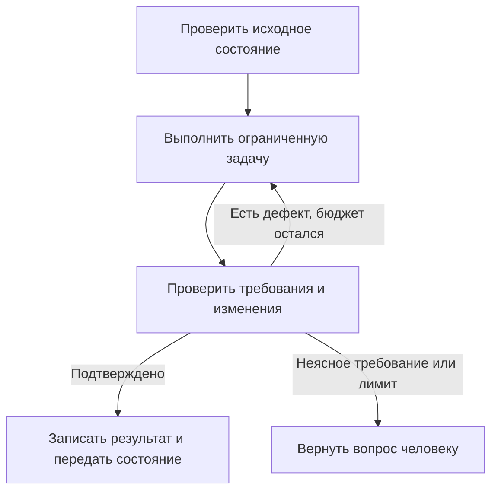

# Часть 13. Когда нужна схема из нескольких шагов

**Цель:** выразить процесс и развилки явно, сохраняя простое решение там, где оно
достаточно.

## Перед чтением

Вы умеете описывать ограниченный цикл и его остановку. Схема процесса, или граф,
показывает шаги и переходы между ними. Она не требует специальной библиотеки:
для учебного разбора достаточно рисунка и таблицы.

## Из цикла в понятную схему

У DocCatalog есть подготовка, исполнение и приёмка. При неверном результате работа
возвращается к исполнению. При неясном требовании она возвращается человеку.

Стрелка описывает не только порядок, но и условие. Если в таблице записано
«проверка → готово» без оговорки об успехе, схема разрешает объявить готовность
после любого запуска проверки.

## Что должно быть определено у шага

Для каждого шага укажите входы, выход, разрешённые действия и условие перехода.

| Шаг | Вход | Выход | Условие следующего перехода |
|---|---|---|---|
| Подготовка | Исходная копия, данные, команды | Результат исходной проверки | Окружение позволяет выполнять задачу |
| Исполнение | Требование и границы | Изменение разрешённых файлов | Можно проверять текущую версию |
| Приёмка | Текущие файлы и критерии | Подтверждено / нарушено / неизвестно | Только подтверждённый результат ведёт к готовности |
| Передача | Результаты и ограничения | Записка состояния | Следующий читатель может продолжить |

Если одно слово «проверить» скрывает и запуск, и субъективное впечатление, разделите
его на два условия. Однако не добавляйте новую роль для каждого действия. Одна сессия
может последовательно пройти несколько шагов.

## Схема и исполняемый процесс

Логичный вопрос: гарантирует ли нарисованная схема, что инструмент пройдёт по её
переходам? Коротко — нет. Рисунок помогает обсуждать намерение. Он не гарантирует,
что инструмент соблюдает переходы. Исполняемый процесс — код или настройки, которые
действительно управляют переходами. В обязательной практике этого тома рисунок
описывает ручную работу; новый программный движок не создаётся.

Перед автоматизацией сверьте рисунок с реальным журналом. Если агент начал новую
функцию после отказа проверки, фактический переход отличается от схемы. Исправляйте
наблюдаемую причину: неясное условие, отсутствующий статус или чрезмерные полномочия.

## Когда несколько исполнителей создают проблему

Два агента правят catalog.py одновременно. Один меняет регистр, другой сортировку.
Оба проверяют разные промежуточные версии, затем общий файл выглядит иначе. Их
отдельные зелёные результаты не подтверждают итоговый объединённый файл.

Для маленького каталога проще последовательная работа. Параллельность полезна,
когда задачи независимы и ответственность за файлы определена. После объединения
мы проверяем получившийся результат, а не суммируем успехи ветвей.

Отдельный оценщик тоже может работать по устаревшему снимку. Привяжите его вывод к
проверяемой версии. Если исполнитель продолжает менять файлы во время приёмки,
вердикт требует повторной сверки после завершения правок.

## Возврат к человеку — полноценный выход

Сценарий: найден документ без заголовка, а требования не определяют поведение.
Агент может угадать, пропустить файл или остановиться. Для нашего примера требование
уже задаёт имя файла как запасное название. В реальной новой задаче неопределённость
нужно обозначить и получить решение, если оно влияет на пользовательское поведение.

Выход к человеку должен содержать конкретный вопрос, текущие факты и последствия
вариантов. «Что делать?» без объяснения перекладывает весь разбор на адресата.
«Для файла без заголовка использовать имя или исключать его? Сейчас он попадает
в выдачу как gamma.md» даёт основание для решения.

## Упражнение и контрольный факт

Нарисуйте процесс лабораторной 5 и добавьте одну развилку для неизвестного требования.
На каждом ребре подпишите условие. Затем сопоставьте рисунок с одной реальной попыткой.

Контрольный факт: вы можете объяснить каждый переход по журналу и не вводите
параллельных исполнителей без независимой задачи.

## Вопросы для самопроверки

1. Чем рисунок процесса отличается от его исполнения?
2. Почему две отдельные зелёные проверки не подтверждают общий файл после объединения?
3. Как обосновать дополнительную роль или развилку?

Ответы

1. Рисунок описывает правила; исполнение должно действительно соблюдать их.
2. Проверялись разные состояния. Объединённый результат может содержать новые нарушения.
3. Показать наблюдаемый пробел простого процесса, который эта роль или развилка закрывает.

## Источники

- [walkinglabs: Graph engineering](https://github.com/walkinglabs/learn-harness-engineering/blob/38ddcd2bf8d65271f668b94e7c875ca1d629d622/docs/en/lectures/lecture-14-graph-engineering/index.md).
- [Anthropic: Building effective agents](https://www.anthropic.com/engineering/building-effective-agents).

[Предыдущая часть](part-12-bounded-loop.md) · [Следующая часть](part-14-measurement.md)
